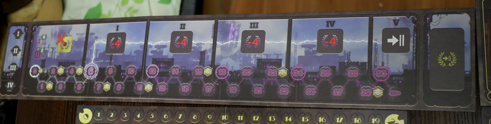

# バラージ解説

## 本文章の目的
この文章はボドゲ紹介アドベントカレンダーのバラージ紹介記事なのですが、
サブの目的として「次回のボドゲ回でバラージのイントロを省略する」ことを目的と設定しており、
解説記事としては不必要に詳細にまで踏み込んでいますが仕様です。
おおむね重要な順番に並べたつもりなので、雰囲気だけ知りたい人は途中まで読んで切り上げるのを推奨します。

## ゲームの概要

1-4人、120分のいわゆる重量級ボドゲです。
あなたはエネルギー開発を行う企業のCEOとなり、
ダム・発電所・導管を建設することでエネルギーを生産し、ライバル企業を出し抜きましょう。
ワーカーマネジメント的な側面もあります。

コンポーネントは重厚で満足感がありますが、若干の懐の余裕と非常に広い机を必要とします。
持ち運びは重量と箱の大きさにより覚悟を必要とします。

## ゲームの目的
このゲームの勝利条件は勝利点を稼ぐことにありますが、勝利点やクレジット(お金です)はエネルギー生産からもたらされます。
従ってエネルギー生産を最大化することが勝利に直結するでしょう。

エネルギー生産には水と発電所を必要とします。
ゲーム序盤は中立ダムから導管を引く、またはライバルの導管をコストを支払って利用して自分の発電所に水を流して生産しますが、
すぐに水が足りなくなり、自分でダム建設に乗り出すことになるでしょう。

エネルギーを生産するとそれを企業との契約の履行に利用することができ、
これによって勝利点などを得てゲームを有利に展開できます。

## 全体のゲームの流れ
バラージは5つのラウンドで稼いだ勝利点の合計で勝敗を競います。

ラウンドは以下の5つのフェイズに分かれています。

1. 収入と源流
1. アクション
1. 水の流れ
1. 得点計算
1. ラウンドの終了

このゲームは主にアクションフェイズで技術者を自ボードや共有のアクションスペースに置くことで、
様々なアクションを実行していきます。

## 水の流れ

バラージのマップには上から源流・山岳・丘陵・平原の3つの地形があり、水が上から順番に流れていきます。

源流にはラウンド開始時に水が供給されます。
ユーザのアクションによっても水が供給されることがあります。

山岳・丘陵・平原にはダムを建設できるスペースがあります。
下流の方が安価にダムを建設できますが、
上流のダムは生産量が多めであったり、
他のユーザに水の供給を左右されにくいメリットがあります。

水が流れる途中にダムがあるとそこで止まり、ダムを水で満たします。
ダムにはダムの段数だけの水を貯めることができます。ダムの最大段数は3です。
越えた水は溢れてそのまま下流に流れていきます。

## 生産
エネルギーの生産を行うためには以下の3要素が必要です。

- 中立または自社のダムに溜まっている水
- 自社の発電所
- 水の溜まっているダムと発電所を繋ぐ導管(自社に限らない)

導管は自社のものである必要はないですが、
他社の導管を利用した場合、流した水の量と同じクレジットを支払い、所有企業に勝利点が追加されます。

発電量は主に流した水の量×導管の生産値で決まります。

生産に使った水はそのまま発電所から下流に流れていきます。

## エネルギーの使用
エネルギーを使用してできることは主に2つがあります。

### 契約の履行

所持している企業契約を履行する、または共有の国家契約を即座に履行できます。
左のコストを支払うと、右にある勝利点などの様々な恩恵を受けることができます。

1度に履行可能な契約は1つのみです。
複数の生産をまとめて支払うこともできません。

### エネルギートラック

契約の履行の有無に関わらず生産したエネルギーの分エネルギートラックを進めます。
エネルギートラックを進めると以下の特典があります。

- ラウンド内で1位になると6勝利点、2位は2勝利点
- ラウンド内のボーナスタイルに応じた勝利点
- エネルギーに応じたクレジット

ボーナスタイルは例えば「導管1つにつき4点」などの点が入りますが、
ラウンド内で最低6までエネルギートラックを進める必要があり、
ラウンド規定のエネルギー量に満たない場合は1あたり1点の減点があります。

## 建設
ダム・導管・発電所の建設を行うことができます。
ダムには基礎と上部があり、基礎(1段目)を先に作る必要があります。

建設には重機駒(削岩機/コンクリートミキサー)と技術タイルが必要です。

建設を実行したら即座に自分のボードから建設したコマを左から取ってマップに置きます。

コマを外した際にマークが書かれている場合はその効果が発動するようになります。
!マークは収入フェイズで発動する効果で、発電所のマークは常時効果があります。
(テラミスティカに同じようなルールがありますね!)

### 建設ホイール
右が建設ホイールです。

重機駒と技術タイルは消費するのではなく、建設ホイールに置かれます。

建設コストの重機駒と技術タイルは建設ホイールの開放区域に置き、1つ回すことによって建設を行うことができます。

開放区画まで戻ってきた重機駒と技術タイルは手元に戻り、即座に利用することができます。

一部契約の履行やアクションでホイールを回すこともできます。

## 各フェイズの詳細

### 収入と源流
ボード上の!マークの収入を得るのと、源流に水駒を置きます

### 水の流れ
源流の水が下流に流れます

### 得点計算
エネルギートラックの計算を行います。

→ [エネルギートラック](#エネルギートラック)参照

### ラウンドの終了
手番順マーカーを並び換えます。
ラウンドで生産エネルギーの小さい方が次のラウンドで先にプレイできます。
同じ場合は今ラウンドと逆順にします。

## アクション

技術者コマをアクションスペースに置くことで手番順マーカーの順にアクションを実行していきます。
技術者コマが無い場合パスしなくてはならず、全員パスしたらアクションフェイズは終わりです。

赤枠で囲われたアクションを実行したい場合、追加でクレジットを支払うことで実行できます。

### 建設アクション
各自のボード上にある建設アクションを実行します。
ラウンド中建設アクションの回数が増える毎に技術者駒のコストも上昇します。

→ [建設](#建設)参照

### 管理ボード
建設アクション以外は管理ボードにアクションがあり、各企業の共有となります。

### Turbine Station
生産を行うことができます。
Turbine Stationには場所によって生産ボーナスがあり、生産の計算終了後に補正をかけます。

→ [生産](#生産)参照

### Water Management
水源に水を追加できます。
複数の水源に分けることも可能です。
規定数より少ない水を流すことも可能です。
下矢印付きのものは即座に流水させることができます。

### Bank
置いた技術者駒の数に等しい数のクレジットを得ます。
いくつでも技術者駒を置くことができます。

### Workshop
建設ホイールを回転させて、重機駒と技術タイルの回収を早めることができます。

### Machinary Shop
重機を購入できます。

### Contract Office
民間契約タイルを取ることができます。

手番終了時に補充されます。

各プレイヤーは履行していない契約タイルを3つまでしか持つことができず、4つ目を取った場合即座に3枚になるまで破棄します。

## その他の要素
### 企業
企業ごとにボードは異なり、個性があります。
建設数のボーナスが異なる他、以下のような固有能力を持ちます。

- 発電所に水が流れるとエネルギートラックを1進める
- 2度目の生産アクションを行うことができる
- 生産アクションを行うと追加でエネルギートラックを3進められる
- 3少ないエネルギーで契約を履行できる

### 重役
各プレイヤーに1人重役が割り当てられ、様々な能力を持ちます。

### 目的タイル
ゲームセットアップで1枚セットされ、
ゲーム終了時にタイルが要求する要素を最も多く持ったプレイヤーから順に15/10/5勝利点をもたらします。

### ゲーム終了時の追加勝利点
- 自分のダム上にある水1つにつき1勝利点
- 重機/クレジット5つにつき1勝利点(生産ホイール上のものは含まない)

### 上級ルール
実はここで説明してるのは完全ルールからいくらか要素を取り除いた初心者ルールです。
完全ルールでは

- 企業と1ラウンド目の順番の選択ルール(初心者ルールは固定)
- 上級技術タイルと特許局アクション

があります。

### オートマ
1人でやる時などに使うAIプレイヤーを設定できます。
これだけで1冊のルールブックがあるので詳細は割愛します。
