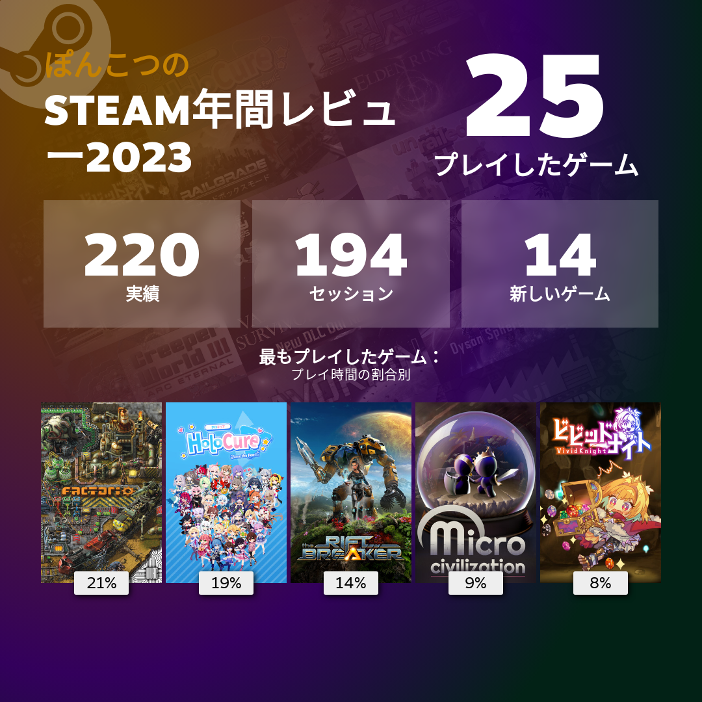
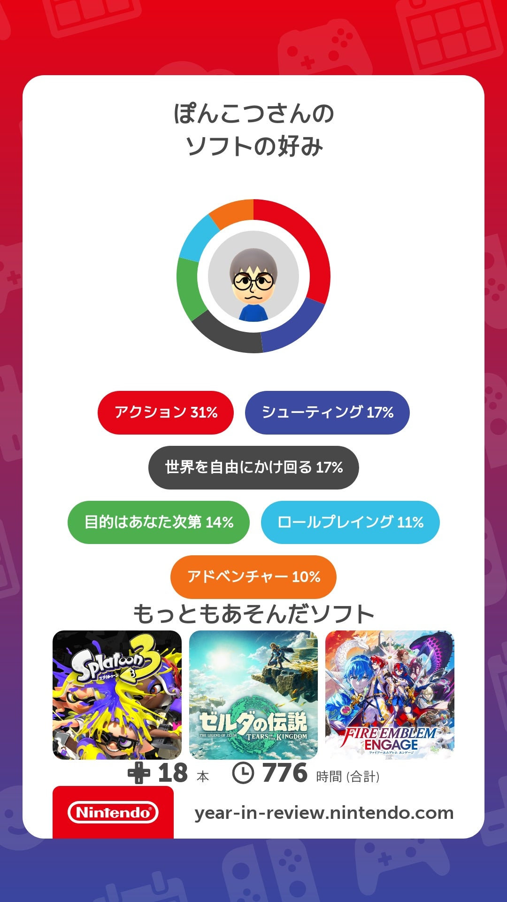

# ベストゲーム2023

## 内容
SteamとSwitchでほぼ100%ゲームやってるんですが、この2社は2023年振り返りみたいなページを作ってくれるので、今年の振り返りが簡単にできるぞ、というので今年やった中でオススメゲームをつらつらと書きます。

やるゲームの情報源は2パターンあって、Twitter/Mastodonの近しい知り合いがやってるゲーム、お勧めするゲームのパターンと、Steamのレコメンドとかクロールに近い探し方の2パターン。Factorioというゲームに人生変えられるほどハマってしまったけど、周りにプレイヤーがあまりおらんので、類似のゲームを探すなら大体後者で探すことになります。

Steam: https://s.team/y23/kfmwphn?l=japanese

## ゼルダの伝説 Tears of the Kingdom
ゼルダの伝説最新作オープンワールドのアクションゲーム、謎解きもおもしろくて…エッこれぼくが説明する必要ある？はよやって。189時間。

## ファイヤーエムブレム エンゲージ
ターン制シミュレーションゲームって言うんですかね？の老舗。苦手意識がわりとあったんですけど、主人公(女)のキャラデザがあまりにも好き過ぎてはじめて購入。かわいいは正義! 難易度は控え目で多分Lv上げしまくればゴリ押しできるしそんなむずかしくないとおもう。いや、でもお金は終始足りなかったかもしれない。

ラストの方、一人だけ選んで指輪渡せるとかあって、実質結婚では、っていいながら、でも主人公女だしなってヴェイルちゃんとめっちゃ悩んで、結局ロサードさん選んでkawaii!言いまくってた。キャラが濃ゆいし最高なので、好きなキャラがいるならかなり楽しめるとおもう。でも自分以外の評判悪いね、前作はもっと面白かったとかなんかな。

サントラ注文した。めっちゃ楽しみ。79時間。

## ポケットモンスター スカーレット
ポケモン、ここ最近だとアルセウスがクリティカルヒットだったけど、前評判だとそこまでアルセウス寄りじゃなかったし、剣盾そんな好きじゃないし見送りかなあと思ったけど、結局購入。やってみるとオープンワールドでポケモンは普通に楽しいわなって、それなりに満足。満足だけどアルセウスの方が好き。アルセウスの続編出て欲しい。

追加コンテンツはやるか悩んでる。大体追加コンテンツって一通りやりきって冷めて半年後ぐらいに出るので、なんか食指が動かない。70時間。

## ドラゴンクエスト ビルダーズ2
セールで半額なので、前から気になってたので買ったんですけど、えっ、めちゃくちゃ面白いですね。

Minecraftにちゃんとしたチュートリアルと目標突っ込んだら面白いよね、それはそう、版権でやりたいよね、それはそう、そんでもってちゃんとMinecraftの面白いところも損なわずにちゃんと持ってこれてるとおもう。傑作。

あ、でも音楽はドラクエの曲そのまんまでアレンジすらされてないので、手抜きとか場面あわなくないとか個人的にはあるけど誤差。55時間。

## NeoATLAS 1469
交易してお金を稼ぎながら「都合のいい」地図を作るゲーム。どういうことかというと、地図未確定領域に船を出すと地形が明らかになるんだけど、それを拒否してもよくて、拒否すると未確定領域のままで、確定するまでランダムに地形が変わる、みたいなゲーム。なんだけど、確率のよくわからないガチャゲーだしあんまおもんねえな、となってしまった。ちなみにぽんこつさんはガチャゲーという言葉を、支払いコストが高いくせに運要素が強過ぎるという悪い意味で使うことがあります。ガチャが好きなひとごめんね。7時間。

## SURVIVING THE AFTERMATH
コミュニティ運営するストラテジーゲーム。今後こういうゲームは滅茶苦茶ハマったFrostpunkを冠してFrostpunkっぽいと言います。なんだけど、いまいち好みではなかった。Frostpunkハマったのでこういうの手出ししがちなんだけど、イマイチ好きなものが少ない。3時間。

## Factorio
今年もまたやってしまった…様々な自動化を進めていく、主に工場を作るゲーム。マップ変わると割かしできる工場変わるし、開発も積極的なので、アプデするたびにプレイし直してる。名作。通算573時間。(Steamは今年のプレイ時間が分からないので通算で示します)なおSteam移管前に300時間ぐらいプレイしているので…ウッ頭が。

## Dyson Sphere Program
今年もまた(ry ダイソン球を作るゲーム。ダイソン球を作るには沢山の研究開発が必要だし、沢山の資源と組立ラインが必要。隣の惑星や隣の星系から原料を輸送しないといけないこともあるFacotrio。生産ラインの複雑さはこっちの方が若干マイルドなんだけど、球の表面に生産ラインを作る特有の難しさはマイナスかも。でも滅茶苦茶好き。Factorioを脅かす可能性があるのはこのゲームしかない。

12/15のアプデで妨害する敵があらわれました(設定でON/OFFできる)。後から敵が追加されるゲームってあるんだ。でも正直よくわからないし、よくわからないところで工場を滅茶苦茶にぶっこわされてしまい泣いてる。もうちょっと攻略情報揃ったらまたやる。通算380時間。

## Vampire Survivor
今年はそんなにやってないんだけど、HoloCureの説明で必要なので。沢山の敵がわらわら襲ってくるので倒して、経験値アイテムを集めながら武器を強化していく。どんどん敵は固くなって数も増えるのでちゃんとアップデートしないと死ぬぞ、強化しきったら爽快に敵が溶けていくぞ!みたいなゲーム。キャラ毎に最初の武器と特殊能力が違うとか。インフレ感がたのしいゲーム。通算43時間。

## HoloCure
ホロのキャラでVampire Survivorやるやつ、なんだけど、各キャラがスキル持ってて、キャラ毎にかなり違ったプレイ感になる。結果的に違ったビルドを考えたりすることになるのでめっちゃおもしろい。ちなみにビルドっていうのはコンボの組み合わせみたいなもので、例えばキャラのスキルにクリティカル率アップがあるなら、クリティカルダメージ上昇のアイテムを組み合わせるとかでセットにすると強い、みたいな感じです。通算60時間。

## The Riftbreaker
基地を拡張し襲撃をかわしながら防衛するゲーム。Factorio風のゲームだけど、かなりアクション寄りのゲームチューニングで、敵の襲撃が手強く、自機も強いので、自動で撃退できる幅が限られる。逆に複雑なサプライチェーンは作らない。作った物資が自動で共通倉庫に送られるのでベルトコンベア概念がない。電力供給さえキッチリしていれば必要なものを設置するだけでおけ。みたいな感じなので、やはりアクションゲームに近いとおもう。それなりに面白かったけど、もっと複雑なもの作りたい。通算43時間。

## Microcivilization
プレイ時間は長いんだけどイマイチかなーと思っているゲーム。CookieClicker的な放置ゲームとCivilizationの文明進化ゲームの文脈をミックスしたゲームで、戦闘システムとかはかなりよくできてるなあと思う。一方で、CookieClickerってゲームリセット報酬を使って、強くてニューゲームできるのが楽しいんですけど、Microcivilizationのその要素が弱くて、何度も同じことやらされてる感が強くて結構中途半端なところで投げちゃった。通算28時間。

## RAILGRADE
Transport Feverの貨物部分をパズルゲームにしたようなゲーム、って言って通じない人の方が多そう。鉱山や工場の操業に必要な資源を輸送するための鉄道を敷いてお金を稼いでゲームクリアを目指すゲームなんだけど、1つのマップを延々やる感じじゃなくて、長くても1時間ぐらいのステージ毎に条件を達成してクリアしていくパズルゲーム的なシミュレーションゲーム。最初のステージは面白いんだけど、後半ステージむずかしくてお金が貯まるの待ったりするのが苦痛でやめてしまった。通算27時間。

## ビビッドナイト
ダンジョンで手に入る宝石をモンスターと戦わせるローグライク。同じ宝石を重ねて進化させたり、宝石に付いてるマークを集めると能力が常時発動するようになるので、マークを集めたりするゲーム。ローグライクの割に運要素が少なめで、ある意味難しい。クリアまではいけたんだけど、クリア後コンテンツが難しくてそっちは全く手付かず。センスがあんまないっぽい。通算25時間。

## ELDEN RING
オープンワールドの死にゲーアクション。オープンワールドで死にゲー、下手な人でもレベルでゴリ押しできるって話だったけど、実際のところ攻略サイトでボスの強さの上下とか稼ぎポイントとか見ながらじゃないとクリアできる気がしないし、攻略サイトみながらやってもおもんないのでやめちゃった。初手で星見を選んだのも問題かもしれない。通算10時間。

## IXION
今年最大の問題児。宇宙船を運営して移民を成功させるゲームで、Frostpunkにプレイ感はかなり近いんだけど、起こるイベントが片っ端から悪意に満ち溢れていて、ストレスがやばい。プレイ人口の多いゲームなら絶対話で盛り上がるんだけど、残念ながらだれもやってない。ブチ切れてやめちゃった…通算10時間。

## Word Factori
Iを横に曲げるとCになる、Cを反転したものを2つとIをくっつけると…ほらBができる! みたいなのを組み合わせてWordを作るラインを作るゲーム。それなりにおもしろい。プレイ時間短いけどちゃんとクリアまでやった。通算5.6時間。

## Against the Storm
Age of Empireにかなり近いゲーム。神話世界観のリアルタイムストラテジー。なんだけど面白みがイマイチ分かってない…なにをすると強いのかピンとこないんですよねえ。わかってくると面白いかもしれないけど放置してる。なんかあんまゲームよくわかってないのに後戻りできない決断を頻繁に迫られるのが苦痛かもしれない。通算2.7時間。

## Avorion
突然宇宙にほっぽりだされて宇宙船作れって言われたけど、いや、宇宙船作るのめんどうくさいな？って言って放置している。宇宙船の設計がもうちょっと楽になったら起こして。79分。

## Witcher3
PCのスペックが足りないことが発覚して放置している。そういうこともある。
