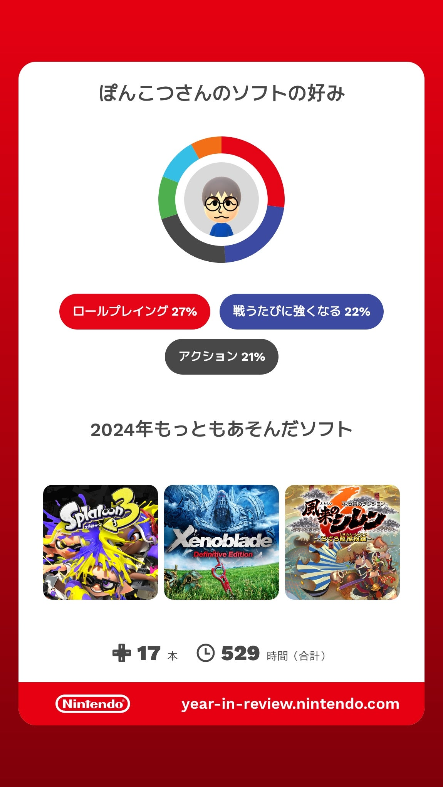
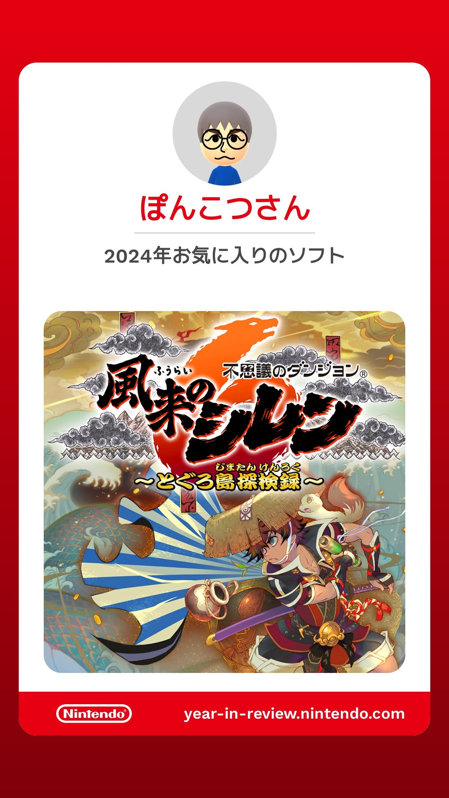
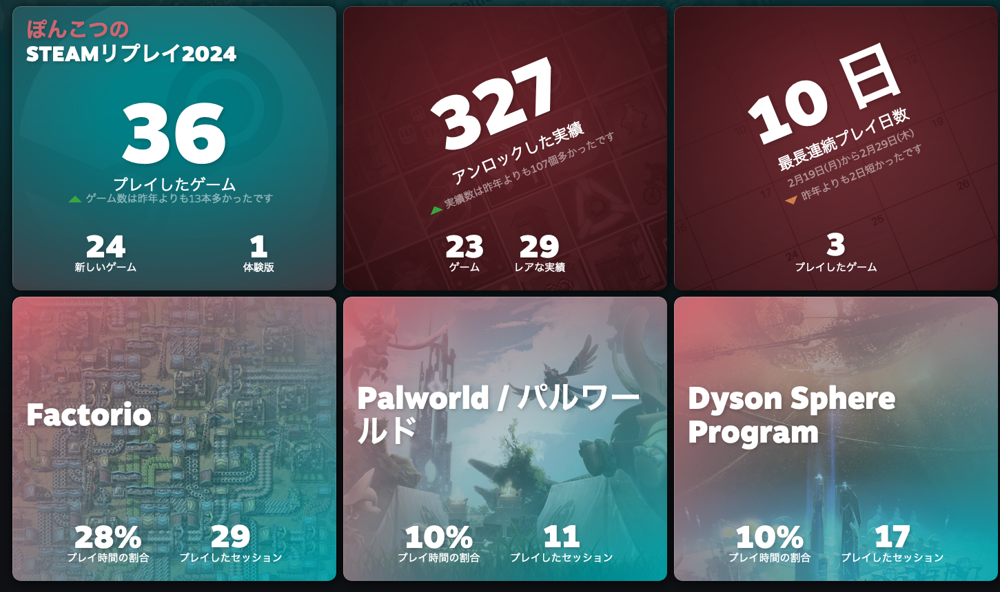

# ベストゲーム2024

## はじめに

去年やったゲームをまとめてて楽しかったので今年もやります。プレイしたゲームは去年と同様に今年もSteamとNintendo
Switch、スマホでほぼ100%です。

今年はSteamDeckを購入したのでSteamのゲームが増えたぞ!とおもいきや特に増えてない、むしろ減った。結局ゲームはコンテンツで決まるんですね。

## Nintendo Switch

### Splatoon3

まあ友人同士でやることが多いので時間的には一番長くなりますね。一緒にやる相手がいるのは楽しいですね。最近あんまりやってないですけど。最近の対戦環境はスピード早過ぎてちょっとついていけてないですね。146時間。

### Xenoblade DE

今年はサントラ目当てに買ったゲームが2本あって、そのうちの1つ。サントラ目当てだったんだけど普通に滅茶苦茶面白かった。

新作やった後の旧作って洗練度が低くてあんまり好きになれないことが多くて、ぼく自身がXenoblade2
Xenoblade3をやってるのでかなりハードル高いなとおもっていたんですけど、全然杞憂で、滅茶苦茶面白かった。

RPGなのでシナリオの出来はすごい大事だと思いますが、Xenobladeに関しては心配することなく実際最高だった。ビジュアルもそんな悪くないですね。メリアちゃんかわいい。

肝心の戦闘システムも、シュルク・ライン・カルナが鉄板とみせかけて、ここにメリア入れるために色々工夫しだすと悩ましくて楽しかった。メリアは物理得意な特定ボスに連れていくとすごい強かったりするんですが、機神兵がシナリオ中半分ぐらい出張ってくるのでシュルクいないと辛いんですよね。ラインをダンバンに入れ替えたりすると火力の出る盾楽しいとかなったり、フィオルンが通常攻撃で回復できるようになると手数で盾になれるとか色々。キャラ変えるとゲーム結構変わるので面白いです。

敢えて言うなら定例のクリア後コンテンツがそんなに面白くなかったけど、まあ本編の方が大事だしいいかな。目当ての音楽は勿論最高だったよ。112時間。

### シレン6

今年一番のゲームはまちがいなくコレ。Xenoblade
DEも面白かったけど昔のゲームだしね。

初代シレンは結構好きなゲームだったけどトルネコ3あたりで挫折してまあええか…となっていたんですが、ちょっと気が変わってシレン6やってみたら、これ面白いね。何よりHP回復がバカ早くなったり序盤がすごいピリピリするようになったの、フロアが狭くなって敵が増えたのは良調整だとおもう。（長いことやってないのでシレン6以前からそうだったやつも含まれる）やっぱ今までのローグライクにありがちだった些細なミスしないことが求められるプレイ感はちょと苦手意識あったのでこっちの方がいいすね。

一通りやったつもりだけど、神髄だけはクリアしてない。99Fダンジョン長過ぎてだれるからあんまり好きじゃないや。持ち込み可なら+99武器でゴリ押しするんだけど。102時間。

### Unicorn Overlord

今思うとこっちも1番にでもいいぐらいの名作だった。序盤に「そのおっぱいで司祭とか無理じゃろwwww」って言いまくってネタにしてたけど、普通に楽しかった。

編成変えるだけで結構戦闘能力変わるので、延々と編成に悩み続けていた記憶がある。あと上位職が開放されたり、Lvが上がったタイミングで、あんまり強くねえなと思ってた職に強いスキルが付いて突然化けたりとかも多くて楽しい。装備もなかなか強いのが多いので運用変わったりとかもした。まあでも最終的に主人公で無双した。つよい。

好きなキャラに指輪を渡すイベントとかもあってなかなかニクい。最近流行りなんですかね。ハーフエルフのリディエルの戦闘シーンのふとももにやられて指輪わたしちゃった…キャラ全体的にふとももがえっち。メリザンドもかわいいかったね。獣人が出ると聞いてどうせ猫耳でしょと思ったらガチもん出てきて本気で好きな人が開発陣でいた可能性が高いですね…そっち方面の人は是非。

### ファイアーエムブレム 風花雪月

今年最大の問題児。エンゲージのサントラが気に入ったので前作も買うか〜ってなったやつ。

ゲーム的にはいつもの戦闘だし（難易度はハードxカジュアルでやった。クラシックやり直すのかったるいので）演出がエンゲージに比べてだいぶショボいし（まあ前作だしね）、育成も実際のところそんなに面白くなかった。2周目やるかーって最初から選んだけどやりたくねーってなってしまったのでそのまま終わりにしちゃった。

シナリオも金鹿のリシテアちゃんかわいいぞ！ってなって金鹿クラス選んだんですけど、シナリオ的には真相解明編って感じで、後半わりとあっさり終わっちゃうんですよね。たぶんこれ最初に回しても楽しくないやつな気がする。帝国内部で結局何が起こっていたのかもわからんし、王国とか騙されて勝手に内戦して自滅しただけだった。そして2周目やるか？ってなったときにゲーム的に面倒くさくて嫌でしょ、となったという話でした。

指輪渡す相手も、女主人公にしたので男に限定されてるけどどうすんだこれ、と思ったらソティス選べて、まあソティスでええかとなったのだった。もうちょっとソティスのkawaiiシーン見たかった。なんか外れルートっぽい扱いだったよな…悲しい。

でもまあサントラはマジで最高だった。ゲームは好みじゃないけど曲が最高って分かってるゲームの扱いどうすんだ、次回作どうするよってなってる。Xenoblade3もゲームが全然好みじゃなかったけど曲は最高だし次回作どうしたらいいんだってなってる。

### リトルノア 楽園の後継者

昔あったスマホゲーのキャラで仕立てた別ゲーって感じだったかな。アクション風味のローグライクゲー。年の始めにやったゲームなのであんま覚えてないけど、結構面白かった記憶ある。まあ主人公かわいいしね。ただクリア後コンテンツの難易度高過ぎてまあええかとなった記憶もある。

## Steam

Steam、結構沢山ゲーム買ったのに、プレイ時間上位は去年とほとんど同じ顔ぶれでFinishしてしまった。プレイ時間短いけど楽しいゲームもそれなりにあったので不満はないんだけど。

### Factorio

毎年恒例。メインバスを自分流にカスタマイズしたのが結構うまく回るようになって楽しい。あとアップデートもありましたね。ヴルカヌスは開拓してて滅茶苦茶楽しかったけど、フルゴラは最後まで工場が安定しなかったし、グレバは面倒くさくなって途中でやめてしまった。宇宙船の設計はまあまあ楽しいんだけど、惑星開拓かったるいし、拡張なしの方が楽しいかもしれない。677時間。（Steamは今年だけじゃなくて通算です）

### Palworld

例のやつ。モンスター捕まえて働かせる。まあまあ楽しい。でもポケットベアって結構悪癖があって、いつもベータ版が出しちゃいけない、早過ぎるタイミングで出るんだよね。前作はまあ処女作だったししゃーないにしても、二作目同じことしますかね、って感じだった。初手で流行り過ぎちゃって制作が追い付く前に飽きられちゃう。実際飽きてしまった…。またどっかのタイミングでやるかもしれない。しかし抜け穴で金策捗る方が楽しかった可能性すらあるのでやんないかもしれない。38時間。

### Dyson Sphere Program

毎年恒例の工場ゲーその2。Factorioは最初の工場ゲーにして結構ストイックな難しいゲームなのに対して、こちらは結構簡単寄り、ビジュアル重視寄りのゲーム。惑星の行ける範囲が増えると工場の製造ルートが短絡できたり、工場を面積の広い惑星に移したりできる。

敵が面倒くさくておざなりになってたけど、攻略情報揃ってきたしそろそろ再開の機運ある。と言いつつ敵なしで今年だけで50時間ぐらいはやってそう。419時間。

### Factory Town Idle

街の住人を生産に割り当てて作ったもので街の需要を満たすとコインが手に入り、コインで技術開発したり建物立てて更に街が発展して、みたいなゲーム。新しい街が見つかると固有資源が出てきて貿易したりもする。こういうの楽しいね。とはいえ一通りやる前に飽きてしまった。39時間。

### 救国のスネジンカ

期待のマルフーシャ続編！相変わらず話は滅茶苦茶ブラックだし救われねえ〜と思いつつも、ついに主人公が税金その他中抜きから開放された姿は涙なしには見られなかった。タワーディフェンス銃アクションも楽しい。キャラの絡みも楽しい。15時間。

### Dicey Dungeons

ダイズを振って消費して戦闘していくスタイルのゲーム。ダイズを消費して使うアイテムは色々あって、取得もランダム。アイテムの組み合わせやキャラ固有のスキルで色々なコンボ作って攻略していく感じ。まあまあ楽しいんだけど、なんか物足りないんだよな、になってる。6時間。

### Frostpunk2

初代Frostpunkにのめりこんだので楽しみにしていたんだけど、正直言って期待外れだった。法制定まわりがすごいリアルになったんだけど、ゲームとして楽しいかと言われるとかなり微妙で、技術開発まわりで自由度がすごい下がったり、全ての技術が2歩進んで1歩下がるなのでワクワク感皆無なのもあって、前作何がおもしろかったのか開発者分かってなかったよ、って顔になった。ゲームが面白さより自己表現とかにエネルギーかけはじめたら黄色信号なんだな、って感じ。9.8時間。ちなみに初代は80時間やってる。

### CARRION

SF映画とかでありがちな研究所で生まれてしまった恐しい生物になって人類を滅ぼすゲーム！まさかの逆パターン！w
ゲーム設定の斬新さに反して割と普通にちょっと難しめの謎解きアクションだった。結構ちゃんとできてて面白かったんだけど、謎解き難しくて結構攻略サイトを参考にした。3.2時間。

### Shapez2

図形をカットしたり合成したりして要求される図形を作って納品するゲーム。だいぶストイックな工場ゲー。Factorioみたいに途中で襲撃食らったりしないのは楽しいかというと、個人的には微妙かもしれない。目玉の列車システムも結構やれること限られててそんなに面白くない。どんな組合せの納品目標が来ても大丈夫な汎用工場の仕組みとか考案している人がいて、あーいうのは楽しいかもしれないけど、言われた図形を作る工場を作るだけだと単調過ぎて飽きが来るかもしれない。飽きた。15.2時間。
