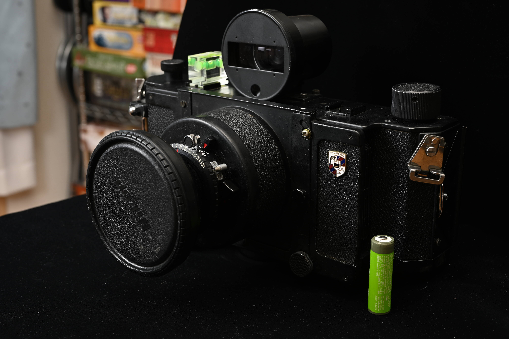
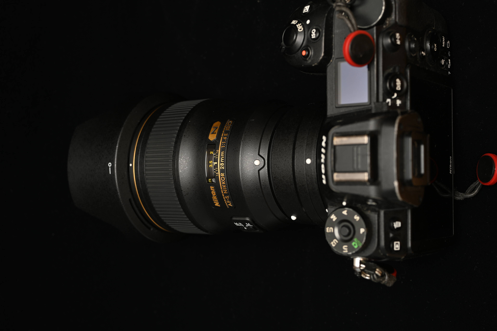
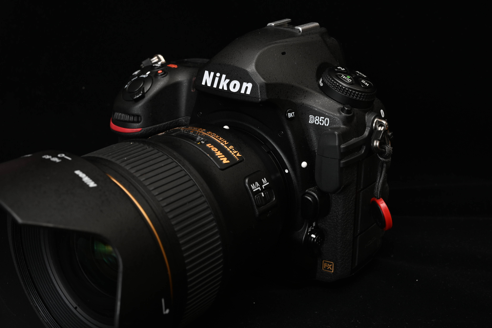
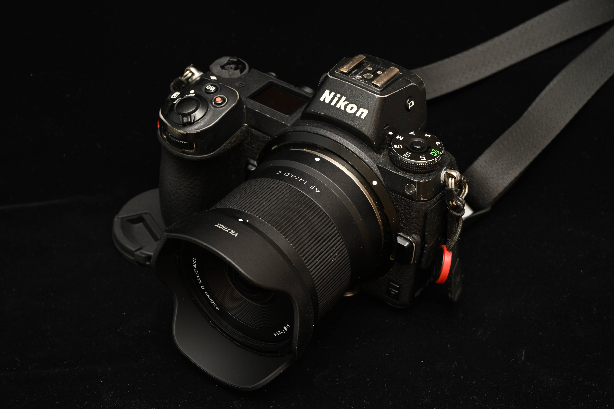
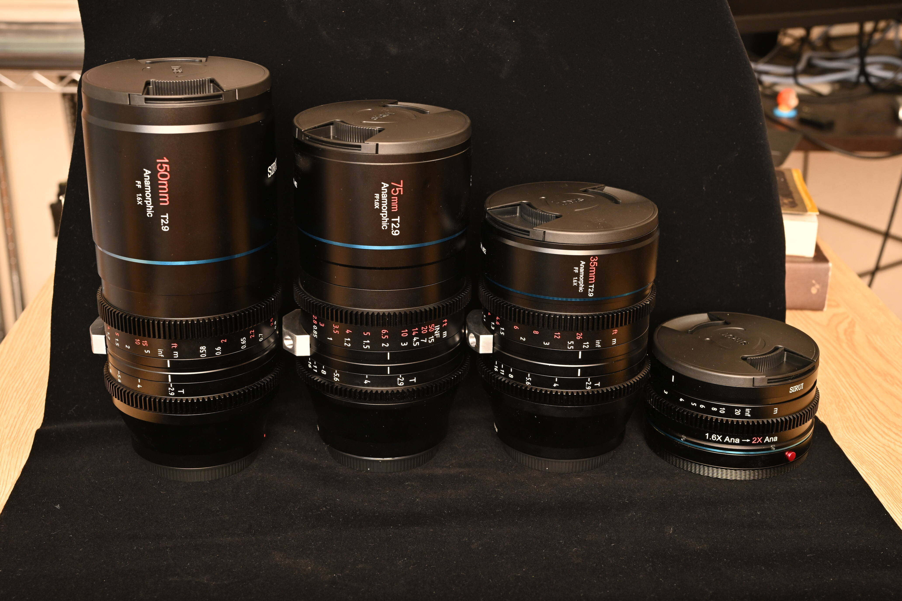
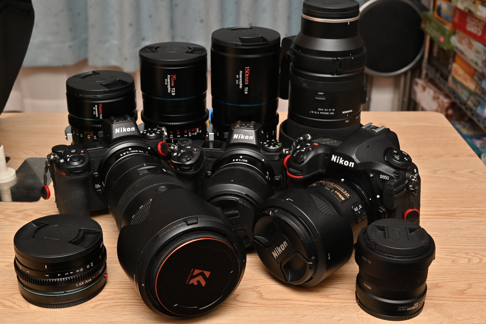

# Best機材2025

## なにこれ

[mstdn.maud.io Advent Calendar 2025](https://adventar.org/calendars/11516)の8日目の記事です。

[2023ベスト機材](../best-lens-2023/index.md)

毎年書いているベスト機材になります。前回から1年飛んでるのは、2024年はかなり動きのない1年で、記事書くのたるくてスルーしてしまったんですが、今年はまあまあ動きがあったので書きます。主にカメラ機材とその周辺の話です。

## 2024年概況

動きはほぼ無かったんですが、1本だけ。Z 20/1.8が生えて、一瞬メイン3本の広角がこれになっていたことがあります。しかし14-30で30を多用してる人間なので、20mmは個人的に使い勝手が悪く、売却してしまったので残っていません。

## 2025年初頭概況

持ち運ぶ機材は、デジタルカメラはZ7が2台とZ6が1台が基本になっていました。相変わらずの3台体制ということで、当然常用レンズが3本ありまして、こちらも使用頻度の高いZ 50/1.8を中心に、望遠側Z 70-200/2.8、広角側がZ 14-30/4、という構成でした。

実は去年末あたりにテレコンの代わりにTAMRON 150-500が追加されたため、超望遠寄りはこちらでカバーするようになったのですが、あまり工場夜景を撮る機会が少ないのでイマイチ稼働率が低い状態が続いています。近場の撮りやすい工場軒並み撮り終わった感が…。

自家用車はずっとハスラーです。大体ハスラーで走り回ってます。今年はなんせハスラーで北海道まで行きましたからね。

## TOMIYAMA Art Panorama 170

ひさしぶりのフィルムカメラ。6x17というブローニーフィルムを贅沢に使うカメラで、1巻で4枚しか撮れないヤバいやつ。持っていった先々で見たことない言われまくる逸品。

フィルムの値段が爆上がりしたので号泣しながら撮りまくりました。フィルムカメラでここまで稼働率が高いカメラは今まで4x5ぐらいしか無かった気がする。個人的に広角写真の最終解はパノラマだとおもってたので、ようやく欲しかったものが手に入った気持ちになっています。

滅茶苦茶重いので、こんなのクルマが無いと運用できるはずがなく。ハスラー様々です。

## AF-S 28/1.4E

20mmに不満が出たのでZマウントの30mm近辺のレンズを探し求めてみたものの、満足できる水準の該当レンズはほぼコレしかなく、久しぶりのFマウントレンズになります。

とはいえマイクロフォーサーズ時代は15mmレンズ（換算30mm）で3年ぐらい撮りまくっていたため、ジャストフィットして大変使い勝手のよいレンズとなっております。

逆光でも全然無問題な写真をお出ししてくれることもあるすごいやつ。過信は禁物だけど。

## D850

とまあFマウントレンズが生えたところで、前々からZ6をZ7みたいな高画素機で置き換えようかなあと思ってたやつをD850で置き換えることにしたのでした。D850は信者が多いので使ってみたかったのはあります。

ただまあ…シャッター音はすごい好きだし楽しいカメラなんだけど、ミラーレスに慣れ過ぎたので、どちらかというと実用上不便な点が目立つなあというのが偽らざる気持ち。重いし…。

とはいえAF-S 28/1.4Eの利用頻度が抜群に高いので、こちらも頻繁に持ち出すことになっています。メイン機の一角。

## VILTROX AF 14/4.0

ぼくにとって広角の範囲はずっとZ 14-30/4がカバーしていたんですが、28mm単に置き換えたため、このままだと14-20あたりが空くことになって困るわけです。というので28mm単を買った直後もZ 14-30/4がこの範囲をカバーしていたんですが、稀に右側のピントが合わなくなる事象が発生し、壊れた判定を下さざるをえず、14mm単焦点で一旦カバーしておこうとなったため購入。何より安い。ほぼ定価で買ったあと、Amazonのセールでもっと安くなってたのを発見したのは悲しかったけど。

このあたりの超広角単焦点はVoigtlanderの15mmが定番で、描写ならまちがいなくそっちなんだけど、なんやかんやAFはあると便利なのと安過ぎたためこちらに。

中華レンズの14mmなんで周辺減光ヤバヤバかなあと思ったら全然そんなことないし、AFもするし、逆光もまあまあで、値段考えると十分以上のレンズ。描写もZ 14-30/4よりはいい気がするんだけど、まだ稼働回数が多くないのでもうちょっと動かしてみて判断したい。

## SIRUI アナモルフィック3本セット

今年はメイン機材もだいぶ入れ替わったしこれで打ち止めかと思いきや買ってしまった。

アナモルフィックレンズ、横を圧縮して動画を撮り、上映時に引き伸ばすことでパノラマ上映を実現するんだけど、このレンズが独特のフレアを出すのでフレアを再現するためにこのレンズを使おうとする人が沢山いるぽい。でもぼくはパノラマ写真が好きなだけなんだ…と言いながら写真を撮ってる。

正直なところ現像環境が苦しい。なんか変な歪みが残ってる気がするけど直す方法もわからない。まだ買ったばかりなので実験中。

## まとめ

今年のベスト機材は、すげー悩んだけどAF-S 28/1.4Eにします。悩んだのは6x17カメラで、パノラマやっぱ楽しい〜ってなったし、いい写真も沢山撮れたけど、AF-S 28/1.4Eはメイン3本の一角としていきなりバンバンレベル高い写真を出しまくったので、こっちには勝てねえなあとなったのでした。

というわけで最終的にこれだけクルマに積んで撮影にいってます。

<figure>

<figcaption>おそろしいのはこれを撮影しているフルサイズカメラ＋レンズがあるという…</figcaption>
</figure>
