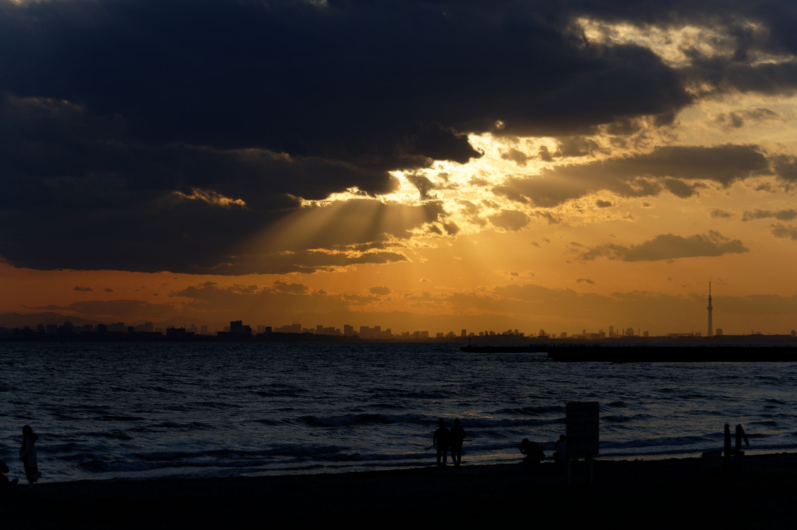
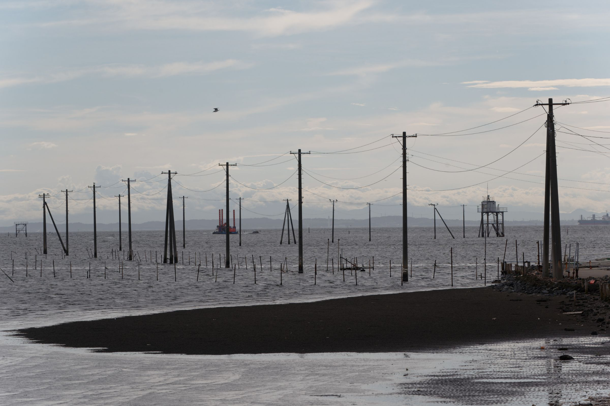
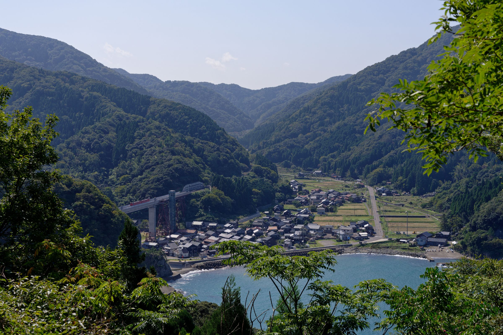
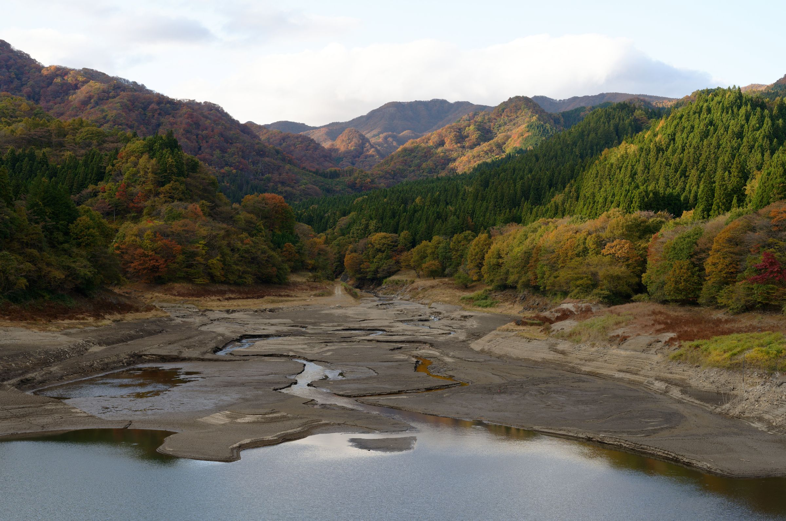
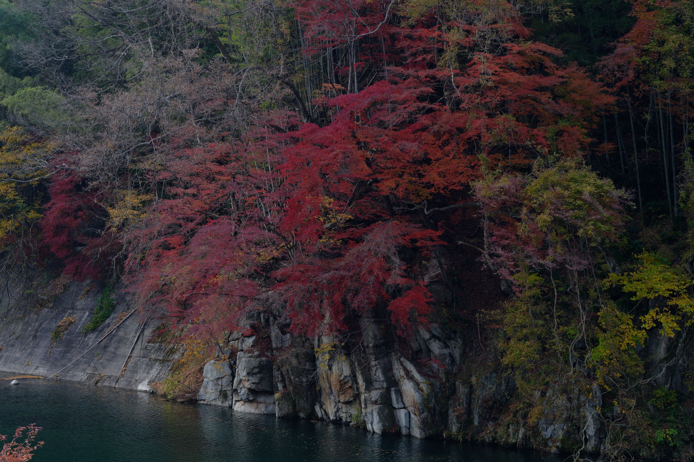
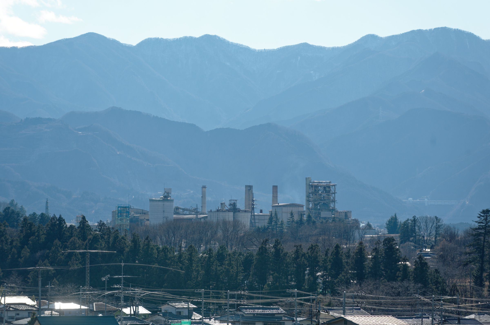
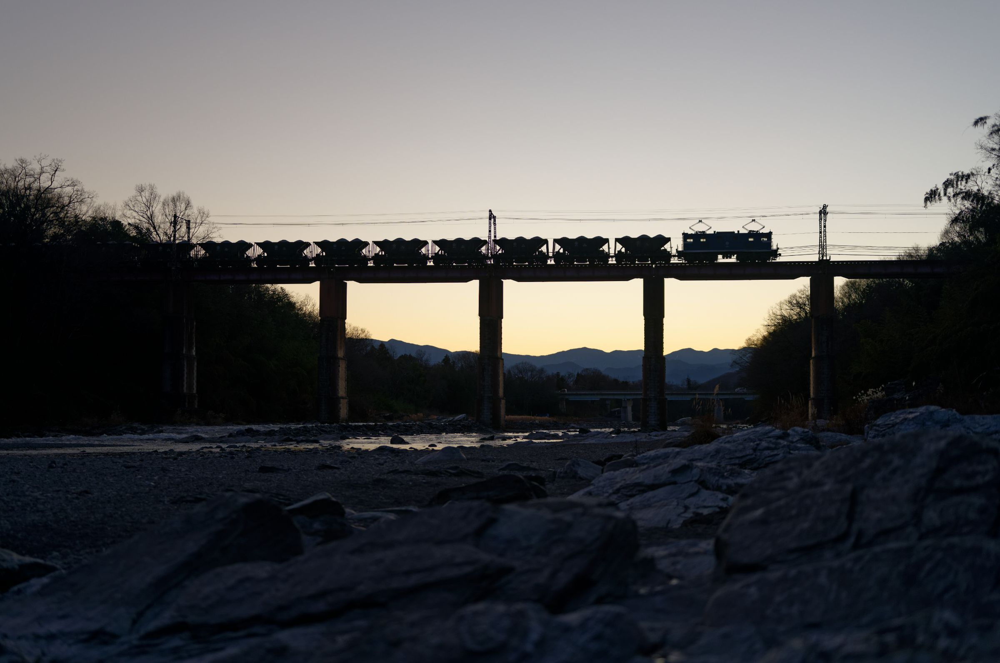

# 2021年のベスト写真
2021年は2020年12月に買ったNikon Z6を気に入って、ひたすらZのシステムを増やしつつ、コロナで遠出しづらいので近場で写真を撮りつつZの習熟をする、みたいな1年でした。機材の話は別でする予定ですが、先にこの1年に撮った写真でお気に入りを載せていきたいとおもいます。

## 稲毛海岸からの夕日

<dl>
<dt>環境</dt><dd>5月3日 千葉県千葉市 稲毛海岸公園</dd>
<dt>機材</dt><dd>Z7 + AF-S 70-300mm f/4.5-5.6G</dd>
<dt>設定<dt><dd>100mm f/5.0 1/1600 ISO100</dd>
</dl>

カメラ仲間で成田空港に飛行機の写真を撮りに行った帰りに、夕日撮るという話で稲毛海岸寄って、着いて最初に撮った写真です。とても綺麗で夢中で撮ってたのであまり覚えていないのですが、後で見返してみると望遠レンズで撮った、この最初のショットが一番気に入ってます。夢中で撮ってたので、特に絞りが雑で開放なんですが、今思うともうちょい絞ってもよかったかもしれないですね。

## 久津間海岸海中電柱

<dl>
<dt>環境</dt><dd>8月22日 千葉県木更津市 久津間海岸</dd>
<dt>機材</dt><dd>Z6 + AF-S 70-300mm f/4.5-5.6G</dd>
<dt>設定<dt><dd>140mm f/9.0 1/320 ISO100</dd>
</dl>

大変暑い時期だったので、真っ昼間に遠征するのを避けて、近場で工場を撮りたくて木更津に向かい、君津製鉄所を撮るついでに撮った海中電柱です。後から見返してみると構図がよくできてる気がして割と気に入っていて、実際現地でも、「単に電柱ならんでるの見て終末感があってすごいいいけど、これどうやって纏めるんだよ」と思いつつ、ひたすら角度変えて試して一番よかったのがコレ、って感じでした。念を入れて被写界深度稼ぐためにギリギリまで絞った記憶があります。

## 狭隘な餘部

<dl>
<dt>環境</dt><dd>10月2日 兵庫県 余部</dd>
<dt>機材</dt><dd>Z7 + Z 50mm f/1.8 S</dd>
<dt>設定<dt><dd>f/8.0 1/250 ISO100</dd>
</dl>

コロナが落ち着いたし遠出したいとなって、餘部鉄橋を撮りに行って、撮ってきたのがコレです。撮影ポイントがかなり奥まったところにあって、蜘蛛の巣押し退けたりして大変だったのを覚えています。海、狭隘な市街地、餘部鉄橋、山々、列車を、50mmで一通り構図に収めることができて、大変満足度が高かったです。ただ今思うとPLフィルター欲しかったですね…。

## 霧積湖と紅葉

<dl>
<dt>環境</dt><dd>11月3日 群馬県安中市 霧積ダム</dd>
<dt>機材</dt><dd>Z7 + Z 50mm f/1.8 S</dd>
<dt>設定<dt><dd>f/4.8 1/180 ISO100</dd>
</dl>

険しいルートであるため、新幹線ができた今は2本の廃線が残るのみになっている、信越本線の碓氷峠区間を撮ったついでに、霧積ダムの写真を撮りに来たら、ダム湖である霧積湖の湖面、湖底、山の紅葉、稜線が層になって見えて面白かったので撮った写真です。夕方なので若干日が落ちかけてて暗かったりするところもありますが、良い光景でした。紅葉撮るの楽しいですね。

## 岸壁と紅葉

<dl>
<dt>環境</dt><dd>11月21日 群馬県みどり市 渡良瀬川(沢入駅ふれあいパーク)</dd>
<dt>機材</dt><dd>Z7 + Z 50mm f/1.8 S</dd>
<dt>設定<dt><dd>f/4.8 1/125 ISO250</dd>
</dl>

わたらせ渓谷鐵道の写真を撮りたくて、草木トンネルを抜けてすぐに、草木ダム湖である草木湖を越える橋梁、黒板石川橋梁を撮影ポイントに定めてウロウロして、満足して移動する沢入駅で列車を待つ間に岸壁で撮った写真です。暗めの真っ赤な紅葉と岸壁が、あとで見返してみるとすごいマッチしているように感じたので、ちょっとクロップしつつ色を弄って出したのがこれです。こういう暗めの写真が好きですね…。

## 武甲山の工場

<dl>
<dt>環境</dt><dd>12月18日 埼玉県秩父市 黒谷 から 横瀬町 三菱マテリアルのセメント工場</dd>
<dt>機材</dt><dd>Z6 + AF-S 80-200 f/2.8D</dd>
<dt>設定<dt><dd>200mm f/4.8 1/125 ISO250</dd>
</dl>

今年の前半に親鼻鉄橋で撮り鉄しててよかったので、もう一度撮りに行くついでに工場めぐりしたときの写真です。和銅黒谷から和銅採掘露天掘り跡に行く途中で、秩父盆地が見渡せるポイントがあり、そこで「なにげなく」さきほど撮ってきた三菱マテリアルのセメント工場を、借りた望遠レンズで撮って帰り、見返してみたら稜線もきっちり入ってるし市街地も入ってて「いいのでは…？」となってここに入れた写真です。層状になってるのは霧積湖で撮った写真を思い出す良さがあると思ってます。

構図作ったのではなく、本当に偶然撮れちゃった写真なのはちょい反省としてはあります。最近大判カメラでたまに撮りに行くんですが、大判カメラはこういう「ちょっと撮ってみるか」ができないので、現地で「これを撮ればいい写真ができる!」みたいな確信がないと撮れなくて、このパターンの写真は残らないという話になるんですよね…。

## 夕焼けの親鼻鉄橋貨物

<dl>
<dt>環境</dt><dd>12月18日 埼玉県長瀞町 秩父鉄道親鼻鉄橋</dd>
<dt>機材</dt><dd>Z7 + Z 50mm f/1.8 S</dd>
<dt>設定<dt><dd>f/2.0 1/500 ISO100</dd>
</dl>

前の写真と同日の写真です。寒い中、日が沈むタイミングまで、秩父鉄道の親鼻鉄橋で待っていたら丁度いい感じに貨物列車が来たのでパシャリ。折角長瀞側から撮ったので荒川と橋だけじゃなくて石畳も入れたくて構図調整したりして、暗くなり過ぎないタイミングで列車が来て、個人的にはあまり文句の付けどころのない写真が撮れて満足です。こういう狙った写真が狙った通りに撮れるようになりたいですね。

# まとめ
Twitterで絵師が「今年の4枚」という感じで描いた絵上げてるのを見て、自分も4枚ぐらい選んで上げようかなーと思って、ついでにいつもどんな感じで写真撮ってるかとかの話も入れて書いてみたやつです。エッ、7枚ある？数え間違いじゃないですかね？感想、アドバイスは割と欲しいので [Twitter(@ponkotuy)](https://twitter.com/ponkotuy/) などにもらえるとうれしいです。来年も良い写真ライフを。

