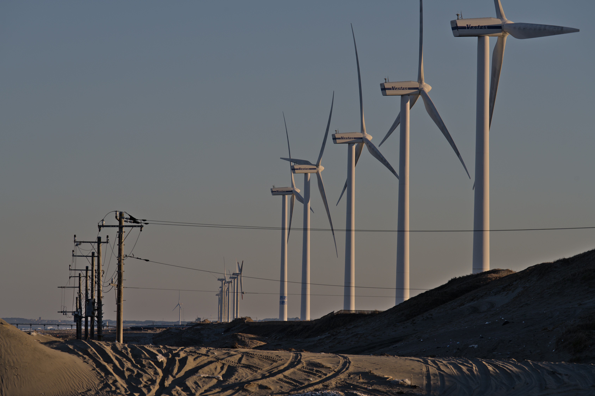
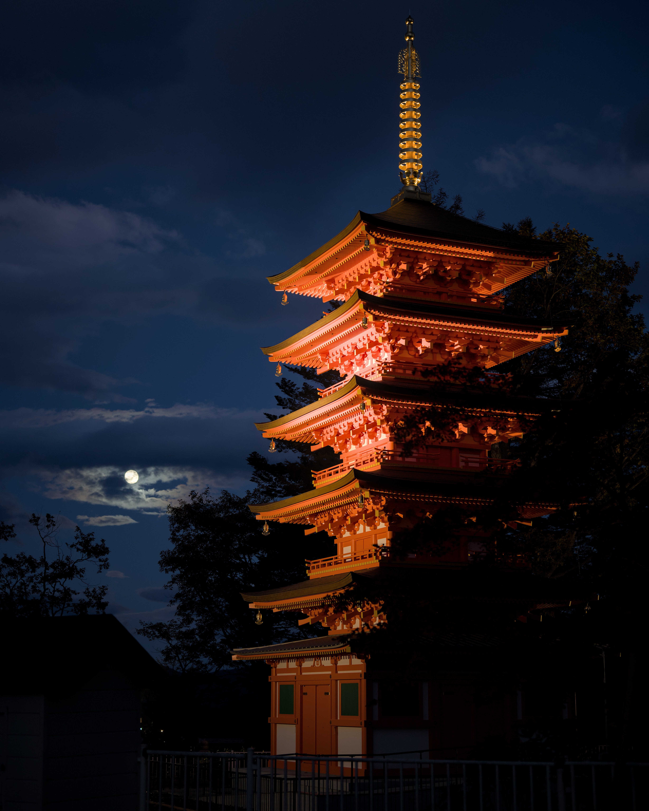

# 2023年ベスト写真

Nikon Zで旅行先の風景をメインに撮ってる人です。写真を見直すのは定期的にやった方がいいと思っていて、そのためにもちょっと今年のベストを選んでみるかーする企画です。

## 「良い写真」の考え方
アマチュアの人なら大体自分の好きな写真を撮っていると思います。その一方で、お気に入りの写真を公開してみると、様々な感想をもらったり、単純にViewやFavが多かったりして、「ウケる写真」みたいなのがおぼろげながら見えてきて、好きな写真がその評価に引き摺られることは往々にしてあります。というので、ぼくが「良い写真」として選出する過程にはその2つの要素が混じりあったものになります。

他人の評価という話をすると、ぼくの認識だと、実は工場写真の方がウケがいいような気がしますし、夕陽はよく撮るし好きですけど、他人の評価に引き摺られている部分が大きいような気がしています。

それ以外の写真の場合、世間的な評価と乖離値の大きい「好き嫌い」というものが根強く存在し、ぼくの場合には、「希少性」「厨二病」あたりが入るかとおもいます。

希少性、こんな写真撮ったやつそんなおらへんやろ、みたいな奴で、これはまあぼくでなくても良く聞く話だとおもいます。たくさんカメラがあるところで撮った写真の評価が下がり気味だったり、ぼくが変なとこ行って有名観光地の劣化版みたいな写真とか、凄いレアな現象ををありがたがってるのはこのあたりが理由です。

厨二病、まあこれもシンプルでポストアポカリプス的なやつとか、人間が自然に負けた写真がめちゃくちゃ好きなんですよね。晴天の工場が少ないのはこれが理由なんですが、実はシンプルに晴れる日が少ないとかもあります…。

とかの思想が入り込んでるという前提を踏まえて写真を見ると楽しめるかもしれないです。あと純粋に図解的な写真も好みなんですが、ここでは選ばれていないです。シンプルにSNSでカジュアルに解説付きで流す表現の方がいいとおもっているので。

(ちなみに他人の写真で評価値が高いのは風景写真と報道写真、あと廃墟ですね)

## Flickr
ノミネート写真リストです。最終的に数枚に絞り込みたかったので作りました。

[https://flic.kr/s/aHBqjB7WNE](https://flic.kr/s/aHBqjB7WNE)

## ポストアポカリプス

鹿島の日川浜にある風車の写真。どちらかというと砂浜に突然生えてる電柱の方が好みで、こういうタイトルを付けています。でもこの場所もう一度来たら電柱が消えてたので二度と撮れないかもしれない。

<dl>
<dt>環境</dt><dd>1月1日 茨城県神栖市 日川浜</dd>
<dt>機材</dt><dd>Z7 + Z 70-200/2.8</dd>
<dt>設定</dt><dd>200mm f/8.0 1/320 ISO100</dd>
</dl>

## 竜王の滝

基本的に神社みたいな神域の写真も、高速シャッターで撮る滝の写真も好きなんですけど、このときは丁度滝に日が当たってタイミングもよく最高でした。

<dl>
<dt>環境</dt><dd>7月2日 奈良県奈良市 月ヶ瀬竜王の滝</dd>
<dt>機材</dt><dd>Z7 + Z 50/1.8</dd>
<dt>設定</dt><dd>50mm f/1.8 1/800 ISO560</dd>
</dl>

## 喜多方の光芒

めっちゃ出来過ぎた光景で、この光景をもっとうまく写真に収める方法があったのではないかという気持ちがずっとあります。ウッカリ宗教を創始してしまった人はこういう光景を見たに違いありません。
福島でこういう光景は2度ほど見ており、地理的に割とよくある光景なのかもしれません。

<dl>
<dt>環境</dt><dd>7月16日 福島県喜多方市</dd>
<dt>機材</dt><dd>Z7 + Z 70-200/2.8</dd>
<dt>設定</dt><dd>80mm f/6.3 1/200 ISO100</dd>
</dl>

## 銅沼

割と情報量の多い写真が好きなんですけど、湖の水面、水位まで赤く染まる岩、紅葉する木々、冠雪する磐梯山、急峻な崖、という贅沢写真ですね。容易に到達できない場所にあるのも個人的にポイント高い。2日連続で撮りに行ったんですが、2日目に1日目になかった冠雪が追加されていたのは現地で絶叫しかけた。

<dl>
<dt>環境</dt><dd>10月22日 福島県北塩原村 裏磐梯銅(あか)沼</dd>
<dt>機材</dt><dd>Z7 + Z 50/1.8</dd>
<dt>設定</dt><dd>50mm f/4.0 1/125 ISO160</dd>
</dl>

## 月夜の五重塔

見た瞬間に最高やんけ、ってなった1枚。月が雲から丁度出ていて完璧な構図でした。草津の夜を散策しているときに偶然見つけたものです。

<dl>
<dt>環境</dt><dd>10月28日 群馬県草津町 光泉寺五重塔</dd>
<dt>機材</dt><dd>Z7 + Z 50/1.8</dd>
<dt>設定</dt><dd>50mm f/1.8 1/30 ISO360</dd>
</dl>
