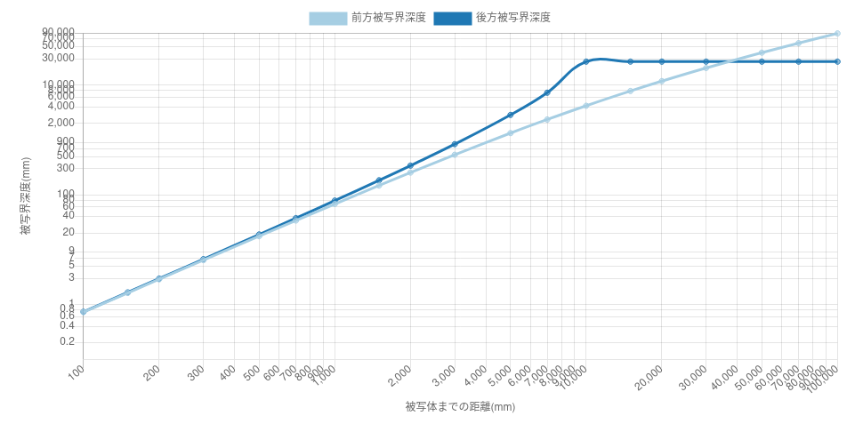
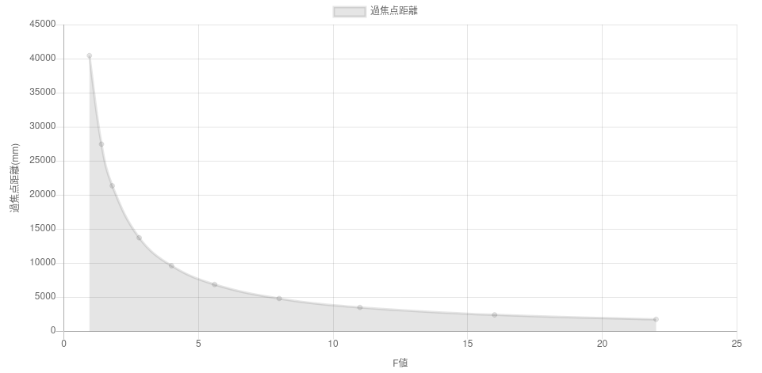
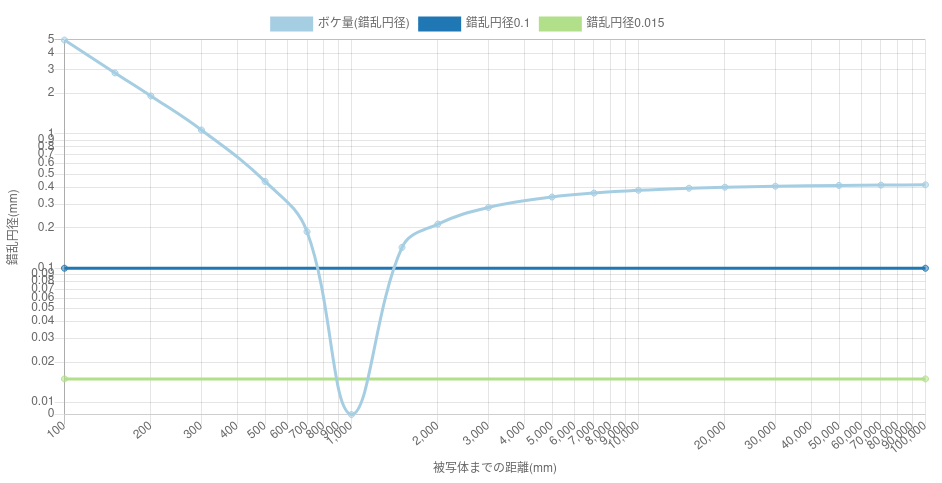
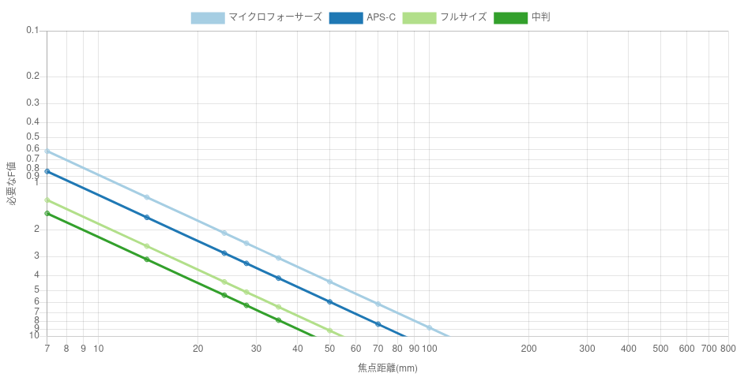
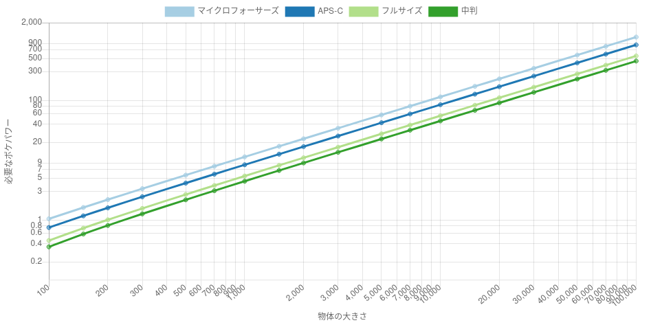

# ボケ量を稼ぐためのレンズ入門
## なにこれ
念願のフルサイズを手に入れたぽんこつ(@ponkotuy)が折角のフルサイズだしボケるレンズ1本買いたかったのと、マイクロフォーサーズの25mm F0.95をもってしてもボケなかった経験から「単純にF値増やせばいいわけじゃないのか…」みたいな経験をもとにボケを計算してみるだけの記事です。

計算結果のグラフは自作の [被写界深度計算機](https://ponkotuy.github.io/calc-dof/) で作ったやつです。

## 被写界深度
本来カメラの光学系ではピントが合うのは1つの面だけで、厳密にはその面から前方に行っても後方に行ってもピントは合わない。この面をピント面と言う。ピント面から少しでも離れると、センサー面において1点に光が収束せず、錯乱円径の範囲に散らばってしまう。しかし現実問題として、この錯乱円径が非常に小さい場合であれば、錯乱したとしても像に影響せず、ピントがあっているとみなすことができる。これを被写界深度と言い、前方と後方で長さは異なる。ここで前方被写界深度 $$D_N$$ と 後方被写界深度 $$D_F$$ を、許容錯乱円径 $$c$$ 、絞り値(F値) $$N$$ 、焦点距離 $$f$$ 、被写体までの距離を $$s$$ で表すと以下の式になる。

$$ D_N \approx \frac{cNs^2}{f^2 + cNs} $$

$$ D_F \approx \frac{cNs^2}{f^2 - cNs} $$

<figure>

<figcaption>被写界深度と被写体までの距離のグラフ。後方被写界深度は一定を越えると無限遠までピントが合う状態になるので数値が発散する。発散する場所は、グラフ描画の都合上それまでの最大値と同じ値に直している</figcaption>
</figure>

## 過焦点距離
上記の式を見ればわかるように、後方被写界深度 $$D_F$$ の分母がマイナスになると最終的に解がマイナスになる。このとき、入射光はほぼ平行になっていると見做してよく、無限遠にピントが合った状態になる。これのプラスマイナスが逆転する点が無限遠にピント面がくる最もカメラから近い距離になる。これを過焦点距離という。先のグラフで見ると描画の都合上最大値で固定される点になる。過焦点距離 $$H$$ を、許容錯乱円径 $$c$$ 、絞り値 $$N$$ 、焦点距離 $$f$$ で表すと以下にようになる。

$$ H \approx \frac{f^2}{Nc} $$

なお、この式は実は被写界深度の導出の途中で用いる近似値で、被写界深度から導出するのは本来逆である。厳密には以下になる。

$$ H = f + \frac{f^2}{Nc} $$

過焦点距離を越えると、写したいものを置いても背景をボカすことが不可能になってしまう。そしてこの値の最大値はレンズの明るさと焦点距離によって決定され、絞り値に反比例、焦点距離の二乗に比例する。

<figure>

<figcaption>過焦点距離とF値の関係。反比例関係にある</figcaption>
</figure>

## 許容錯乱円径
今まで説明してこなかった許容錯乱円径だが、この値をどのように決定するかは「何を計算したいのか」に関わってくる。一般的には0.03-0.015mmという値が使われるようであるが、この値は不適であることが多いと考えている。

もしあなたがボケておらずシャープな写真を撮りたい場合、錯乱円径はできる限りセンサーの画素のサイズに収めるべきである。ナナメ方向の画素サイズでいってもフルサイズの0.0082mmからマイクロフォーサーズの0.0046mmの間であり、現代のデジタルカメラの画素サイズは非常に小さい。

逆にボケを写真の技法として使う場合、画素サイズでは4Kモニターで引き伸ばして辛うじてボケているかどうか分かるぐらいのボケ量になってしまい、圧倒的に足りない。個人的な感覚としては0.1mmぐらいの錯乱円径がないと、パッと見ボケていると分からないのではないかと考えている。

現代の数千万画素のデジタルカメラにおいては、この間のボケは全て「引き伸ばしたらピンボケしていると気付いてしまう、単なる撮影の失敗」として扱われるということであり、素子サイズの小さな高画素機では特に厳しいことになる。

既に気付いているとはおもうが、錯乱円径は事実上のボケ量ということになる。

<figure>

<figcaption>ボケ量(錯乱円径)と被写体までの距離。当然ピント面で錯乱円径は0になる。このグラフと写真を見比べながら、写真表現に必要な「ボケ量」を決定してほしい</figcaption>
</figure>

## ボケパワー
非常にシンプルな撮影シーンとして、手前にある被写体と無限遠にあるボカしたい背景を考える。レンズスペックによって過焦点距離が決まるため、過焦点距離の内側であればどんな物体を撮影する場合でも背景をボカすことができる。しかし寄ってしまうと被写体の一部分しか写すことができない。このため、レンズがボカすことができる物体のサイズには上限があると考えられる。計算してみよう。

背景をボカしたい被写体を横のサイズのみを考え、写真全体の半分の大きさで撮影したいと仮定する。物体の大きさ $$L$$ と、横方向の画角 $$\theta$$ 、被写体までの距離 $$s$$ の関係は、直角三角形なので

$$ L = s \tan \theta $$

と表すことができる。横方向の画角 $$\theta$$ は、焦点距離 $$f$$と、横のセンサーサイズ $$C_x$$ から以下のように求めることができる。

$$ \theta = a \tan \frac{C_x}{2f} $$

被写体までの距離 $$s$$ について解く。

$$ f = \frac{sC_x}{2L} $$

$$ s = \frac{2fL}{C_x} $$

被写体までの距離 $$s$$ の上限は過焦点距離の式から

$$ s < f + \frac{f^2}{Nc} $$

これを絞り値 $$N$$ について解く。

$$ N < \frac{f^2}{c(s - f)} $$

$$s$$ に先の式を代入して解く。

$$ N < \frac{f}{\frac{2Lc}{C_x} - c} $$

<figure>

<figcaption>1mの物体をボカすのに必要なF値と焦点距離。フルサイズであれば、よっぽどの広角レンズを使わない限りはF4などの暗いレンズで事足りることがわかる</figcaption>
</figure>

前の式をグラフに表わすと、物体の大きさを固定したとき、焦点距離と必要なF値が綺麗な比例関係にある。言い変えると、

$$ P_{Bokeh} = \frac{f}{N} $$

のように置けば、あるサイズの物体の背景をボカすのに必要なレンズスペック、ボケパワー $$P_{Bokeh}$$ が定義できる。

使用例：58mm F0.95のレンズはボケパワー61に対して、800mm F11のレンズはボケパワーが73あるので、800mm F11の方がボケパワーがつよい。

<figure>

<figcaption>フルサイズの最も強いレンズでもボケパワーは100程度なので、10mオーバーの物体の背景をボカす方法は、現状存在しないことになる</figcaption>
</figure>

また、物体の大きさが大きくなるほど必要なボケパワーは単純に増えていくことが分かる。1mの物体では5(よほど広角なレンズでなければ越えている)だったものが10mでは50とかになり、相当にハイスペックな望遠レンズでないと達成できないことがわかる。建物のような巨大な写真の背景がボケている写真を見たことがないのも当然で、人類のレンズの力が足りてないだけだったということになる。また、センサーサーズの小さいフォーマットは画角の関係上ボカすのが非常に困難となる。
