# ぽんこつカメラ遍歴
## なにこれ
[@ponkotuy](https://twitter.com/ponkotuy) がいかにしてカメラ沼に入るに至ったかの長い道程を紹介するだけの記事。

## 現況機材
### フルサイズ
- Z6
- NIKKOR Z 14-30mm F4
- TEZ-01
- SONY 50mm F1.8
- TAKUMAR 50mm F1.4
- TAKUMAR 50mm F4 MACRO

### マイクロフォーサーズ
- GX7MK3
- LAOWA 7.5mm F2
- Panasonic 14-140mm F3.5-5.6
- Panasonic 100-300mm F4.0-5.6
- SPEEDMASTER 25mm F0.95

ちかいうちにAlice Cameraが届く予定がある。

## 前史
スマートフォン以前に一時期OLYMPUSやNikonのコンデジを使っていた記憶があるのだが、機種までは覚えていないので飛ばし。スマートフォンの時代が来てからはコンデジなんて忘れて、ひたすらスマートフォンで写メを撮っていた。そう写メ! 今覚えばある意味で一番楽で幸せな時代だった。

そしてNexus6というスマートフォンを使っていた時代の話として、当時Ingressにハマっていたので、Ingressで面白いものを見つけては写真をTwitterに上げたりしていた。しかし、なんとNexus6のカメラ機能だけが壊れる事件があり、代替のカメラを調達する必要に駆られてしまった。これこそが延々と続くカメラ遍歴の始まりである。というか素直にスマホ買い替えた方が安上がりだったよね、今思うと。

Nexus6のカメラ機能の代替という話からして、当然のように撮影したらすぐにNexus6に転送できる必要があり、その要件を満たすカメラをひたすら探し続けるのが前半の話になる。

ぼく自身記憶があやふやなので [これ](https://ponkotuy.hatenablog.jp/entry/2016/12/04/000000) などを見て思い出しつつ書いてる。

## レンズスタイルカメラDSC-QX10
<figure>
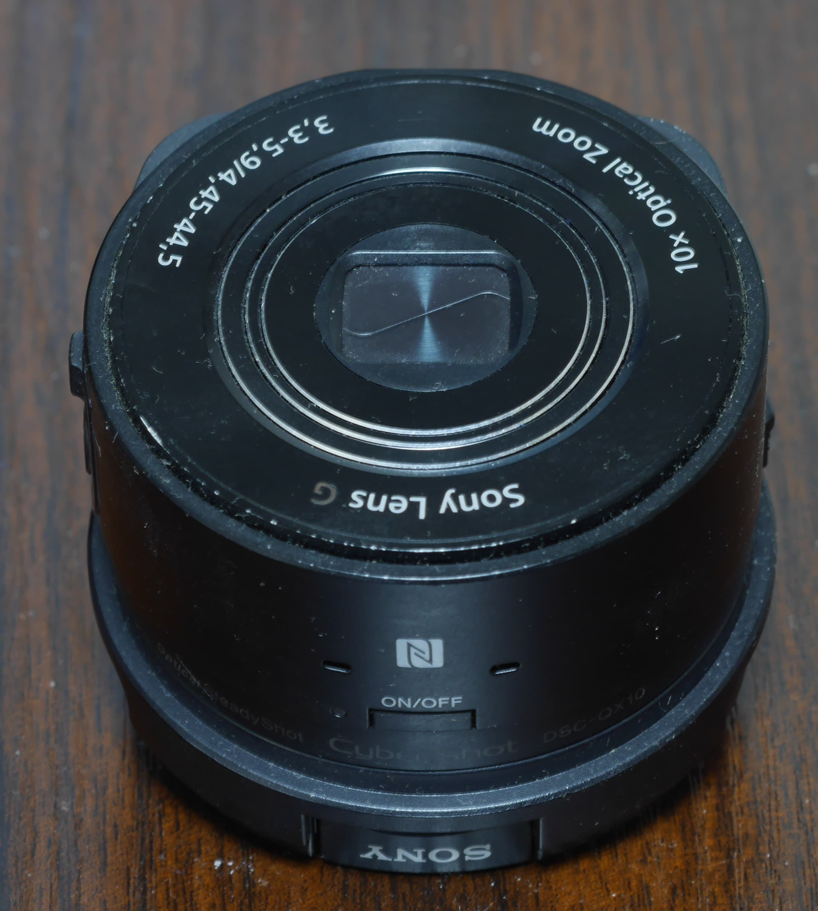
</figure>

まず試したのがこれで、液晶画面もファインダーもなく、センサーとレンズ(上位モデルにレンズ交換式のものもあったので、それは本当にセンサーだけ)の機能しか持たないカメラ。スマホと接続してはじめてフル機能のカメラとして使える仕組みだった。当然撮影したデータは自動でスマホに送られる。

しかしこのカメラは本当にひどくて、そもそも被写体を発見して構図を確認するためには、スマホとの接続を確立する必要があるけど、それにえらい時間がかかり、その間にシャッターチャンスを当然のごとく逃すという使えないカメラだった。これはたぶん買って1週間ぐらいしか使ってないとおもう。

## CASIO EX-ZR1600
次に試したのはこれで、普通のコンデジ。Bluetooth付きのモデルで、Bluetooth側から無線LANを立ち上げて写真転送するという、今でもよく見るタイプの接続を初期に実現したモデル。たしかまだBluetooth付きのコンデジは少なかった。んだけど、初期に実装したモデルにありがちな話として、ソフトウェアの出来がショボくて、接続がうまく確立しなかったりすることが多かった。

ただカメラ自体はズーム性能も高くてそこそこ気に入っており、SDカード側で転送を楽にしようという試みが続いた。Eye-Fiも使ってみたが微妙。次に試したTransferJetが、スマホ側のUSBトングルが面倒とかはあったものの、安定していてインターネット回線を阻害しないのでまあまあ使い勝手が良かった。

## DMC-CM10
<figure>
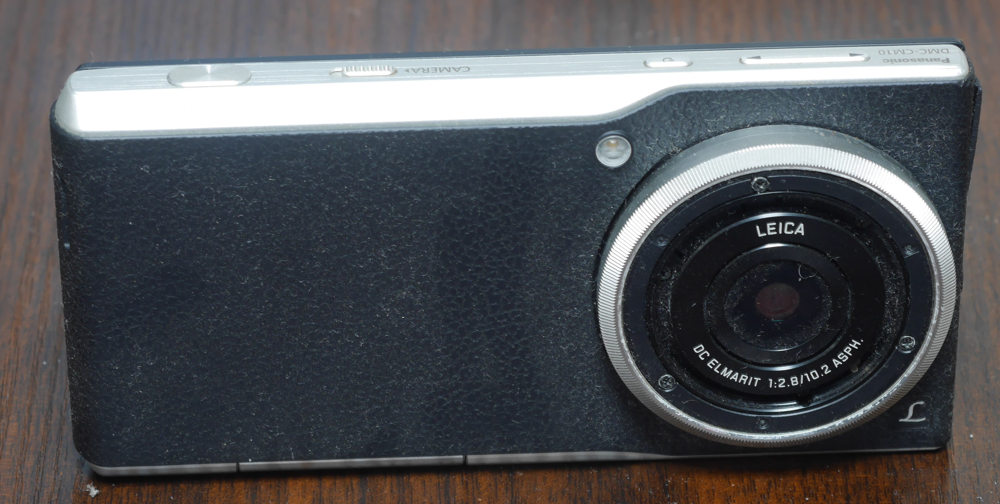
</figure>

でも結局面倒くさいのは変わらずなので、Android搭載カメラという売り文句のPanasonic DMC-CM10を購入。出た時期的に4Gがband1しか対応してない問題はあったものの、そのままツイートできるのは本当に強くて、結構長期に渡って使ってた記憶。ただこれズームが確か倍ぐらいしかできなくて、そこらへん大きな不満があった。

これがあってEX-ZR1600に戻り、USBで直接接続を試したところ、うまくいったため、一瞬EX-ZR1600に戻ったりした。

## GX7
<figure>
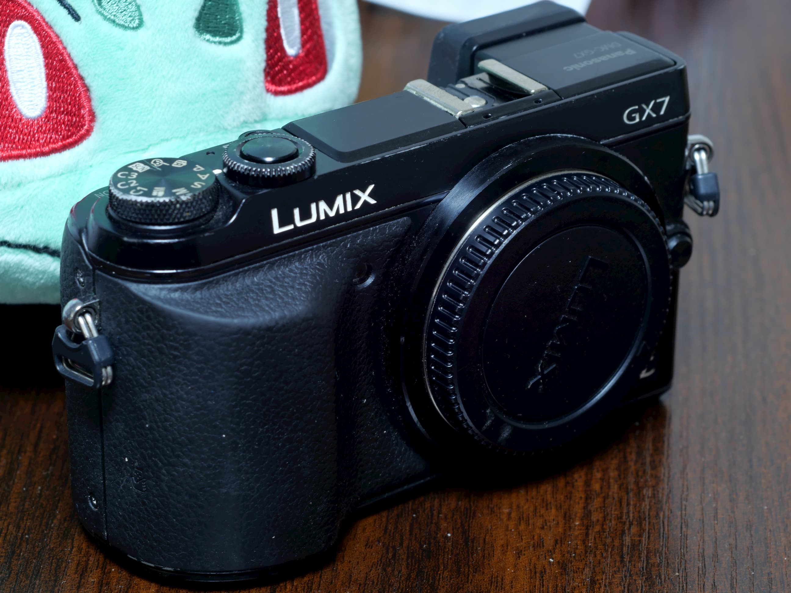
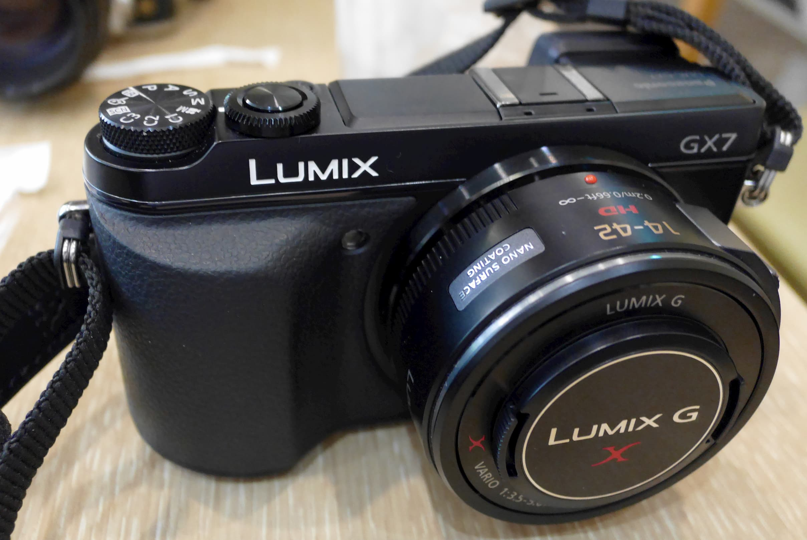
<figcaption>左が末期のGX7。扱いの悪い人がだいぶ使い込んだので結構年季が入っている</figcaption>
</figure>

実はここでマイクロフォーサーズでレンズ交換式のカメラに移行するのだが、この結論に至った理由があまり思い出せない。一眼レフは明らかに体積デカいし重いと思っててずっと敬遠していたのと、店頭でミラーレスが思ったより小さくてこれなら持てそう、と思った記憶はある。など色々あってレンズ沼の住民に相談したところ、いつのまにかPanasonicのGX7の中古を買っていた。

このとき同時に買ったのがLUMIX G VARIO 14-42mm F3.5-5.6のパンケーキレンズとOLYMPUS 40-150mm F4-5.6の望遠レンズ。所謂ダブルズームキットで、全部で6万円ぐらいだったとおもう。

GX7は上記でうまくいっていたUSBの直接接続ができなくて、仕方なしに内蔵のWiFi機能を使っていたのだが、これがまあEX-ZR1600のWiFi接続より酷くて、この頃にはNexus6から次の世代のスマホになってたので、GX7使わずに普通にスマホで撮影していたときもあった。あとこのときにレンズがカビた。いいレンズは防湿庫に入れような。

### 14-42mmパンケーキ
最初に買ったレンズ。薄い軽いので便利に使ってた。とはいえ7-8割ぐらい14mmだった記憶ある。まぁF5.6はだいぶ暗いしね。最終的に友人に引き取られた。

### OLYMPUS 40-150mm
最初に買ったレンズその2。初期はレンズ交換面倒くさくてあまり使わなかったが、後にXiaomiのカメラが入って2カメラ体制になったときにそこそこ使った。その後友人に引き取られ、そいつを望遠沼にハメることになった。多分そっちの方が仕事してる。

### Panasonic 20mm F1.7
<figure>
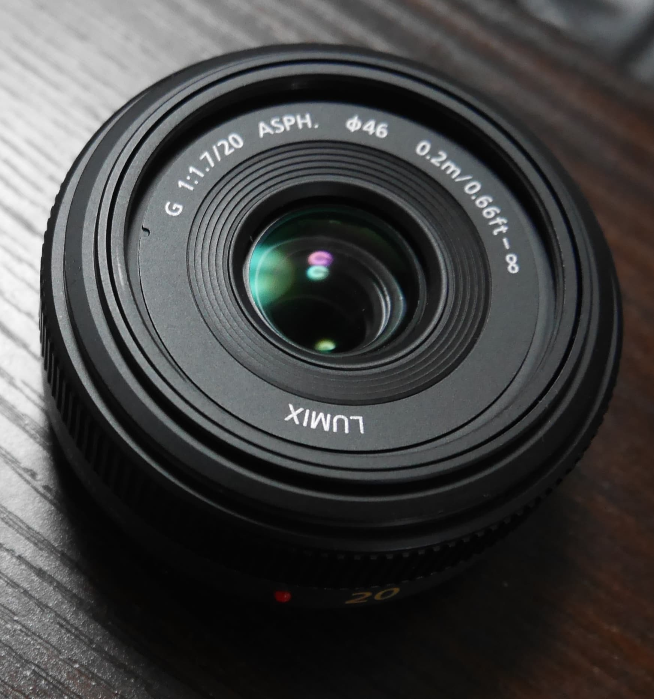
</figure>

折角レンズ交換式カメラ買ったし単焦点も試してみるかあって買った中古レンズ。理由は明るいレンズの中で一番安かったからで、IIですらなく初代。夜に撮っても明るくていいなあと思ったものの、レンズ全体を駆動するAFがショボいとかあり、ボケとかは有効に活用できてなかった気がする。あんまり使わなかった。友人に引き取られた。

### TAKUMAR 55mm F1.8
<figure>
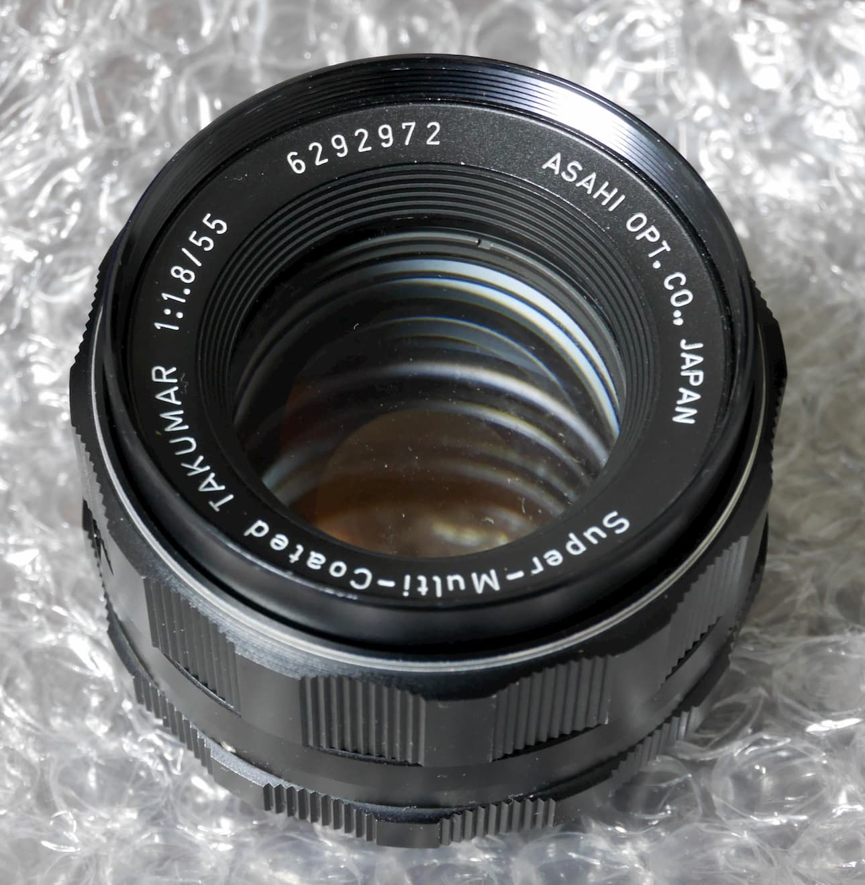
</figure>

たしかGX7を買った直後ぐらいに誕生日プレゼントでマイクロフォーサーズとM42のアダプタが送られてくる。ダブルズームキットしか買ってない人間にM42アダプタ送ってくるとか、本当に気が狂ってると思う。確かマイクロフォーサーズと言えばM42でしょ、という話だった記憶がある。意味が分からない。仕方ないのでヤフオクでTAKUMAR 55mm F1.8を買った。買ったのだが、当然55mmという画角はマイクロフォーサーズ的にはかなり使いづらいので試写ぐらいしかしてない。

ただその後フルサイズを手に入れてからは一度だけ連れ回したことがあり、やはりフルサイズの55mm F1.8はすげーボケるな!最高!ってなった。あとの調べで適当に買ったこのレンズがアトムレンズであることが発覚した。

## GX7MK3
<figure>
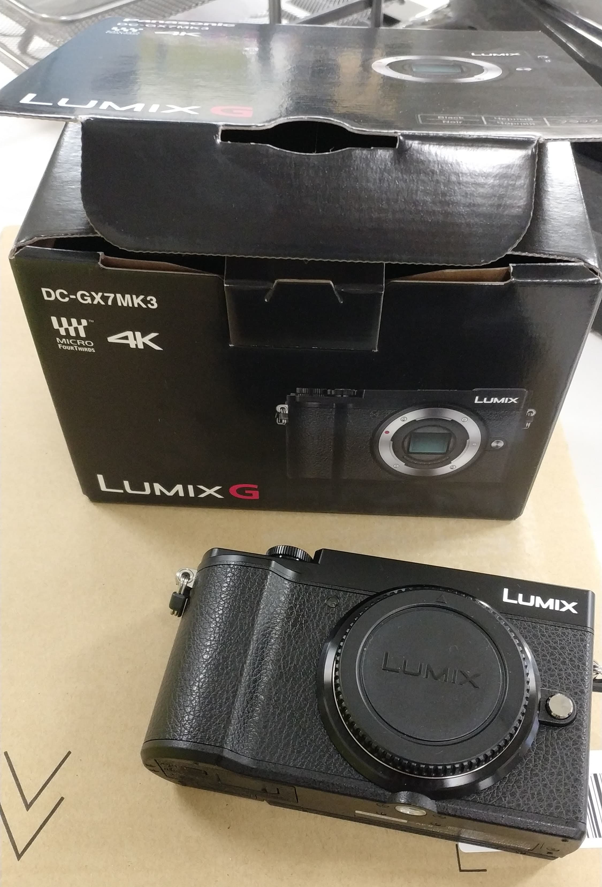
</figure>

このあたりでレンズ交換式カメラ捨てようという気持ちが強かったのだが、Panasonicが新機種でBluetoothに対応してスマホへの自動転送対応したという触れ込みでGX7MK3が発売したので、発売して速攻購入することになった。

この辺りの話は [ここ](https://ponkotuy.hatenablog.jp/entry/2019/03/31/023007) を見ながら書いてる。

GX7よりは写真同期まわりがまあまあ進歩していた。勿論不満はかなりあったが、たまにiPhoneを見るぐらいであとは全自動で転送できるようになったので及第点ラインには到達した感じがした。買った当時はあまり気にしてなかったのだが、実は未だにPanasonicの機種の中では性能と重量のバランスが良く、代替機種を見つけられていない。

### Voigtlander 25mm F0.95
これは知り合いからレンタルしたレンズで、当人のお気に入りだけどマイクロフォーサーズ最近使ってないから貸すよ、みたいな感じだったとおもう。今ならボケが楽しいのを知ってるので有効活用できそうなんだけど、当時はあんまり良さが分からないレンズだった。ただMFと単焦点でも何とかなるというか、ズームしないの却って楽なのでは、みたいな気持ちになったレンズで、この経験が切っ掛けで次のレンズ購入が決定した。

### Panasonic 15mm F1.7
<figure>
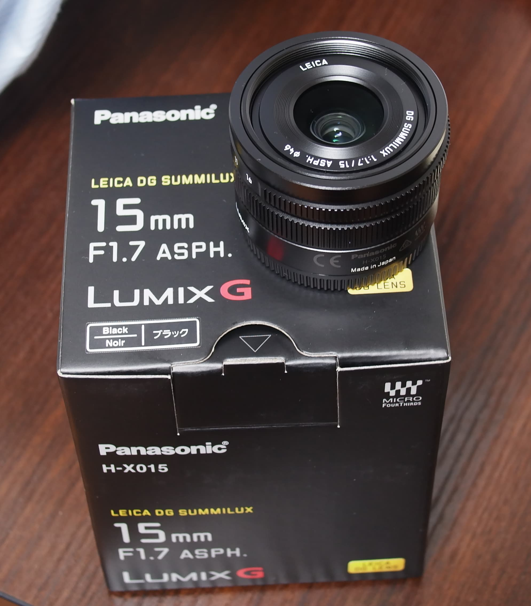
</figure>

自分的傑作レンズその1。LUMIXの20mmのAF問題とVoigtlander使った経験のベスト画角を勘案したところ、おそらく15mm近辺が使いやすいだろう、という結論になったので買ったやつ。LEICAの名を冠しているものの確か4万円台で新品が買えたとおもう。実は新品でレンズ買ったの初。単焦点のAFレンズは本当にスッと写真撮れるし、必要ならボカせるし、夜でもそこそこの画質で撮れるとかあり、カジュアルに写真撮るなら最高だなあと感じた1本。画角も使い勝手いいし。1年ぐらいずっとこれメインで撮影した。

最終的に広角沼にハマって使わなくなったため、友人に売却した。

## Xiaomi YI-A1
GX7MK3使いつつも微妙に不満があったので、Xiaomiならソフトウェアまわり大丈夫でしょって買ったやつ。 [ここ](https://ponkotuy.hatenablog.jp/entry/2019/07/26/005649) を見ながら書いてる。

レンズセットで2万円というぶっとんだ安さの軽いカメラで、センサーは不相応なスペックがあった一方で、AFがショボいとか、老舗のカメラメーカーなら最低限載っていそうな撮影機能がほぼなくて、液晶の解像度が低過ぎてシャープネスをほぼ確認できないとか、ダイアルが少ないとか、MFアシスト無くて解像度が低いからMFレンズでピントチェックできんとか、カメラとしての機能が十分でない問題があった。

同期まわりはバグがあんまり無かったのは優秀だった一方でBluetoothないから自動で同期できない不満もあった。サブ機として使うなら必要十分なので一時期40-150mmを挿して使っていた。

なおこれは友人にレンズ一式と共にプレゼントしたのだが、非常にウケが悪く、速攻で2世代前のハイエンド機のG8を買っていたのは正直申し分け無さがある。サブ機として使えるというぼくの認識は大分おおらかだったらしい。

### Panasonic 14-140mm F3.5-5.6
<figure>
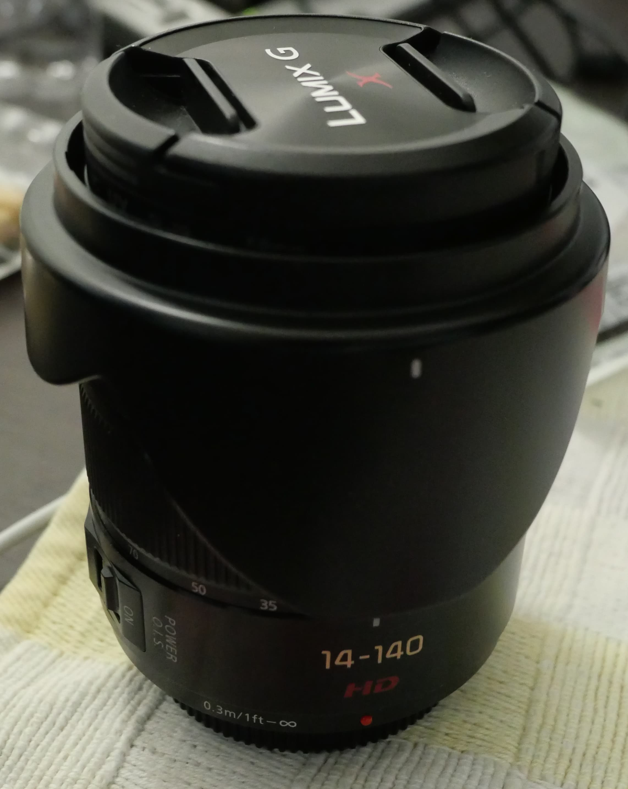
</figure>

知り合いに安価で譲ってもらった。確か花火大会でカメラ持っていったときに、15mmだと遠過ぎて40-150mmだと近過ぎるとかいうことがあった記憶。便利だとは言いつつもぶっちゃけパナライカの15mmが気に入っていてあまり使っていない。使っていないが、この1本でかなりの画角がカバーできて便利なので、40-150mmには退場願って、必要ならこちらに挿しかえて使うような運用になった。最近はこのレンズを持っていくものの使わない、ということが多い。現役のレンズで最も古いやつ。

このあたりからレンズ沼の知り合いが増えてマドハンドの魔の手が伸びるようになってきた。

### LAOWA 7.5mm F2
<figure>
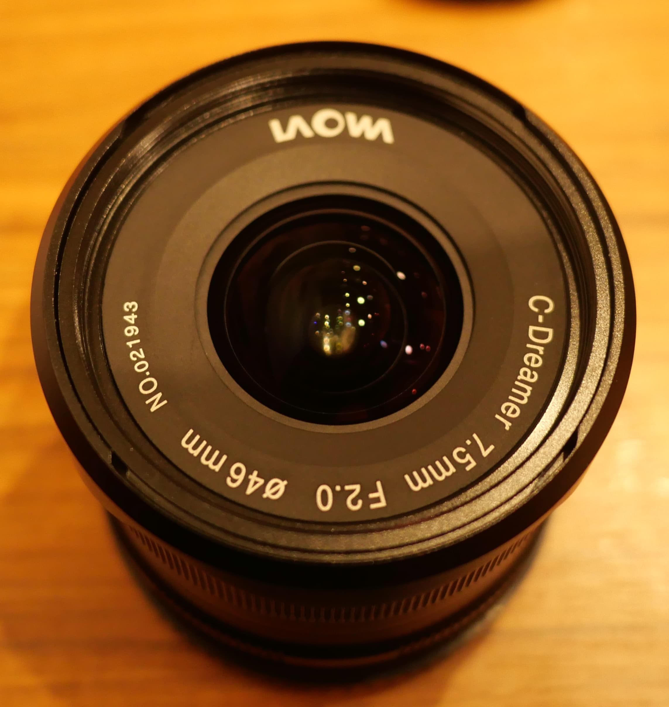
</figure>

あまりにも気に入ってしまい超広角沼に開眼するハメになった傑作レンズその2。実はパノラマ写真を撮りたくなることがまあまあある一方で、面倒くさい上にGX7MK3のアルゴリズムが割とアホなのであまり撮ってはいなかったのだが、広角レンズの話をTwitterでしていて、ふと「15mmよりもっと広角なレンズなら実質パノラマなのでは」と思って買ったレンズ。当初はPanasonicの7-14mm F4が有力な候補としてはあったのだが、薄々「これ15mm F1.7を置き換える可能性があるのでは？」と思って敢えて明るいこのスペックにした。

結論から言ってこの画角はとても気に入り、15mmを一気に端役に追いやったのだが、一方で初のMFということもあり、ピンボケ画像を量産することにもなる。超広角でAFが欲しいという欲求で沼度が一気に上がっていくハメになる。

### Kenko 400mm F8 ミラーレンズ
<figure>
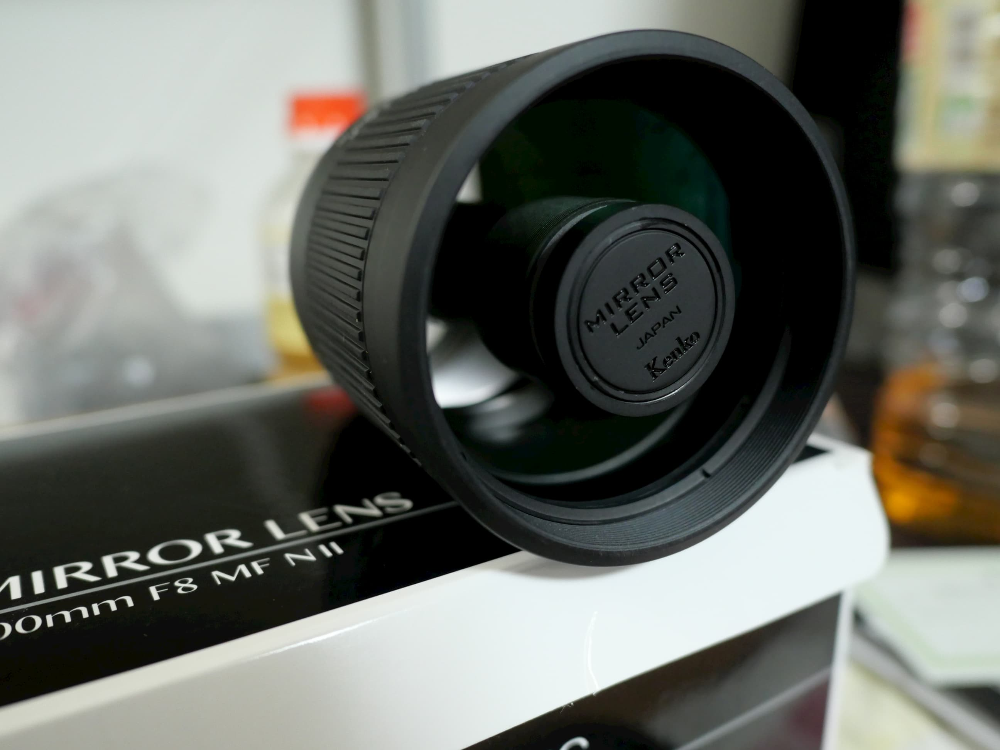
</figure>

非常に安価かつ軽量で換算800mmを実現する割とピーキーなレンズ…ではなくミラーレンズで、猛烈に圧縮する画像が撮れるのは非常に楽しかった一方、超望遠のMFは本当に撮影が困難過ぎてムリという勉強代になった。一応まだ持ってるが捨てそう。

### MACRO-TAKUMAR 50mm F4
<figure>
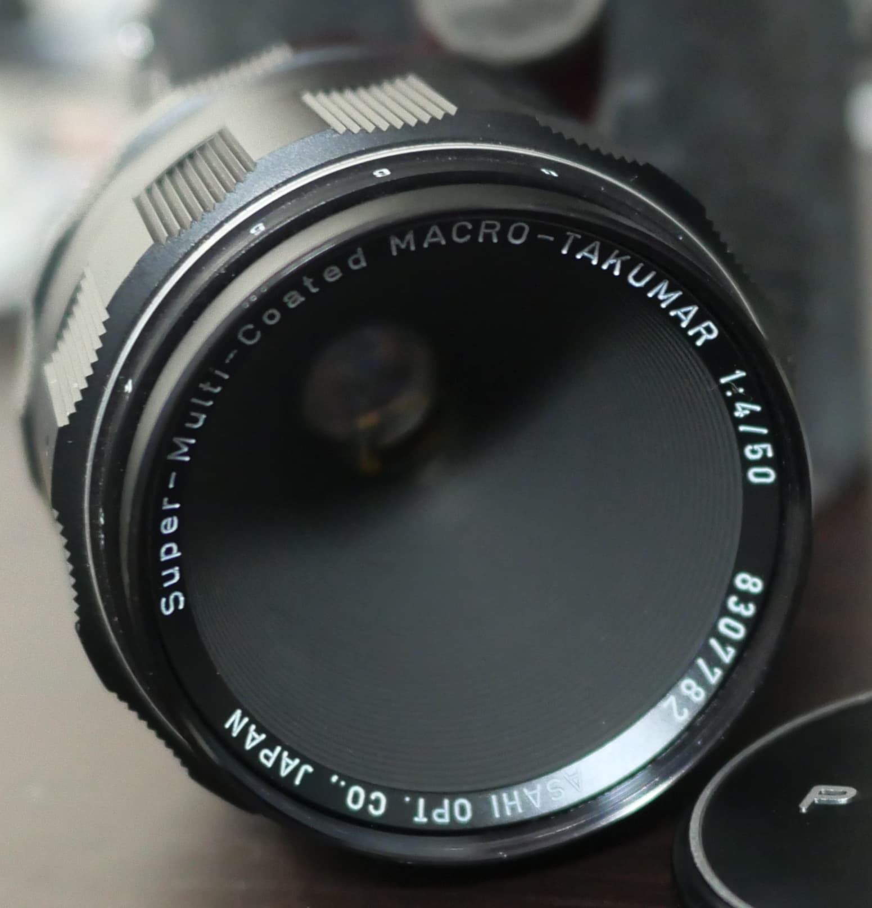
</figure>

マクロレンズ面白そうだけど、そんな金掛けたくないしそういえばM42のアダプタあったなあと思って調べてみたら安価で買えそうなので買ったやつ。オールドレンズではあるが、マクロ撮影はほとんどの場合F8とかまで絞るので、オールドレンズとはいえ描写は悪くない。My New Gearの撮影用として重宝している。マイクロフォーサーズ時代は微妙に遠くて使いづらいが、フルサイズになって近過ぎて使いづらい。カミソリマクロの70mmは本当に筋がいいとおもう。

### OLYMPUS 7-14mm F2.8
<figure>
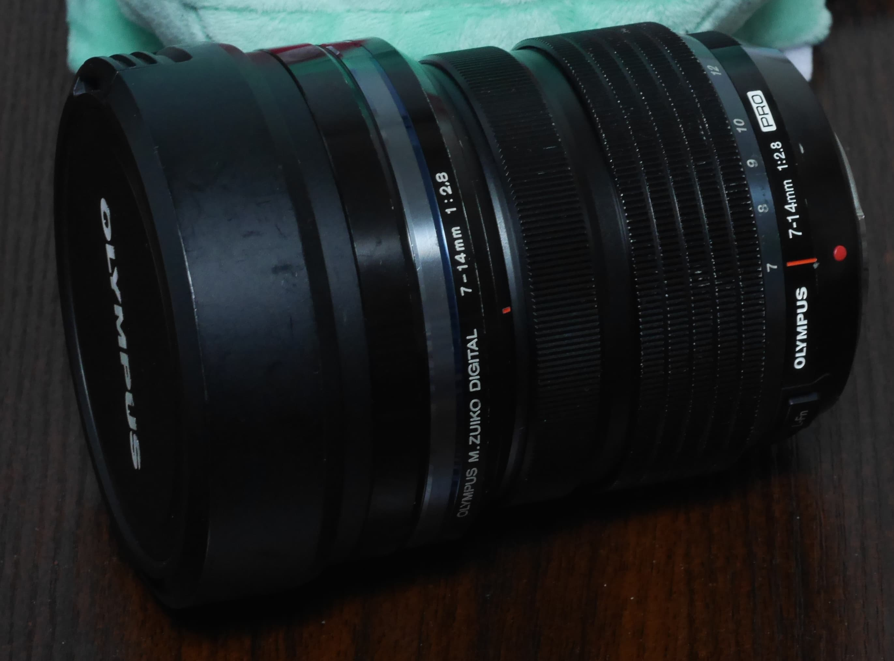
</figure>

超広角でAFが欲しい、に対する回答。マイクロフォーサーズの超広角は本当に選択肢がなくて、実はこのあたりでかなり悩んでフルサイズへの移行を計画したりもしたのだが、結果的にマイクロフォーサーズにしばらく居座ることにした。中古で買ったのだがカメラ機材で始めて10万の大台を突破した。

7mm F2.8というスペックもそうだし、14mmもカバーしてるのは地味に使い勝手がよくて、一時期結構連れ回していた。独特のレンズフレアもかなり気に入っていた。ただ今までのレンズとは比べものにならないほど重いのと、LAOWA 7.5mm F2が頻繁にピンボケしていた理由がオーバーインフであることが分かってきたので、最終的に持ち出し頻度がだいぶ下がっていた。

あとこの重さ(534g)に不満を持っていたある日にNIKKOR Z 14-24mm F2.8の重さがこれと殆ど変わらないことを知って、マイクロフォーサーズのウリの軽さが広角レンズだと殆ど無いことが判明してしまったとかもある。これはフルサイズ移行への布石の1つになる。

フルサイズ移行した段階で上位互換のレンズが手に入ったのでXiaomiをプレゼントした友人に売った。

### SPEEDMASTER 25mm F0.95
<figure>
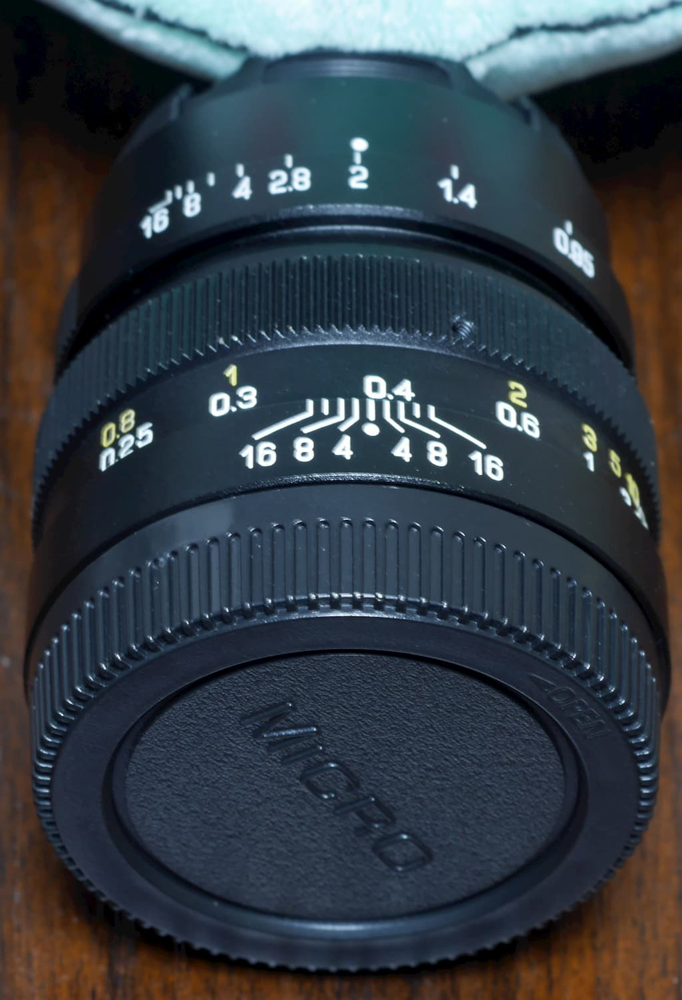
</figure>
偶然夜に人間を撮る機会があったのだが、この条件はマイクロフォーサーズにはかなり重荷であり、マトモに撮れるレンズがなくて、とにかく安価に明るさ稼ぎたいぞ、となって買ったレンズ。

ところが買ってみるとボカせる楽しい、とかなったのと、標準画角と言われているだけあって、超広角のサブ用途としては大変に都合がいい画角だったとかあり、常時NDフィルターを付けて色んなところに連れ回すようになった。逆に使用頻度が高くなったので「もっといいレンズの方がよくね？」ってなってる。

### Panasonic 100-300mm
<figure>
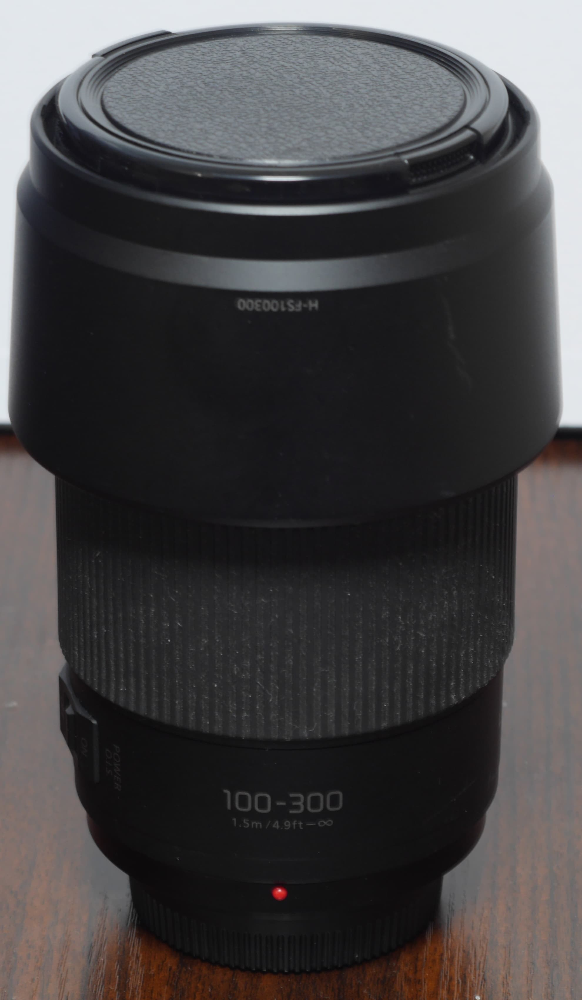
</figure>
400mmのレンズが面白かったけどAFやっぱ必要だわ、に対する解。知り合いから安価に譲ってもらった。このぐらいのスペックになるとギリギリ鳥と飛行機が撮れるので、たまに持ち出して撮りに行くが、やはり鳥の撮影はGX7MK3のAFスペックの問題かむずかしい。鳥を本格的に撮るなら色々買い足しが必要そうとは思いつつも、確実に風景カジュアル撮影路線から外れるので当面は多分やんない。

## GX7の故障とレンタル遍歴
このあたりで換算15mmをメイン機に、換算50mmの2本をサブ機に挿して撮影するスタイルが確立して、2台で色々な場所に連れ回していたのだが、GX7がお亡くなりになったのを機に、次の本体を早急に購入する必要が出てきて、検討をはじめた。

マイクロフォーサーズに留まるのであれば、OLYMPUSを買うだろうと思っていた。Panasonicの本体はGX7系とGF系以外全体的に重いからである。GX7MK3よりも上位モデルでなおかつBluetoothが欲しかったので、この時点で選択肢はE-M1 Mk3しか残ってなかった。スマホ同期まわりを確認するためにPENをレンタルしてみたところ、同期まわりがPanasonicに比べて使いやすいと思わなかったのと、E-M1の値段がフルサイズ本体と同じ値段するのがあまり納得いかないのがあり、マイクロフォーサーズの選択肢が消えた。

この時点で広角レンズの選択肢が豊富なフルサイズ移行が確定したのだが、自分の中ではほぼSONYのα7Cに内定していた。SONYのEマウントはレンズの選択肢が一番豊富なのが目に見えていたからである。ただSONY機は昔スマホ転送まわりがあまりイケてなかった問題があり、当て馬のノリでNikonのZ50を借りたところ、スマホ同期がほぼ完璧でグリップ重量操作性その他諸々がよくできていて正直惚れ込んでしまった。なおα7Cもレンタルする予定だったのだが、人気でなかなかレンタルできなかったので、最終的によくわからない。ただ公式サイト見る限り自動で転送してくれると書いてあるのでまあ大丈夫だろうという結論になった。

## Nikon Z6
<figure>
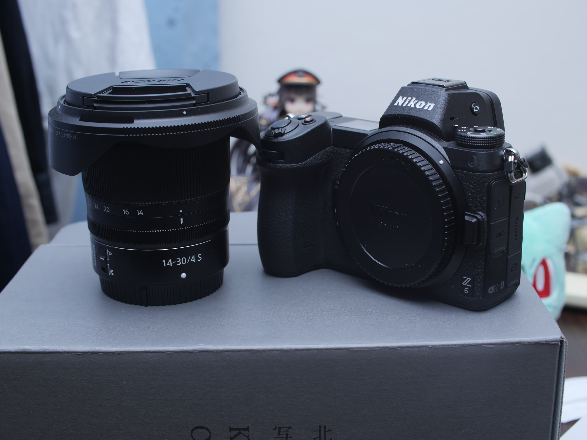
</figure>
と書いたのに最終的にZ6になったのは、土壇場で「SONYはやめとけ」っていう声が掛かったからである。この時点でフルサイズは広角単焦点で使う予定だったので、想定されているレンズがLAOWA/Voigtlanderであり、あまりEマウントに拘泥する必要もないだろう、という話とか、Z50が気に入った直感を信じろ、みたいな話もあり、最終的にかなり値段が落ちているZ6の中古になった。

詳しくは [Z6でNikon入門とフルサイズ入門した話](https://ponkotuy.github.io/ponkotuy-blog/z6/)

最初に買うレンズはLAOWAの予定だったのだが、重量調べてみるとNIKKOR Z 14-30mm F4の方が軽いのと、Voigtlanderはマウントアダプタが必要で、初手のレンズでマウントアダプタはないだろうとかなって結果的にNIKKOR Z 14-30mm F4の中古になった。

ついでにM42のマウントアダプタを買い、オールドレンズを本来の画角で使えるようになった。ここでTAKUMAR 55mm F1.8を使ってみたところ、マイクロフォーサーズと桁違いのボケ量に感動してしまい、本来広角側で使う予定だったフルサイズ機は、標準画角を中心に運用する方針になった。

### NIKKOR Z 14-30mm F4
7-14mm F2.8の代替。これとZ6の組み合わせのAF速度は本当に快適で、30mmまで対応してるのもあって大変便利。風景撮りに行くならとりあえずこれ挿していけばパシャパシャ撮っていける。

ただフィルターに対応しているものの、後ろがスマートなのに前玉とフィルターがあまりにもでかくてかなり不恰好なレンズなのは、唯一のマイナス点かもしれない。現在持ってるレンズでは最高額。

### Voigtlander 65mm F2 APO-LANTHAR
こちらは購入ではなくレンタル。70mm前後のマクロが欲しくて調べてみたところ、Zマウントには無い上に、Eマウントでもカミソリマクロとこれしかなく、TEZ-01というEマウントのアダプタを試しに買って使ってみた。F2であればカミソリマクロのF2.8と違って、お外で50mm単焦点相当の使い方ができるだろうという期待があった。写りは評判通りでかなり気に入ったものの、650gという重さで外に持ち出す前提での運用は無理そうという結論になり、結局買わなかった。あとTEZ-01がレンズ情報も絞り値も渡してくれないとかの問題もあった。

### SONY 50mm F1.8
<figure>
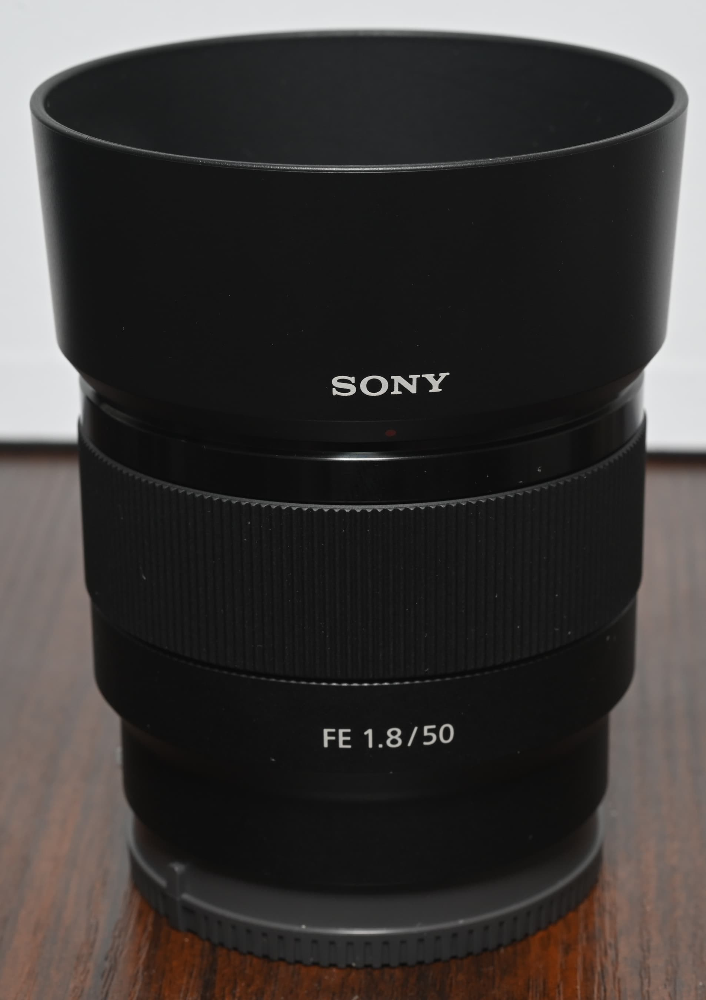
</figure>

Zマウントのカメラを買ったのにEマウントの撒き餌を買っている。これは如何に？先程出てきたEマウントアダプタがあり、なおかつ店頭でめっちゃ安く並んでいたのと、非常に軽いのもあって上位の50mmレンズ買っても使うだろう、みたいな思惑があって購入してしまった。Zマウントの50mm F1.8は撒き餌スペックじゃ全然なくて写りはいいけど高い重いんですよね。

前評判ではAF微妙とのことだったが特に不満が出るほどではなかった。1日伊豆半島で振り回してみたが、やはり50mm画角の使い易さもあり最高だった。

### TAKUMAR 50mm F1.4
<figure>
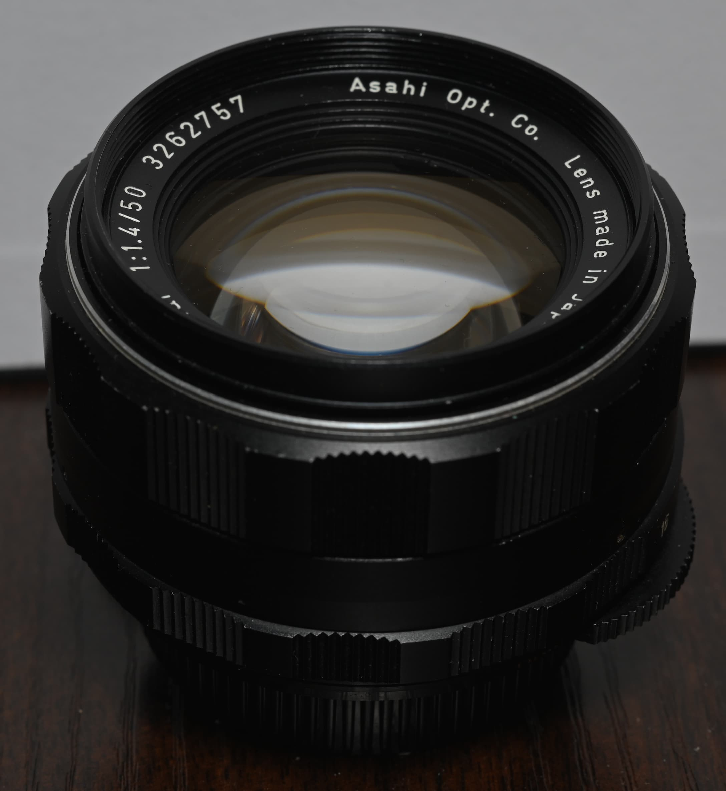
</figure>

SONYの撒き餌レンズより明るい上にレンズフレアが綺麗だったので衝動買いしてしまったオールドレンズ。F1.4とF2.8で全然別のレンズで、F1.4はだいぶ解像が甘いけど、そういう効果として割り切るなら寧ろ有用。常用としてはF2がギリギリかな…。

なおガイガーカウンターで調べたところ、非常に線量の多いアトムレンズだった。
