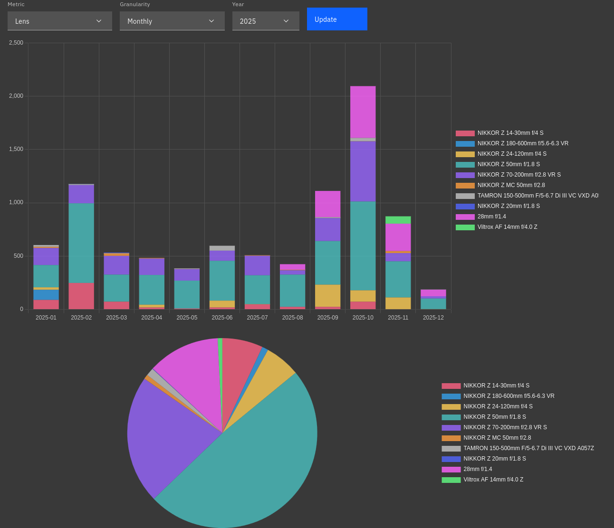
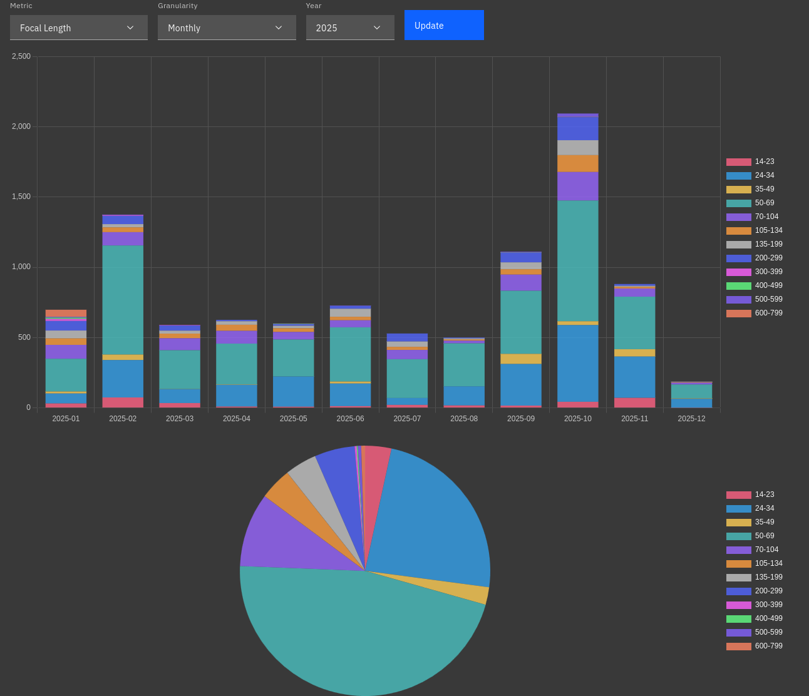

# レンズ使用統計2025
## なにこれ
レンズ使用統計です。使っているレンズと画角を把握して次のレンズに生かそう、みたいな趣旨のやつです。

昔はちゃんとやっていたレンズ使用統計、ここ最近は動きが少ないのもあってツール動かすのだりーとなっていたんですが、作り直して簡単に見れるようになったので今年はやるぞ!となって書いてます。

## レンズ

F 28/1.4を買ったことにより、広角まわりに変動がありましたが、ざっくり50単が半分、望遠が1/4、広角が1/4という比率で推移しています。旅行単体だと結構差があるんですが、年で均すとそんなもんですね。2024年もデータ見てみたんですが殆ど同じなので変動なしです。

それよりも10月の撮影枚数が2週間の北海道旅行で史上最多の枚数を撮影したのと、それ以外の月の枚数が減っているのは今年の特徴かもしれないですね。実は枚数は長期的には減少傾向で、多分旅行の回数は減ってないけど撮影までのハードルが上がってるのかなあって感じです。撮り過ぎると現像が苦しいので…。

## 焦点距離

まあそもそもメイン3本のうち2本が単になったので、レンズとそんな変わらない統計になっちゃったんですよねえ。ツールを改良してレンズ(特に24-120)とかflickrとかでフィルターできるようにしようかな。

## まとめ
ぶっちゃけレンズを買い替えたりした割にはあんまり変わってないすね。今年楽しんだパノラマ類はフィルムだったり電子接点の無いレンズなこともあってカウントされてないのもありますが。だいぶ撮影スタイルも固まってきたということですかね。来年も撮影楽しんでいきましょう。
