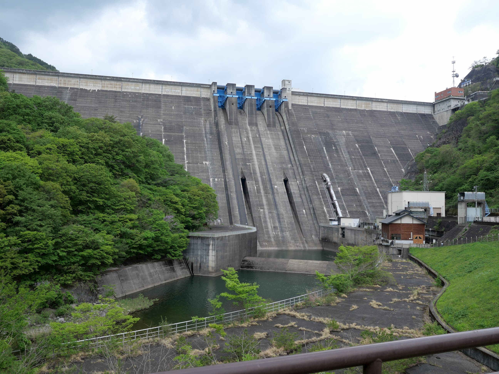
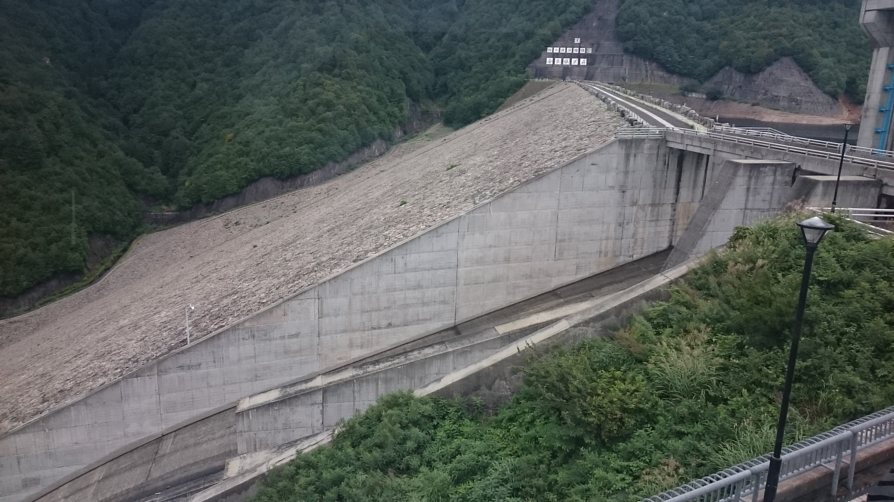
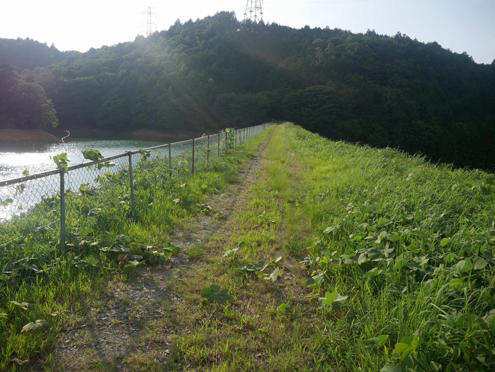

# ダムの基本的な話
2020年ダムAdvent calendar3日目の記事。

自分で立てたダムAdvent Calendarの1日目の記事にする予定で書かれた記事なのだが、後で作られたダムAdvent Calendarの方が集まりが良いように見えたのでそっちに合流し、書き溜めていた記事を放出することにした。

前書いた [ダムの話](https://ponkotuy.github.io/ponkotuy-blog/dum/) の要約と補間も企図している。

## ダム先史
水は人間にとって飲み水や作物の栽培で非常に重要で、きれいな水を簡単に入手可能な川、池のほとりに住むことになったが、それが故にまた洪水の被害に怯えることとなった。

このため、水の制御は多くの人間にとって悲願であったが、土木技術の限界による、数十メートル級の小さな溜池では、限られた地域の農業用水や非常時の飲み水としては十分こそすれ、大河川の本流の流量を本質的に制御するには至らなかった。

しかし19世紀後半になると、人類の土木技術は100mを越えるようなコンクリートの塊を構築できるようになり、大河川の流水量を制御できるようになった。ダム開発の時代である

日本においては、ヨーロッパ諸国より少し遅れて1920年から、大河川の本流の流量に影響を与えるだけの容量を持つダムが建造されはじめた。

## ダムの用途
日本のダムには利水・治水・発電の3用途がある。

### 利水
人間が水を利用するためにダムに貯めておく水。用途としては主に水道水・農業用水・工業用水がある。

ダム開発前の河川はほぼ全量が農業用水として使い切られていて、新規参入の余地に乏しかったので、地方自治体が水道を整備するにあたり、水源開発…すなわちダムの建設によって水を確保する方法が取られることが多かった。

利水用途のダムは容量に余裕が無い限りは、使う分だけ流す、というのが基本原則である。

### 治水
大雨のとき、河川の氾濫を防ぐために、ダムに水を貯めて下流への水の量を減らすことで治水を行う。実際に氾濫が予想される場合は上流からの流入よりも少ない量の水を下流に流すことで、下流に流れる水の量を減らす処理が行われる。もし水が満杯になった場合は「ただし書き」操作に移行し、上流から流入する水の量と下流に流す水の量を均衡させることになる。大ダムがこの操作に移行した場合下流でほぼ確実に決壊が起こるが、勿論できる限りこのようなことが起こらないようにダムの容量を設定したり流量の計画が行われる。

利水と異なり、ダムに貯まっている水は少なければ少ない方が、治水の用に供しやすいため、利水と治水の両方の機能を持つダムでは利水容量と治水容量が別々に設定される。治水容量が必要となる季節になると、治水容量の分だけ水が捨てられ、水害時には最低でもその容量だけ貯め込む余地ができる。

### 発電
日本においては戦後すぐは極度の電力不足にあり、土木技術の発達もあいまって最も効率の良い発電の手段として水力発電用の大ダムが多く建設された。最近では純粋な水力発電用のダムは殆ど無いが、24時間稼動しっぱなしの原子力発電が増えるに従い、昼と夜の電力需要格差を埋めるべく揚水式水力発電が作られた。

特筆すべき点として、発電量は水の量x落差で決まるため、上記2つと違い容量だけでなく落差が重視される傾向にある。このため、落差の激しい渓谷上流部に建設されることが多い。

## ダムの種類
ダムには様々な種類がある。これは地盤や必要な幅、近隣で採取可能な土砂、必要な貯水量、用途などに応じて必要な設計が全く異なり、また高価なので個別設計する余地があるからである。

<figure>

<figcaption>重力式コンクリートダムの草木ダム。大ダムではかなりメジャーな形だ</figcaption>
</figure>

1つ目の分類として、水の重さを支える力を確保する方法による分類がある。多数派はダム自身の重力によって支える広義の重力式のダムに分類され、それとは別に側面の岩盤の力によって水を支えるアーチ式ダムがある。アーチ式は当然側面岩盤の強固さが必要で、その代わり必要なコンクリートの量は少なくなる。

<figure>

<figcaption>アーチ式ダムの奈川渡ダム</figcaption>
</figure>

重力式のダムにはコンクリートで作られる狭義の重力式ダムと、土砂がメインのアースダム、石がメインのロックフィルダムがある。コンクリートの場合、地盤が強固でないといけない代わりに広さがあまり要らないため、大ダムではよくみる形式である。アースダムは溜め池のような小さなものに良く使われる。ロックフィルダムは大規模なものにも使われ、地盤があまり強固でない場合によく作られる。

<figure>

<figcaption>ロックフィルダムに分類される奈良俣ダム。前から見ると分かりにくいが、横から見ると傾斜が重力式ダムよりもかなりゆるいのが分かる</figcaption>
</figure>

<figure>

<figcaption>よくみるタイプの農業用の溜池。小さいが典型的なアースダムだ。</figcaption>
</figure>

また、ダムを建造すると別の箇所から水が流れ出てしまう箇所がある場合もあり、この場合は副ダムを作る必要がある。副ダムが別の種類で作られることもある。
