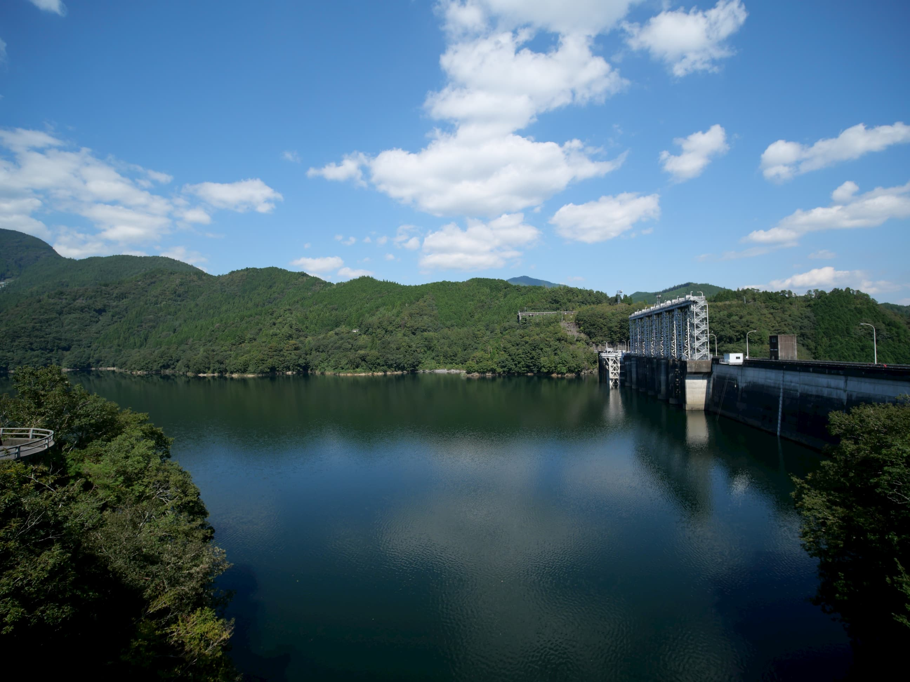
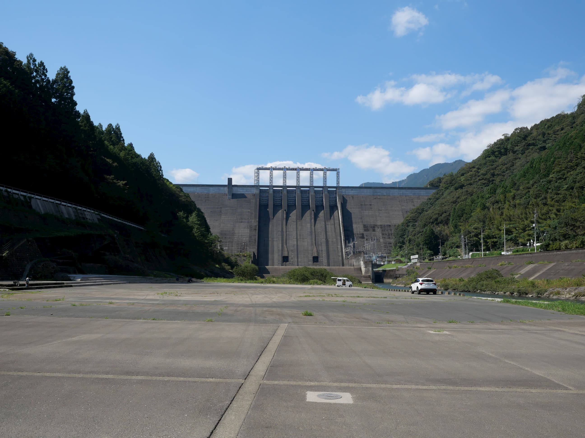
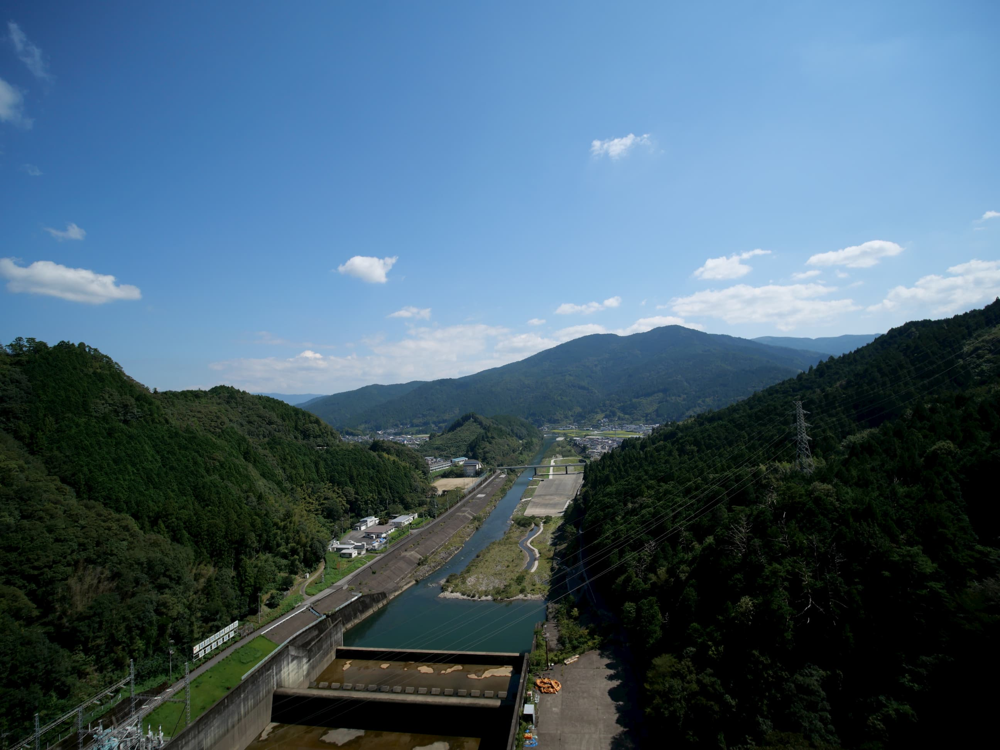

# 早明浦ダム
## なにこれ
ダム Advent Calendar 2020の5日目です。早明浦ダムの話をします。

<figure>

<figcaption>早明浦ダム</figcaption>
</figure>

## 概要
早明浦ダムは四国で最も大きな貯水容量を持つダムである。最も重要な用途として利水用途があり、香川・徳島のほぼ全域と愛媛の東部、高知県の一部向けにも水利権が設定されている。ダムには「四国のいのち」という碑があり、四国東部のほぼ全域に水を供給するこのダムを言い表す言葉としてこれ以上ふさわしい言葉はない。

<figure>

<figcaption>「四国のいのち」の碑</figcaption>
</figure>

早明浦ダムは吉野川水系にある。吉野川は高知県の中心あたりを源流とし、徳島市まで流れている四国の大河川である。大河川の少ない四国では、吉野川流域を潤すのに限らず、数々の用水路が吉野川から導水して山を越えて取水される。特に大規模なものとしては香川用水があり、香川県のほぼ全域と愛媛県の一部に水道水・農業用水を供給している。その水源地としての早明浦ダムの重要性は非常に高い。

また治水容量の設定があり、非常に台風が多い地域でもあるので、治水目的でも重要性が高い。

## 工学的知見
早明浦ダムはよくある重力式コンクリートダムである。堤高は106mであまり高くはないが、水を溜め込むには都合のよい地形であるため、日本でも十指に入る容量のダム湖、さめうら湖を形成する。

<figure>

<figcaption>ダムとさめうら湖</figcaption>
</figure>

## 写真

<figure>

<figcaption>下からの早明浦ダム</figcaption>
</figure>

<figure>

<figcaption>ダム堤から下流</figcaption>
</figure>
