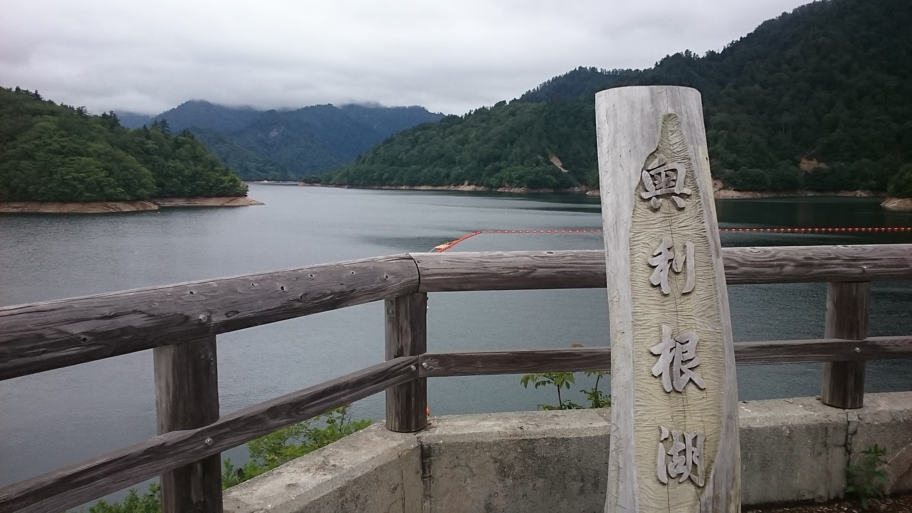
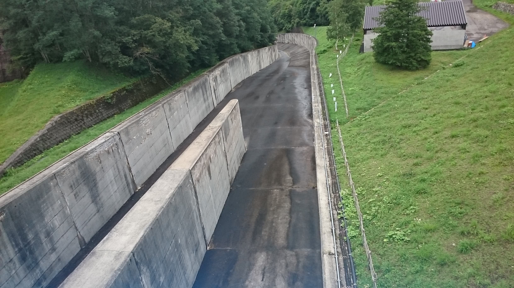
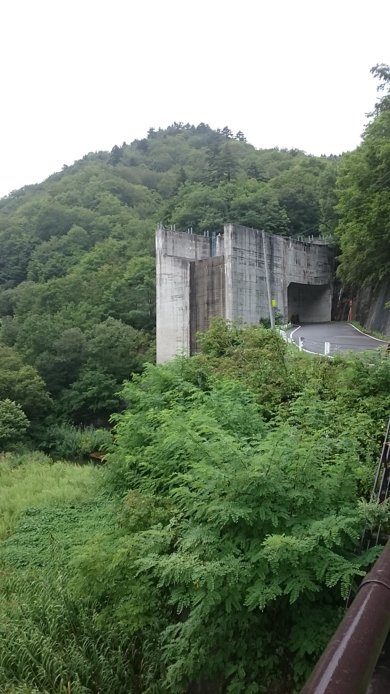
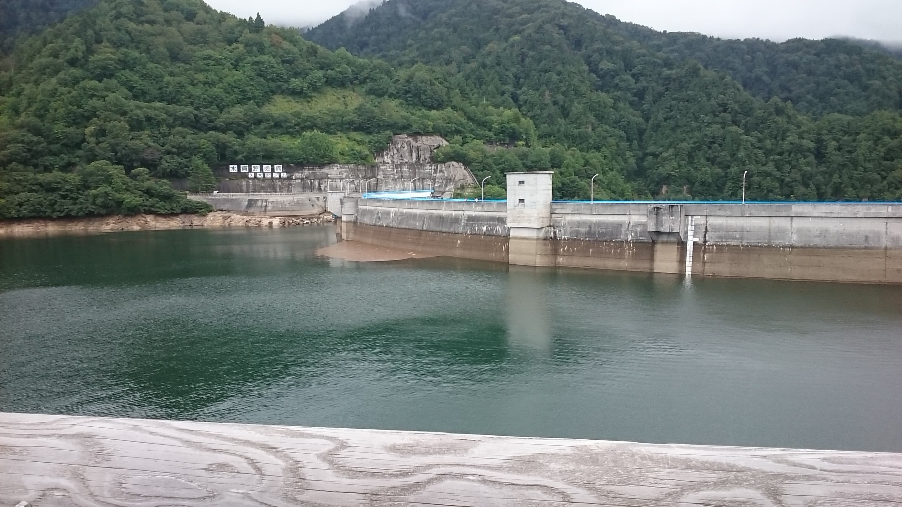

# 矢木沢ダム
## なにこれ
[ダム Advent calendar 2020](https://adventar.org/calendars/5056) の7日目です。矢木沢ダムの話をします。

<figure>

<figcaption>矢木沢ダム。良い撮影スポットが少ない…</figcaption>
</figure>

## 概要
首都圏に水を供給するダムの中で最も大きな貯水池、奥利根湖を持つ利根川水系のダム。65%が利水容量で、20%は揚水発電専用の容量、残りが洪水調節の容量である。利水容量のうち半分が群馬県の農業用水、残りは東京都と群馬県の都市用水が半々で使うような設定になっている。

<figure>

<figcaption>奥利根湖。東京と群馬の重要な水源である</figcaption>
</figure>

矢木沢ダムの発電所は東京電力が初めて設置した揚水発電所で、矢木沢ダム直下にある須田貝ダムを下池として、電力の需要に合わせて水を上げ下げしている。

矢木沢ダムは利根川の源流のすぐ近くという大変奥まった場所にあり、前人未踏の地であったので補償の問題はなかったダムである。そのため、矢木沢ダムに至る道路はダムを所有する水資源機構の私道という扱いになっており、通行可能な時間が限られている。

## 工学的知見
矢木沢ダムはアーチ式のコンクリートダムで、高さ131mもある。正面左側にロックフィル形式の脇ダムを持っている。ダム堤本体に洪水吐きはなく、脇ダムから沢に向かって大きな水路を設置して放流する、あまり見られない仕組みになっている。

<figure>

<figcaption>洪水吐を上から。脇ダムのダム堤の上から撮った写真。長く大きな水路になっている</figcaption>

<figcaption>洪水吐を下から。本流ではなく沢の1つに流している</figcaption>
</figure>

<figure>

<figcaption>矢木沢ダムの裏側</figcaption>
</figure>
