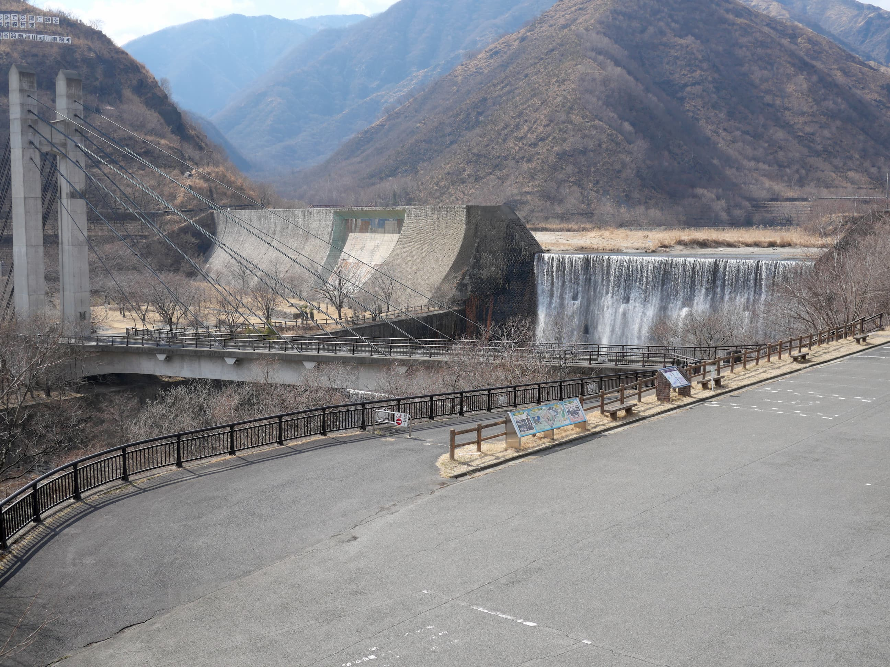
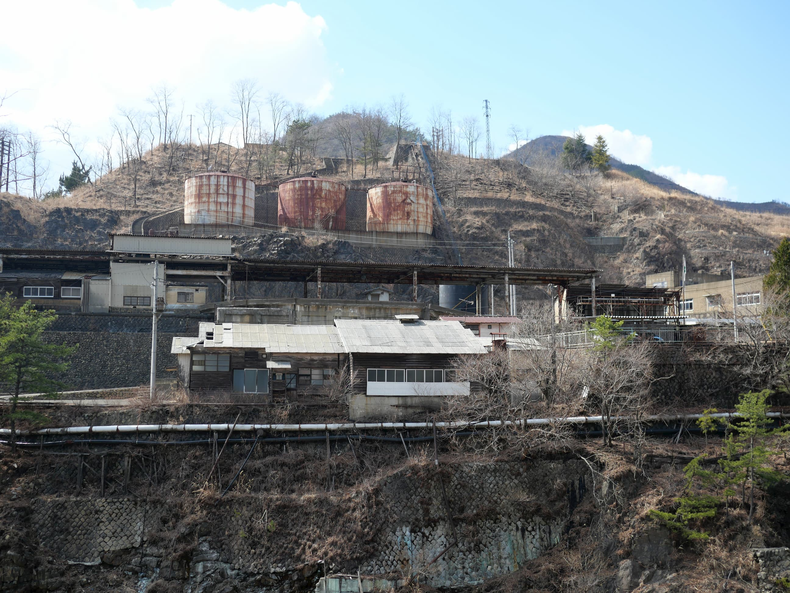

# 足尾砂防堰堤
## なにこれ
[ダム Advent calendar 2020](https://adventar.org/calendars/5056) の11日目です。一般的なダムの定義とは外れるのですが、足尾にある砂防ダムの話をします。

わたらせ渓谷鉄道の終点、間藤駅から更に奥へ行くと、渡良瀬川に突如としてダムのような巨大な構造物があらわれる。しかしこれはダムはダムでも砂防ダムである。

一般的に砂防ダムは渓流と呼べる程度の沢にあるのが一般的で、大河川の本流ではあまりみかけないのだが、この足尾の渡良瀬川本流にある砂防ダムは非常に大規模である。

<figure>

<figcaption>はげ山に対するこのような工事中らしき痕跡は沢山ある</figcaption>
</figure>

元々足尾銅山を有する足尾一帯は、坑木や薪などの需要が旺盛で、それによる伐採と、鉱毒による被害などが重なってはげ山となっており、土砂災害が大変おきやすい状況となっている。そのための対策として周辺ではかなり大規模な治山事業が行われており、その最大規模の成果物がこの足尾砂防堰堤である。

<figure>

<figcaption>砂防ダムの更に上流。渡良瀬川の源流は近い</figcaption>
</figure>

<figure>

<figcaption>付近一帯は足尾銅山関連施設の廃墟が沢山残っている</figcaption>
</figure>
