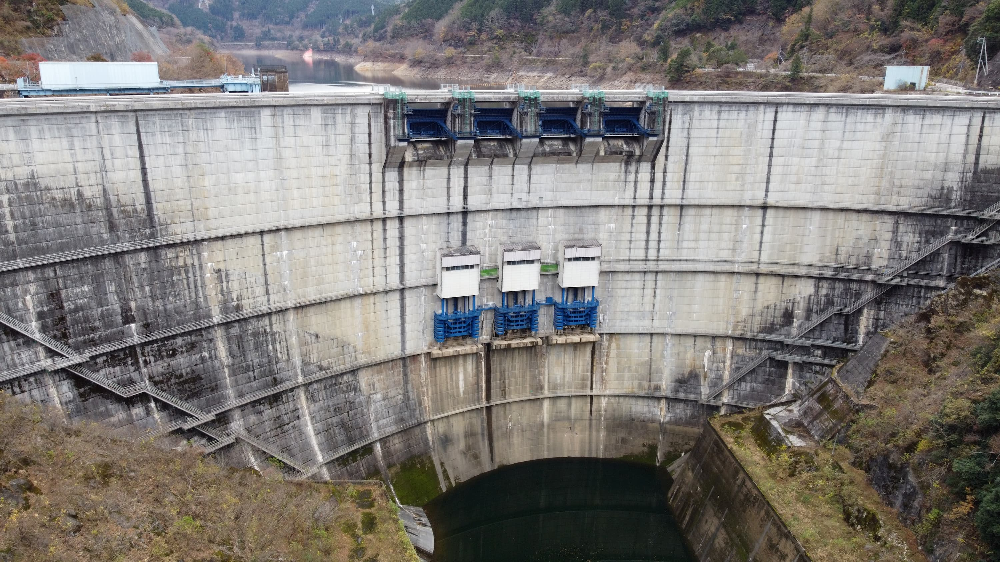
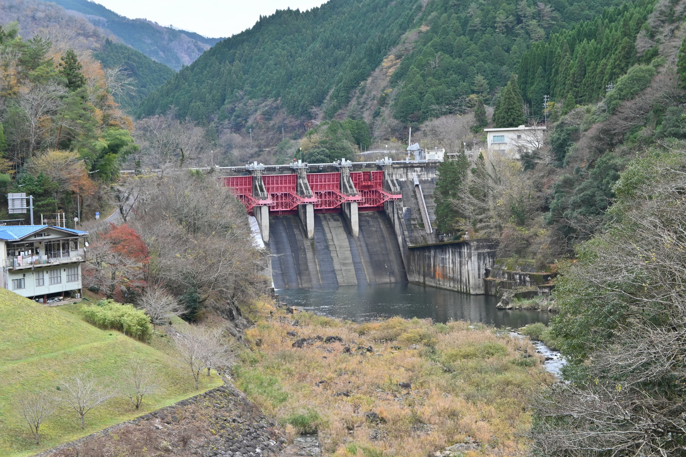
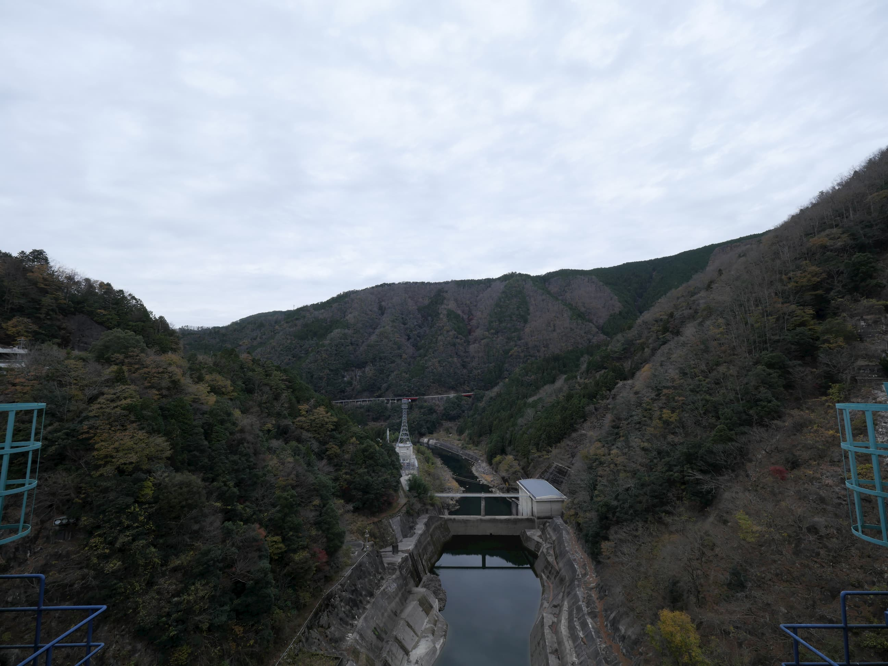
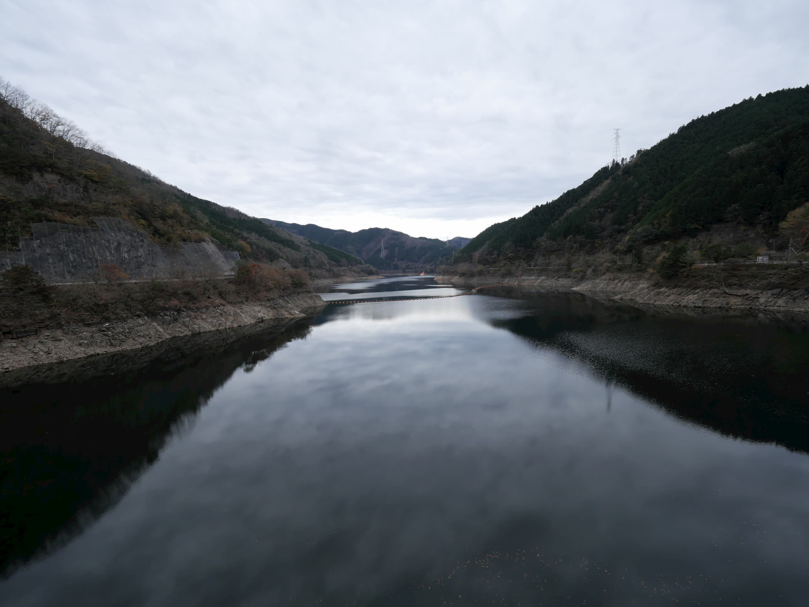
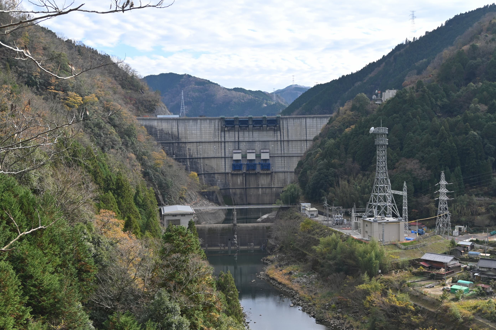

# 矢作ダム
## なにこれ
[ダムAdvent calendar](https://adventar.org/calendars/5056)6日目が空いてたので勝手に埋めた記事です。11月末に矢作ダム行ったのでその話をします。

<figure>

<figcaption>矢作ダム。高さよりも幅が大きいダムである。</figcaption>
</figure>

## 概要
愛知県は大河川が多く水に恵まれた立地であるが、矢作川はその一端であり、愛知県の中央、西三河(有名な豊田市が含まれている)を潤す川である。そして矢作ダムはその上流にある矢作川水系最大のダムである。伊勢湾台風の傷跡の深い地域でもあり(治水)、豊田自動車などの工業も盛んで(工業用水)、安城は安定した水供給の結果として、有数の高い生産性を誇る農地になったし(農業用水)、トヨタ自動車の多くの従業員や名古屋の郊外としての役割もあり(水道水)、また周辺には中小の発電所が数多く接続されており、非常に多岐に渡って西三河の生活を支えるダムである。

25%が洪水調整容量で、残りが利水用途で設定されている。最大取水量ベースで84%が農業用水として設定されていて、続いて8.8%の工業用水、6%の水道用水と続く。農業用水は農繁期のみ流す容量であるので、実態として使われる容量はそこまで多くないと思われるが、首都圏のダムと違い、産業用途(農業・工業)の比率が非常に高いのが特徴のダムである。

矢作ダム単体としては電力用の容量を持たないが、奥矢作湖から富永貯水池を経由して黒田ダムの黒田貯水池まで揚水することで揚水式発電を行うことができ、電力調整機能としても重要な役割を果たす。

<figure>

<figcaption>矢作ダムの下流にある矢作第二ダム</figcaption>
</figure>

直下に高さ38mの発電専用の矢作第二ダムがある。

## 工学的知見
矢作ダムはアーチ式のコンクリートダムで、高さは100m。本体に洪水吐がついている、よくあるアーチ式ダムである。

## 写真

<figure>

<figcaption>矢作ダムの下流</figcaption>
</figure>

<figure>

<figcaption>奥矢作湖</figcaption>
</figure>

<figure>

<figcaption>矢作ダムの周辺。すぐ近くまで民家が迫ってきている</figcaption>
</figure>
