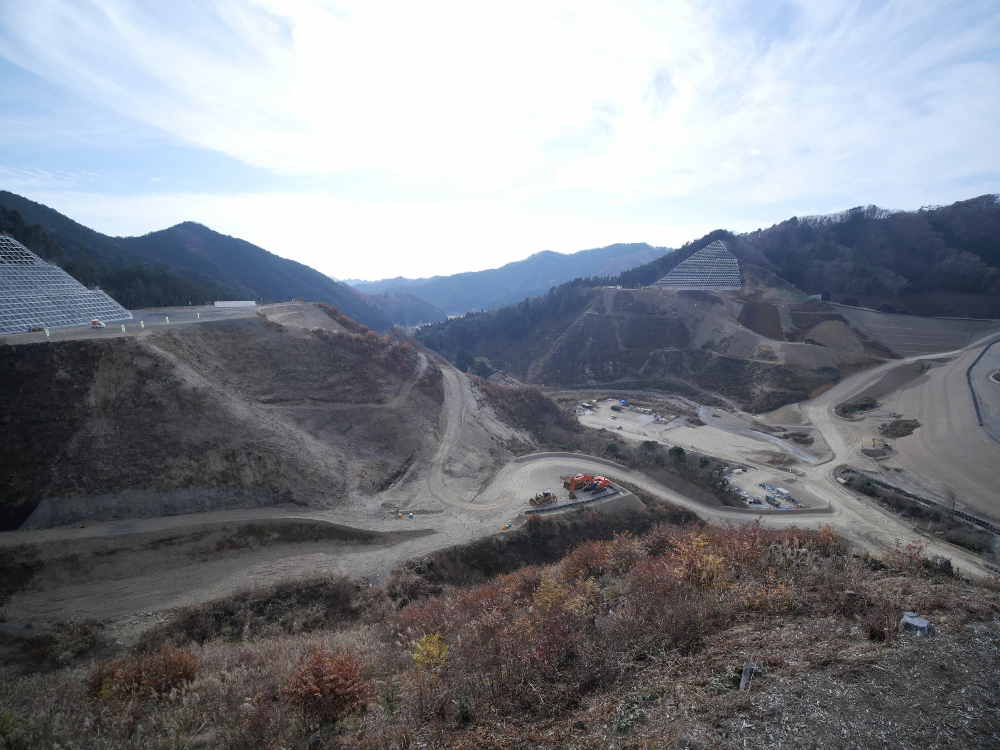
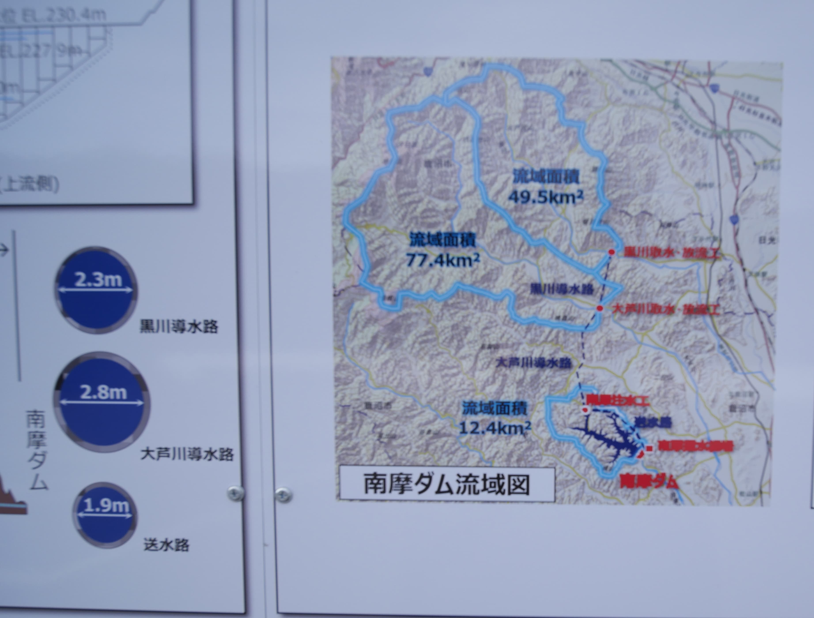
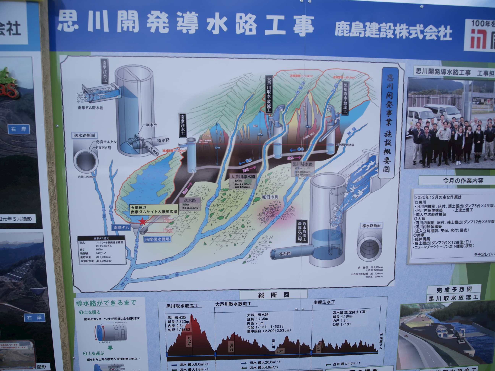
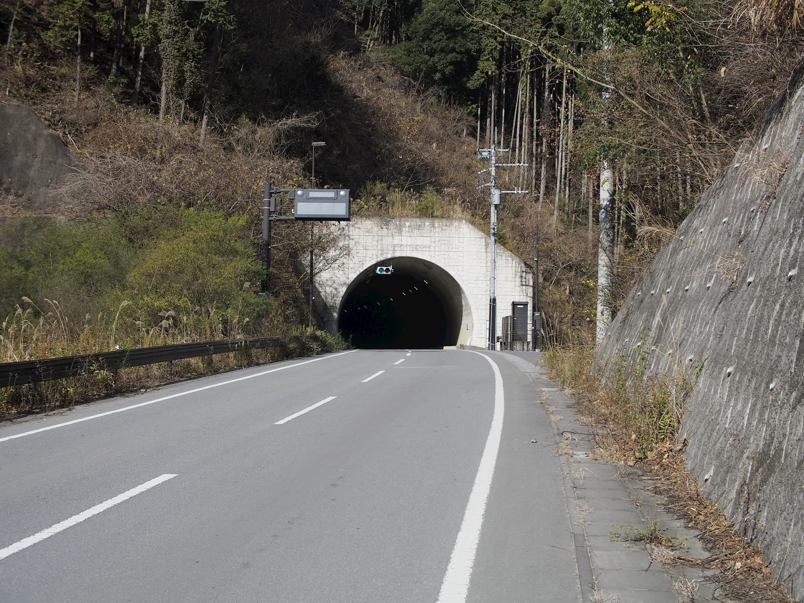
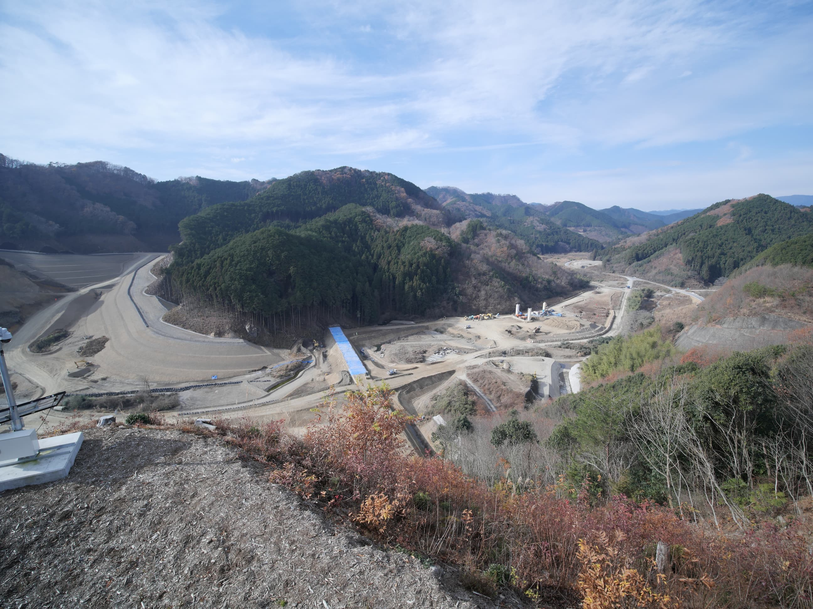

# 南摩ダム
## なにこれ
[ダムAdvent calendar](https://adventar.org/calendars/5056)15日目が空いてたので勝手に埋めた記事です。最近南摩ダムの建設現場を見てきたのでその話をします。

<figure>

<figcaption>建設がはじまったばかりの南摩ダム。ダムを乗せる基礎を作っている</figcaption>
</figure>

## 概要
首都圏の利根川水系の、今現在建設中のダムである。思川という渡良瀬川の大きな支流の支流、南摩川の源流近くに建設中のダムである。

<figure>

<figcaption>流域面積の解説看板</figcaption>
</figure>

最大の特徴として、南摩ダムは他の大ダムとさほど遜色のない貯水量を持つダムでありながら、集水面積が著しく小さい点にある(12.4平方キロ)。このままでは利水に必要な水量を永遠に溜め込むことができないため、大芦川(77.4平方キロ)、黒川(49.5平方キロ)と南摩ダムの貯水池を、水路で相互に結び、それぞれの川で水を取水し導水することで南摩ダムの水量を確保する。日本では他に例を見ない形式である。勿論、水路の分コストが上乗せされてくるが、首都圏のダム開発は基本的に開発され尽くされており、このような高コストな立地にもダムを建設する必要が出てきたというのが実態であろう。

南摩ダムの有効容量のうち10%が洪水調節容量で残りが利水容量になる。平成27年の関東地方の豪雨で思川は実際に決壊しており、思川上流で洪水調節のできる唯一のダムとしての働きが期待される。残りは利水容量で、「流水の正常な機能の維持」のための容量を除いた部分は水道用水として確保される。水道用水は栃木県内で30%、古河市に20%、埼玉県に40%、千葉県に10%が割り当てられている。

<figure>

<figcaption>水路工事の解説看板</figcaption>
</figure>

水路は黒川→大芦川で毎秒8立法メートル、大芦川→南摩ダムで毎秒20立法メートルの導水能力がある。逆方向として、南摩ダムから各河川へポンプを使って水を戻す機能を供えており、このポンプは毎秒4立法メートルの能力がある。

## 工学的知見
コンクリート遮水壁を持つロックフィルダムである。ロックフィルダムは基本的に砂利や粘土の重さで水を堰き止めるタイプのダムなのだが、当然砂利や粘土だけでは水が浸透してしまい、最終的にダムの決壊をまねくため、なんらかの形で水を通さない層が必要で、よくあるのはダムの中心に粘土質のコア材を遮水壁として設置する方法だが、このダムのコンクリート遮水壁タイプはダム湖側の表面を覆うコンクリートによって止水をおこなう。ダムの高さは86.5mである。

<figure>

<figcaption>ダムによって水没するために付け替えられた県道。ダム建設工事に必要な土砂を運ぶダンプカーがひっきりなしに行き交っていた</figcaption>
</figure>

<figure>

<figcaption>南摩ダム湖になる方向</figcaption>
</figure>
