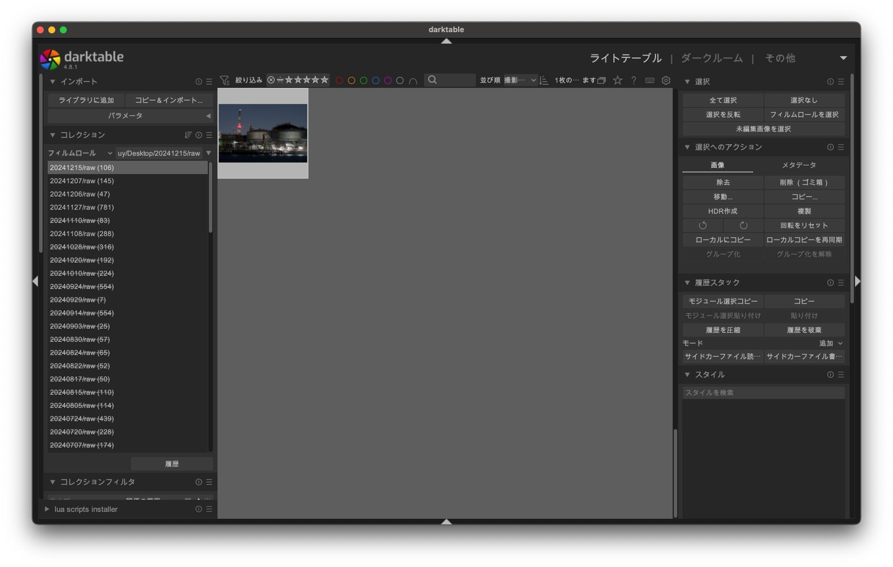
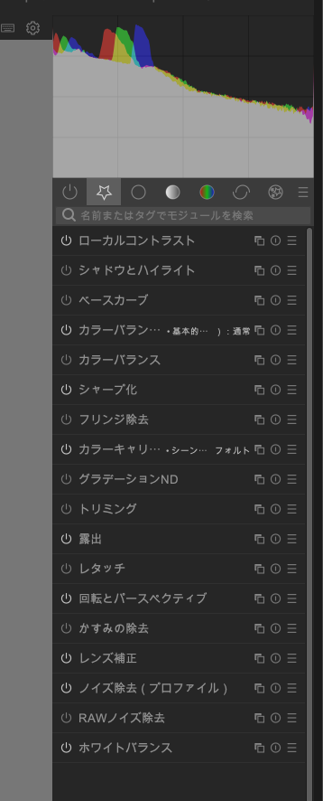

# Darktableで現像入門

## 概要

デジタル写真時代の現像は撮影後に補正作業などをして仕上げる作業のことを言います。フィルム時代の現像は感光したフィルムを現像液につけることによって像を浮き上がらせる必要があったわけですが、その際に様々な補正を行うこともできました。なので同じ名前が付いていても当たらずとも遠からずといったところでしょうか。

現像ソフトウェアは有料のものを中心に様々なものがありますが、Darktableは無料で使える数少ない現像ソフトウェアの1つです。OSもWindows/mac/Linuxに対応しています。

Darktableの特徴の1つは良くも悪くもユーザに知識を要求する点にあります。自分が使っている現像ソフトはDarktableの他にもDxO Photolabなどがあり、こちらは最初からそれなりの画像が1clickでパッと出るようになっています。DarktableはDxO Photolabには無い機能がいくつかあるものの、困ったことに最初に出てくる画像が滅茶苦茶微妙だったりします。これは有料ソフトが最初から自動で入れている様々な標準的な「映えるツール」が入っていないことに起因しています。Darktableは自分でチョイスする必要があります。まあまあ大変です。でした。

この記事の目的はDarktableを使って有料ソフトが自動でやってることを理解しつつ、早期に映える写真を出せるようになることにあります。早速やっていきましょう。

## ソフトウェア以前の話

デジタル時代の現像は、デジタルカメラであれば間違いなく行っていることの1つです。一般によく見るJPEG形式の画像はカメラ側で撮影した瞬間に自動で現像された結果出力されたファイルで、最初から調整されており、サイズを適切に保つため撮影のときに本来持っていたデータはかなりオミットされています。カメラが撮影時に取得した全てのデータを使用して現像し直すためにはカメラの撮影時の生データが必要です。これをRAW形式と呼びます。

RAW形式はカメラ各社の仲が悪いからか全く統一されていません。とはいえ有名な現像ツールであれば、特定メーカーから出たものでない限り一通り対応している筈です。まずはカメラの設定をRAW形式で出力するように変更しましょう。ファイルのデータ量が10倍ほどになるため、必要であればストレージの増強をしましょう。JPEGも同時に出力するのが便利なのでぼくはそうしています。

## mac版特有事情

macを使っている貴方には残念なお知らせがあります。フリーソフトなのでmac版は開発元認証がなされていません。適宜対応してください。

[https://support.apple.com/ja-jp/guide/mac-help/mh40616/mac](https://support.apple.com/ja-jp/guide/mac-help/mh40616/mac)

## ライトテーブル

インストール後アプリを開くと上のような画面が出てくると思います。まず左上のインポートの「ライブラリに追加」で現像したいファイルを含んだディレクトリを選択しましょう。右に中身のファイルが表示される筈です。

このモードをライトテーブルモードと呼びます。画像ビュワーが中心のモードです。ここでは画像を弄ったりはしません。

## ダークルーム

右上にモード選択があります。ここを弄るとダークルームモードに入ります。または編集したい画像をダブルクリックでも入ります。これが編集モードです。テーブルで選んで暗室で現像みたいなノリなんだとおもいます。

左上に縮図と倍率指定があります。真ん中の画面内に収まるサイズで表示する倍率をフィットと呼んでいます。100%にするとドットバイドットで表示します。マウスホイールでも拡大縮小できます。

左のメニューの一番下にエクスポートがあります。できたらJPEGなどに吐き出すことができます。最初は吐き出し先のディレクトリとJPEG品質だけは気を使いましょう。

右のメニューがDarktable、現像のコア部分であるモジュールです。モジュールをON/OFFしたり設定値を変更することによって、明るさやコントラストを弄って写真を仕上げていくことになります。

## モジュール

モジュールはタイトルバーの左のアイコンでON/OFFできます。右にあるハンバーガーメニューで様々なプリセット値が設定できます。そのとなりの○のボタンはパラメータをデフォルト値に戻すことができます。

普段使わないモジュールは検索窓で検索したりすればいいんですが、よく使うものは1まとめにしてモジュールグループを1つ作っておくといいとおもいます。画像でも☆のグループがそれになっています（1つ左は適用されているモジュールのグループです）

次からは個別のモジュールの説明をします。

### ベースカーブ

現代の写真は明るい写真が一般に好まれます。しかし雑に明るさをスライドすると単に白くなるだけであることに気付きます。真ん中の色を持ち上げつつ、最初から明い色はあまり弄らないような操作を求められます。1つの方法はベースカーブを調整することです。

ベースカーブのプリセット値にはメーカーの名前が付いています。大体メーカーが出している色に近いような色が出てきます。個人的に強めに弄りたい場合はFUJIFILM、弱めに弄りたい場合はPanasonic、中間はNikon、ぐらいのノリで使っています。

と言いつつ、実はぼくの写真はベースカーブ弄っている写真は1%もないです。ベースカーブを弄らない場合、別の形で弄る必要があります。

### 露出

実は明るさを弄るモジュールというものは存在しません…アッ待って！Darktable捨てないで！順番に説明します！RAWデータというのは基本的にモニターやJPEGで出力可能な明るさ範囲を越えています。この範囲を狭めるか微細な色の変化を塗り潰してのっぺりにするかする必要があります。それらを全て自動でやってくれるのが露出です。デフォルトでONになっています（OFFにすると大変なことになります）。

もちろん機械調整が常時うまくやってくれるとは限りません。そのときは露出モジュールのタブを開いて露出パラメータのスライダーを調整します。これで明るさだけを調整できます。デフォルトで+0.7EVぐらいになっています。＋0.7EVでも結構暗めであることが多い気がします。

### ローカルコントラスト

ぼんやりした写真の境界のコントラストだけを上げてクッキリさせます。とりあえず無条件で入れることが多いです。

### シャープ化

写真の細かい構造をクッキリさせます。デフォルトは弱めなので無条件に入れちゃいます。ヨドバシのプリントくっきり写ってるようにみえるんですがシャープネスが強過ぎるだけじゃね、ってなったり。

### カラーバランスRGB

無条件で入れがちなやつ。色味を増やすやつです。難しそうなのでプリセットでしか運用してないです。暗めな写真にパッと赤い色が浮いてるような写真が大好きなのでほぼ100％入れてます。あと新緑の緑とかが一気に鮮かになります。ベースカーブと両方入れると色が濃すぎる印象もあるので、どちらを入れるかはよく考えて。

### レンズ補正

デジタル時代のレンズはデジタルで補正することを前提に設計されていることがあり、レンズ特性に合わせてここで補正します。ここをONにしない理由はあまり思い付かないですね。

1つだけ、レンズは外側の光が減ることがよくあって、周辺減光と呼ばれるんですが、真ん中を際立たせることができる側面もあるので、周辺減光を意図的に補正しない、という表現手法があります。レンズ補正3パラメータで周辺減光だけ無い選択肢を選べばいいです。個人的には結構使います。

### ノイズ低減（プロファイル）

ISO感度を上げるとノイズが出ます。800ぐらいで結構出るような感じなので、ISO100-200以外ならセットする、または無条件に付けるでいいと思います。こっちのノイズ低減は効果は控えめですが、副作用も少ないので雑に入れていきましょう。

### RAWノイズ除去

結構効果が大きいノイズ除去です。一方で拡大すると分かりますがだいぶディテールを破壊します。最低でもISO6400などから検討することになるでしょう。Darktableのノイズ除去はかなり下手糞なので正直キツいところがあります。

### ホワイトバランス

暖色のライトや電灯下でも人間の目は白に補正してくれたりするわけですが、カメラはホワイトバランスをキッチリ補正してやらないと人間が見たような白にはなりません。領域から自動設定するなりにそれなりにうまく補正してくれるので、色がおかしいと思ったら設定を変えてみましょう。

ちなみにホワイトバランスをONにするとカラーキャリブレーションからエラーが出ます。カラーキャリブレーションを切ってホワイトバランス補正の二重適用をやめる必要があります。

### トリミング

写真を切ります。[良い写真を撮る方法](../good-photo/)で狭く撮る、と言っていたとおりです。要らない場所はガンガン切りましょう。縦横比を弄ってもいいとおもいます。

### 回転とパースペクティブ

水平を補正したり、広角レンズによる台形を補正します。水平はキッチリ合わせていきましょう。広角レンズで撮った建物みたいな人工物は結構綺麗に自動補正が効くことがあります。

### かすみの除去

遠くの景色は水蒸気によって白くなりがちです。そんなときはここをONにするだけでスッとくっきりします。ちょっと写真が白っぽくなっちゃったら雑にONにしていきましょう。デフォルトはそんなに強くないので。+0.40ぐらいまではたまに使うんですか、違和感が出てくるので気をつけてください。

### カラーバランス

コントラスト設定があります。全体的に明るさの差が小さく感じるときは上げましょう。大きすぎると感じるときはシャドウとハイライトの方がいいかも。

### シャドウとハイライト

明る過ぎるところの明るさを下げて、暗すぎるところの明るさを上げます。陰が消えるような感じです。かげって真っ黒の写真を直したりするのに使います。とはいえ陰が消えるので立体感が消失します。使い過ぎには注意！

### レタッチ

絞って撮ったりすると青空に黒い点ができたりします。センサー面にゴミが乗ってると出てきたりするやつです。近くの綺麗な領域からコピーしてきてそういうゴミを消すことができます。たまにカラスとかも不要だと判断すれば消したり。電線もモノによっては消せなくはない。とはいえ現代のAIなどに比べるとしょぼくて、Photoshopとかあるならそっち使った方がいいです。

### グラデーションND

日の出、日の入りを撮る際は太陽にレンズを向けることが多いんですが、太陽はどうやっても明る過ぎるので、太陽のある上面を意図的に暗くしたりするフィルターを使ったりします。これをグラデーションNDフィルターといってカメラ用品店などで売ってるんですが、それをデジタルで再現するものです。シャドウとハイライトの代わりになることもあります。

### フリンジ除去

偽色やパープルフリンジなどを除去します。安いレンズとソフトパスフィルターの付いてない高画素機で稀に発生します。これをONにするだけでかなり綺麗に消してくれます。エラーが出て代替モジュールを案内してくれますが、こっちの方が手元で発生しがちな高画素機の偽色には効果があるので無視しています。稀に使っています。
