# ダムの話
ダムが好きなのでしょっちゅうダムに行くし、首都圏で行ってないダムはだいぶ少なくなってきているぐらいなのだが、ググってもあまり情報が出てこないものも多く、一旦まとめようと思って作った記事。

## ダムのコスト
### 立ち退き
ダムは巨大な人造湖を発生させるために、比較的多数の地域住民に立ち退きを要請される場合が多く、建設に長期を要したダムのほとんどはこの立ち退きと金額の話し合いがこじれたパターンが多い。立ち退きが全くなかった奥地のダムもたまにあり、このようなダムは比較的早く完成していることが多い一方で、ダム建設に伴うアクセスの整備にコストが掛かる傾向がある。また長期化することで上がるコストもあるため、立ち退きの人数や面積はコストに大きく響く。

### 建設費 
<figure>
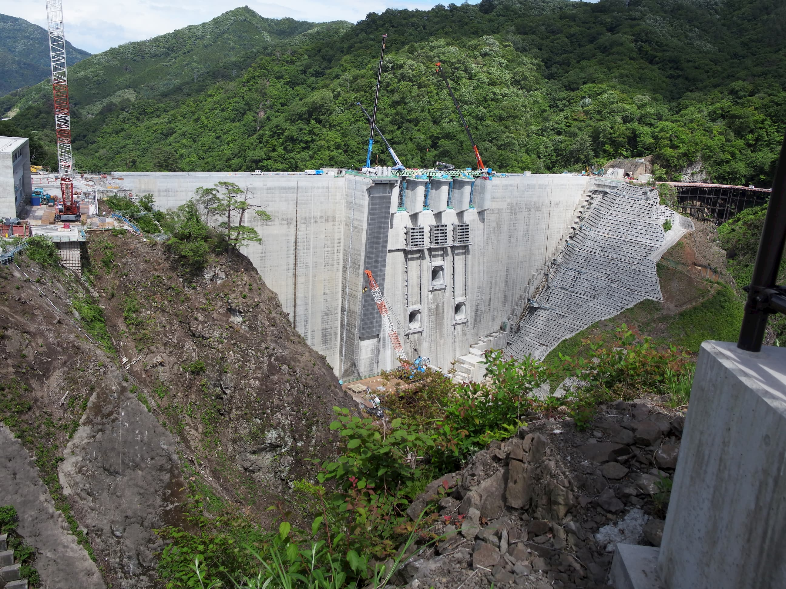
<figcaption>建設中の八ッ場ダム。利根川水系の支流、吾妻川に建設されたダムで、補償問題がこじれて建設が非常に長期化した。2019年6月16日撮影。工事の開始が2015年、2019年10月1日から試験湛水が始まっているのでほぼ完成直前の姿である。</figcaption>
</figure>
ダム本体の建設費も膨大であるが、それだけではなく、ダム建設にともなう新規の道路建設や、既存道路鉄道の迂回工事(多くの場合大規模なトンネル建設を伴っている)や、工事中河川を迂回するためのトンネルなどさまざまな土木工事が必要になる。

なお、ダムは地形・周辺の地質状況など様々な条件から適切な設計がなされて建築が行わ、様々な形式のダムが建造されるが、現代だと形式の違いによる建設費の違いは1割程度しか差がないようだ。

またコスト感にも変化があり、例えば古くはコンクリートが高価で、コンクリートの使用量を減らすために、中空式重力ダムなどの形式も作られた。しかし現代では人件費の方が支配的なようで、わざわざコンクリート使用量を減らすために中のコンクリートを抜いたりといった複雑なことはしない、という話があったりする。

### 殉職
古くはダムに限らず建設工事は命懸けであり、ダムに殉職碑はつきものである。東京タワー建設で有名な、現代的常識から考えるとびっくりするほど安全対策されてない工事現場風景は、おそらく古くのダム建設現場でもよくあったのだろうと容易に想像が付く。例えば日本の比較的初期の大ダムである黒部ダムは殉職者171人、佐久間ダムは96人だが、最新の八ッ場ダムでは殉職者は出ていない。

<figure>
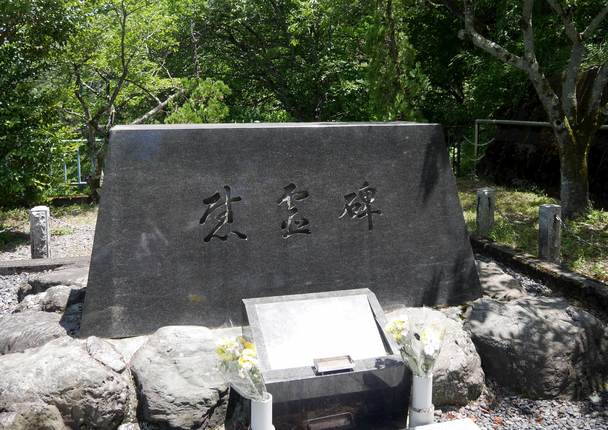
<figcaption>1968年に完成した下久保ダムの慰霊碑。8名が殉職した。</figcaption>
</figure>

### ダム所在交付金
ダムに対する補償金。主に水利権者が支払い、ダムが建設された地方自治体はそれなりに潤う。とはいえダム湖になった部分の固定資産税を失う話や、交付金が減る話、徐々に減額される話もあり、左団扇とはいかないようである。一方でダムに行くとやたらと豪華かつ使われていない地域の設備と出会うこともある。

### 堆砂
ダムの貯水池には上流から流れてくる土砂が底に堆積する。計画時に予めどの程度堆砂するかは想定して容量も設定されるが、計画よりも多く容量に影響が出ることもある。崩れることの多い、新しい山地にある河川では比較的堆砂が進行しやすい。

ダムの維持管理として浚渫する作業があるが、捨てる場所の問題もある。ひどい場合は、上流に貯砂ダムを設置する場合や、排砂ゲート、排砂バイパスを設置することもある。

日本においては、ダムの効果を大きく見せるために計画堆砂量が過少に見積もられているのではないか、という指摘もある。

### 自然への影響
## ダムの便益
ダムには多大なコストが乗ってくる話をしたが、それによって得られる便益はなんだろうか。もちろんその理由は間違いなく貯水ではあるのだが、その水の使い道によっておおまかに3種類が存在する。

### 利水
いわゆる水道水などもこの利水に入ってくるが、それ以外の主であるものの1つに農業用水がある。川の水を使う権利は利水権として保証されており、これを得るのはダムを建設する目的で最もよくあるものの1つである。日本の場合は節水が比較的進んでいることや人口の減少、農地の減少、工業用水の減少などにより利水用途は減少傾向で、現在ほとんどダムの新設計画が無いの理由の1つになっている。

都市の水道水の供給の責任を持つのは基本的に市区町村であるが、1つの河川に依存する複数の市区町村は概ね運命共同体であるので、広域水道企業団を作って共同で水源開発を行ったりすることが多い。

<figure>
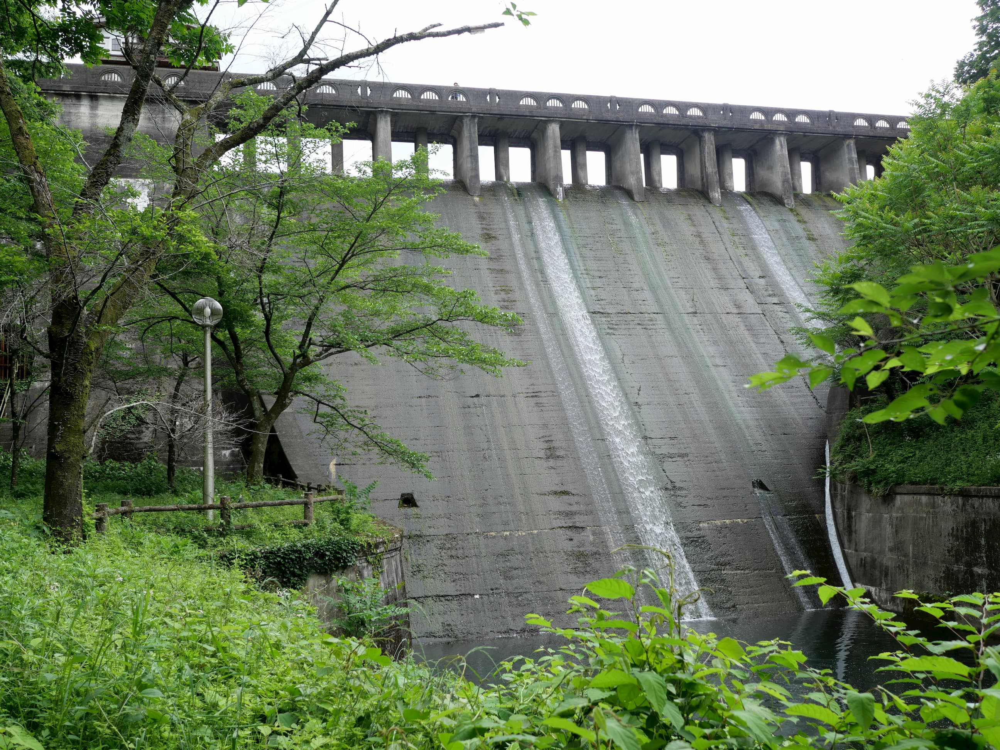
<figcaption>間瀬ダム。1936年に完成した日本初のコンクリート製ダムで、農業用水として使われる。</figcaption>
</figure>

### 発電
特に戦前から戦後すぐの時期は重要度が高い用途で、古い大ダムの多くは電力会社によって建設された。他のダムの用途と決定的に違う点は電力用途の場合、水量x落差で発電量が決まる観点から、落差を稼ぎやすい立地がよく、形成されるダム湖の容量はあまり重視されず、また電力は遠距離輸送が可能なため需要地が離れていてもよいという側面もあり、専用のダムが比較的多い。

一方で、1日の中での電力需要の格差を減らすために、貯水池をバッテリーのように使う揚水式発電用途のダムも存在する。貯水しかせず、流入は下池からの送水にのみ依存し、上流から流れてくる水もバイパスしてそのまま下流に流してしまうタイプのダムも存在する。このようなダムは利水や治水用途として使うことができないので当然発電専用(しかも純粋な発電量は0)の特殊なダムとなる。

### 治水
ダムに一時的に水を貯め込むことによって河川の流量を減らし、氾濫を防ぐ。周辺が都市化された河川ほど、些細な決壊による損失が重大になったり、遊水地が減っていて河川の水を減らす方法に乏しいなどの理由により、利水目的と利害が一致することが多く、複数の目的を持った多目的ダムの典型的な2用途になっている。

## 利水権
利水権は河川から取水する権利である。河川から一定以上の取水を行う場合に必要であり、利水権を取得すれば決められた量の取水する権利が原則として保証される。利水権は原則として必要と認められる量のみが認可され、経済的な取引は禁止されている。

ある河川に設定されている利水権は10年の1度の渇水期の水量を元に設定される。これは利水権が、定常的に取水可能であることが保証されている必要のある用途が想定されていること、利水権によって他の利水権を侵害しないこと、それ以上に稀な異常渇水を前提にするのはコストが高く付きすぎること、などを理由に、そのような決まりがある。

もし河川の新規利水権を申請する場合、当該河川の利水権に空きがあって妥当な理由があれば許可されるが、基本的に日本の河川で利水権に空きのある河川は存在しないため、ほぼ新しい水源開発が必要になる。

水源開発には様々な手法があるが、最もシンプルなのはダムを建設することである。ダムを建設して豊水期に水をため、基準となる10年に1度の渇水期の水量を上乗せすることができれば、その水量を利水権として取得することができる。

10年に1度の渇水期の水量を越える水は豊水、使用する権利を豊水権と呼ぶが、豊水権は厳しく制限されており、原則として将来的に利水権として取得できる予定のある量だけ、しかも数年しか許可されない。これは豊水権が固定化したり、渇水期に豊水権分も取水したりして、他の利水権に悪影響を及ぼすことを防ぐためである。ダムの建造は豊水を利水権として確定させる行為とも言える。

他の利水権を得る方法として、例えば既存の利水権を持つ組織などから譲り受ける方法がある。利水権は経済的な取引が禁止されているので売買はできないのだが、例えば水の使用量を減らすための設備投資を肩代りするかわりに、利水権をゆずってもらう、などの行為は可能である。実例としては、宅地化の進んでいる地域の農業用水の水路を効率化して必要な水の量を減らす投資を、利水権を必要とする都市水道が行い、それによって利水権を再設定することなどが行われる。農業用水は基本的に自然流を利用しており、宅地化などで必要な水量が減ったとしても一定の水の量を流さないと水路として機能しないことがある上、利水権を売買できない以上、このような取引がない限り節水するモチベーションに乏しい。

### 異常渇水
利水権は10年に1度の渇水を元に設定されるので、当然利水権で設定された水量を下回る年がある。この場合法的には「利水権所有者同士で話し合いをし、場合によっては河川管理者の調停を行う」ことになっている。実務的には殆どの場合当事者間の話し合いで決着が付くことが多い。一般に利水権は後から設定された方が不利なので、主に都市用水から節水がはじまり、更に深刻になった場合他の水利権者に補償金を払って減らしてもらう事例がある(福岡渇水)。都市用水が一定以上節水するのは命に関わることが多く、ここで拒否されることは少ない。

最終的に当事者間のやりとりで解決する場合が殆どなのは、利水権を得るのは非常に難しく、利水権の所有者は一握りの大組織のみなので、そのような利害調整がしやすいことも背景にあると思われる。

## ダムの操作
ダムに設定されている用途が確定してはじめて、複雑なダムの水門の操作の原則が理解できるようになる。

### 発電ダム
揚水をしない、純粋に発電用途のダムであれば、取水口が高い位置にある=水が貯まるほど落差が上がり発電量が増え、出力調整や渇水期の発電がしやすくなるため、多めに溜め込もうとする傾向がある。水力発電を負荷に追従しないベース電源として用いる場合は、発電所の出力に合わせて流出量一定になるようにダム操作が行われる一方で、負荷追従運転をする場合は夏場の平日の昼間をピークに放流が行われる。

揚水式に使われるダムであれば負荷追従運転が原則で、ベース電源の電気が余っていれば(場合によっては意図的に余らせて)揚水もすることになる。

### 利水ダム
利水用途のダムであれば原則として取水と放流がセットである。河川維持放流や慣行利水権の水量に取水予定分の水量を加えて放流を行う。10年の1度の渇水、またはそれが見込まれる状況にならない限りはこの操作が維持される。

### 治水ダム
純粋に治水用途のダムであれば、原則として水を溜め込まず、水害の恐れがあるときのみ水を溜め込む操作が可能である。水害の恐れがあるときは、流入量から一定量をカットして安全と思われる量を下流に流す。計画水量を越える水害でダム湖が満杯になってしまった場合、ただし書き操作に移行する。ただし書き操作は流入量と水門の水の量を一致させる操作で、事実上そのダムが存在しないのと同じ量の水が流れる。大きなダムがただし書き操作に移行した場合、ほぼ間違いなく下流における堤防の決壊に直結する。この場合もダムが無かった場合と比べると決壊を遅らせる時間稼ぎが可能であるので、この間に避難などを済ませることになる。

複雑な操作を行わない前提であれば穴あきダムと呼ばれる、一定流量を流す穴を空けたタイプのダムもある。水門の操作を必要としないので小さなダムに適している。

ここでは理想的な純粋治水用途のダムについて説明したが、殆どのダムは多目的ダムであるのでことは単純ではない。

### 多目的ダム
多くの大ダムは多目的ダムに分類されており、複数の目的を持っている。特によくあるのは治水容量の設定を持つ利水用途のダムで、純粋に利水用途のダムであっても、後から要請に応じて少量の治水容量が設定されたダムもある。

平常時の動きは基本的に利水ダムと同じ操作がおこなわれ、水に余裕があれば満水に向かうが、洪水の発生する7-10月などに入ると設定された洪水容量分の水が捨てられる。これは洪水に供えた操作になり、洪水が発生した場合はここの空いた容量に水を溜め込むことになる。非洪水期の洪水容量を持つ場合は非洪水期でもその分水位が下がる(洪水期の容量よりは少ない)。

大きな洪水が見込まれる場合は利水容量から予備放流が行われるときがある。予備放流を行う場合は、2-3日前に雨量を予測し、予備放流を始める必要がある。予備放流により予め容量を空けておくことにより大きな水害に耐えることができるが、予備放流より少ない雨しか振らずに空振りをすることがあり、原則として水利権者の許可が必要な操作となる。一方的に不利な契約を水利権者がする筈はないので、一般に補償が絡む話になる。

## ダムのゲート
ダムのゲートは、上にあればあるほど水圧に耐える必要がないので安くなるが、水が低位のときに放水できなくなり、容量が大きいほど高くつくという傾向がある。このため、大きなダムでは、用途にあわせて複数のゲートを持つ設計が一般的である。

### 非常洪水吐
非常に多量の水が流入してダム湖が満杯になったとき、放流に使われる。常用洪水吐があるダムであれば、ここから水が出る状況は、原則としてダムの決壊を防ぐためにただし書き操作をしているか、非常洪水吐の試験以外では原則として無い筈である。その性質からゲートが無いことが多く、排水容量は非常に大きく、ダムの天頂近くにある。また、大型な設備なので、ダムの見た目の特徴となっていることが多い。

洪水容量を持たない発電専用ダムでは余水吐と呼ばれることがあり、発電に使えなかった水を捨てる用途で使われるのでこの呼び名がある。

### 常用洪水吐
主に洪水時の放水量の調整に使われる。この特性から洪水容量を捨てられる程度の高さにゲートが設置されることが多い。洪水期は全開で運用されるダムもある。利水用ゲートなどより大型なものが設置されることが多い。

<figure>
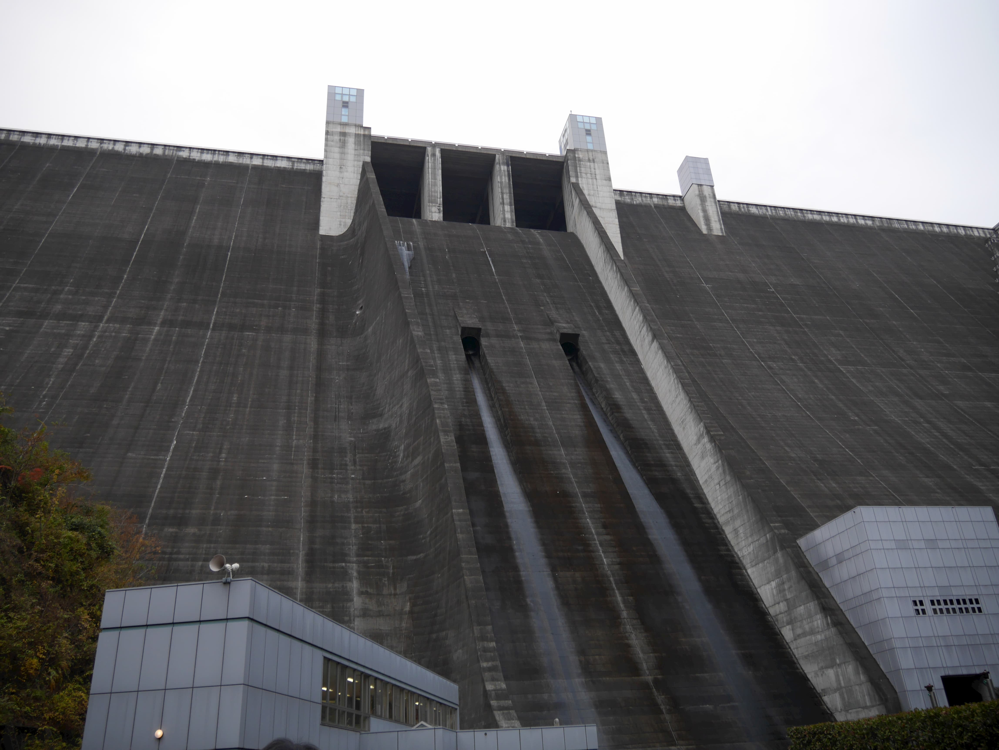
<figcaption>神奈川県の相模川水系の支流中津川にある宮ケ瀬ダム。神奈川県の水道水の6割は相模川水系由来で、そのうち1/3が宮ケ瀬ダムに依存している。中央一番上の構造が非常洪水吐、真ん中にあるのが元々常用洪水吐として設置された高位常用洪水吐、右下の白い設備は低位常用洪水吐で、予備放流を迅速に行うために設置された。低位常用洪水吐は非常に高い水圧がかかる大型ゲートであるので、おおがかりな装置となっている。</figcaption>
</figure>

### 選択取水設備
<figure>
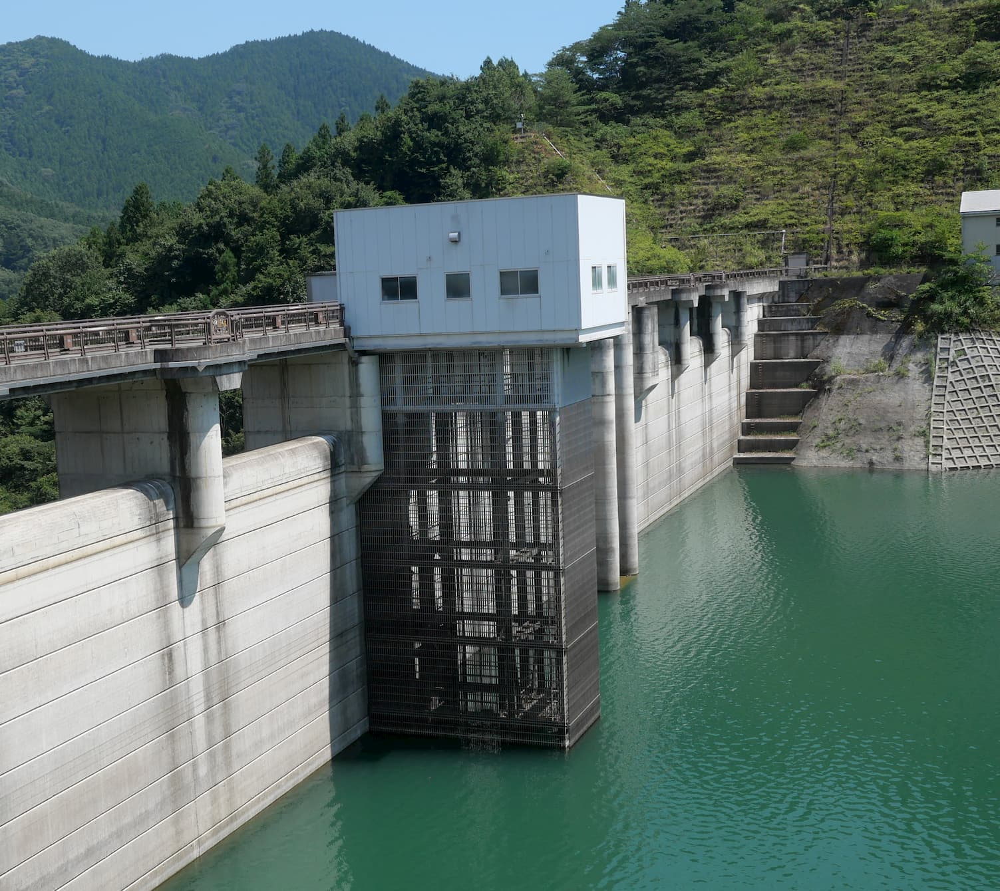
<figcaption>荒川水系の支流吉田川にある合角ダムの選択取水設備</figcaption>
</figure>

どの高さから取水するかを選ぶことができるようになる設備。複数のゲートに繋がっていることもある。一般には一番下にゲートを取り付ければダムの水位によらず取水は可能なのだが、ダム湖の底は表面に比べて温度が低いことが多く、生態系に悪影響がある。これを避けるために水面高に合わせて取水する。

### 発電用ゲート
発電用の放流ゲートだが、発電がメインのダムと利水がメインのダムで傾向が異なる。共通しているのは発電容量に合わせて大きさが設定され、利水メインのばあいは発電はおまけなのでかなり小さく、利水ゲートの一種なので選択取水設備に繋がっているか、低い場所にある。発電メインのダムであれば落差を稼ぐために高い位置にあることが多く、比較的大型のゲートになる。

### 利水用ゲート
想定する主用途により名前は様々だが、ここでは雑に利水用ゲートと呼ぶ。発電用ゲートがあれば利水容量の放流で発電用ゲートの容量を上回った分がここにくる。選択取水設備があれば必ず利水用ゲートに繋がっており、かなり柔軟な排水が可能になっている。一般にこのゲートより下の水は放水できないので、死水容量と言われる。

### 予備放流
大きな洪水が見込まれる場合に利水容量を減らすことで行う予備放流の場合、常用洪水吐より下位の水を放水する必要がある。この場合、特に準備していないダムで使えるのは利水用のゲートだけで排水に長時間掛かり、予報が不確定な状態で放流の決断を求められることになる。

## 地域別の水事情
### 関東

<figure>
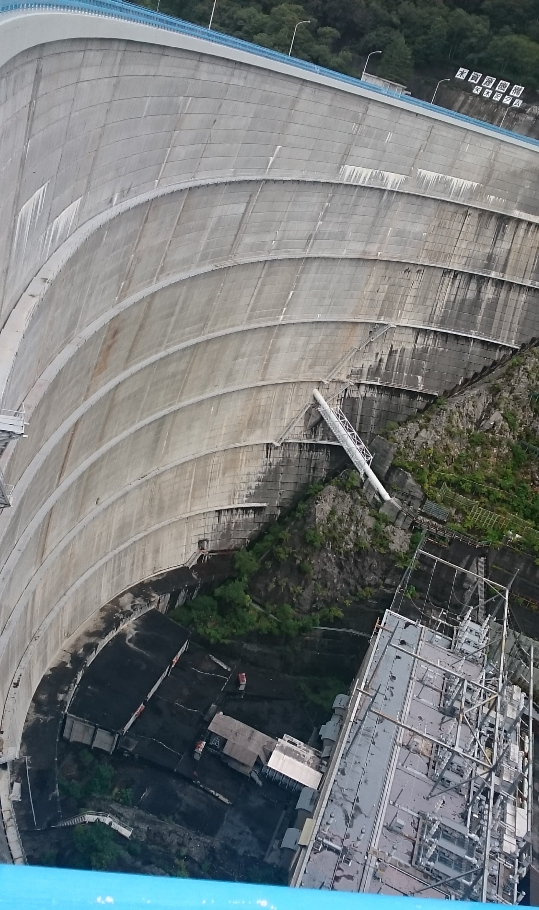
<figcaption>利根川水系の最上流に位置する4ダムの1つで、首都圏最大の貯水池を持つ矢木沢ダム。かつては未開の地にあって住民はおらず、移転などの補償は無かった</figcaption>
</figure>
<figure>
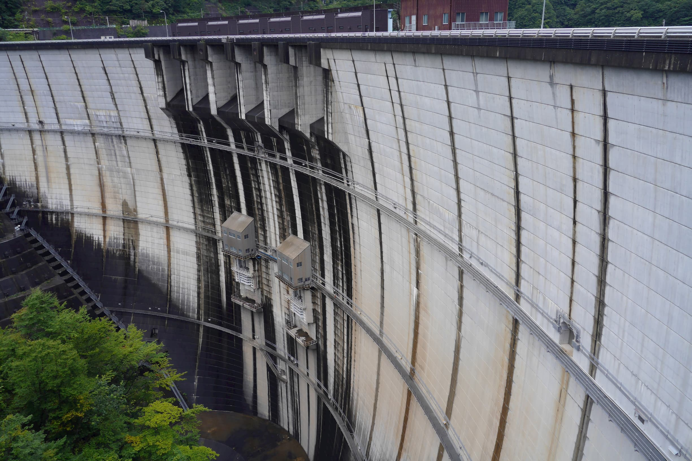
<figcaption>利根川水系の支流鬼怒川上流にある川治ダム。栃木県や北総の水がめとして機能している。</figcaption>
</figure>

関東は長年渇水に苦しんだ地域が多く、特に人口が多い東京は顕著である。東京の初期は多摩川から取水してきたが、すぐに足りなくなって荒川、そして日本最大規模をほこる武蔵水路を通じて利根川からも取水している。その水源の多くはダムに依存しており、ダム依存度の最も高い地域の1つである。

水害も多く、水運などの都合もあって、江戸時代から川の流れを大規模に変更してきた歴史がある。現在利根川の河口は千葉県の銚子にあるが、これは元々東京湾に注いでいた流れを切り替えたものである。また、現在荒川の本流になっている河口付近も、元々は大正に荒川放水路として、氾濫しないように大幅に拡張された人工の河川である。(隅田川が旧荒川)

現在の水害対策は戦後すぐのカスリーン台風がきっかけとなっており、カスリーン台風の水害を防ぐのに必要なだけの貯水量を確保するのがダム開発の原動力のもう1つの軸になっている。

個別の事情として、千葉県は利根川水系以外に大河川を持っておらず、比較的平坦なので、利根川水系からの長大な水路や様々な貯水池に依存している。神奈川県は相模川と酒匂川のみに依存しており、県の西にある酒匂川から独自の水源をほとんど持たない三浦半島まで長大な水路を持っている。

### 関西
関西は日本の他地区と異なり、琵琶湖とその流出河川である淀川を持ち、大ダムをあまり必要としていないのが他の都市との大きな違いである。一方で、淀川以外の水源は、人口を考えると比較的乏しい。

事実上関西では琵琶湖を巨大なダムとして水が賄われているわけであるが、ダムのように琵琶湖を活用する場合、滋賀県の湖岸における高波の被害や水位が下がると水が流出しない、いわゆる死水が非常に多い問題がある。ので、例えばほぼ全量を淀川に依存している神戸市の資金で、琵琶湖に堤防を建てたり出水部の改良を行うことで水源を確保することが実際に行われている。また、京都市内へは明治に作られた琵琶湖疎水が現在でも水道水の99%を供給している。

<figure>
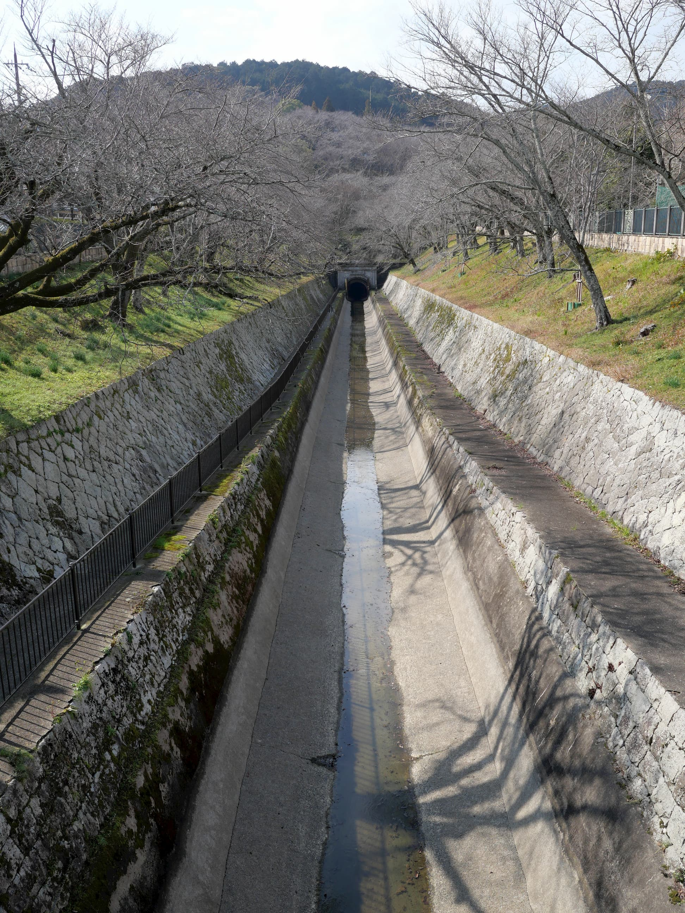
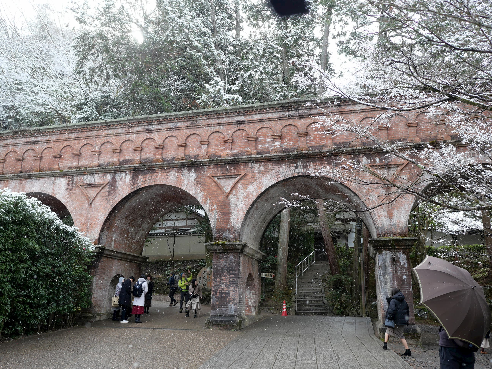
<figcaption>琵琶湖疎水。左は滋賀県側から山を越えるトンネル、右は南禅寺境内の水路。</figcaption>
</figure>

### 東海
非常に豊富な水量をほこる木曽川水系(長良川・揖斐川含む)や、矢作川・豊川など水量の豊富な水源を抱えているので、その人口に反してあまり大規模な渇水を経験していない。豊富に工業用水が確保できるため、工業化の助けになった側面も。一方でその豊富な水量は水害として猛威をふるうことがある。

### 福岡
人口に反して近くに大河川を持たず、小河川にある小さなダムに水源を依存してきたが、水道需要の増大に水源の確保が追い付かず、昭和53年に福岡渇水というかなり大規模な渇水を起こした。最終的に近隣の大河川である筑後川から福岡導水によって福岡まで給水することが可能となり、筑後川に筑後大堰やダムの建設を通じて水源確保に努め、それ以降大規模な渇水は経験していない。現在福岡市の水源の1/3が福岡導水によって賄われている。

### 四国
頻繁に台風が来襲するので水量が豊富かと思いきや、人口が雨量の少ない瀬戸内海川に集中していることもあり、水量の地域差が激しい。大きな水源地が高知県に集中立地する一方、愛媛県と香川県の水不足は深刻である。

香川県と徳島県はほぼ全量を吉野川水系、四国一のダムである早明浦ダムに依存しており、香川県内へは香川用水を通じて早明浦ダムの水が供給される。一方で渇水時には徳島の取水が優先されることになっており、少ない水量でも農業が行えるように工夫された多数の溜池で対策しているのが現状である。

<figure>
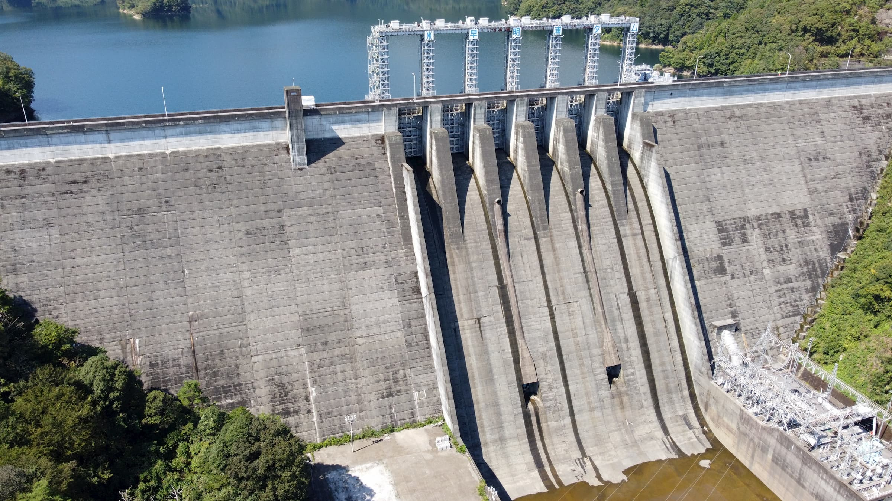
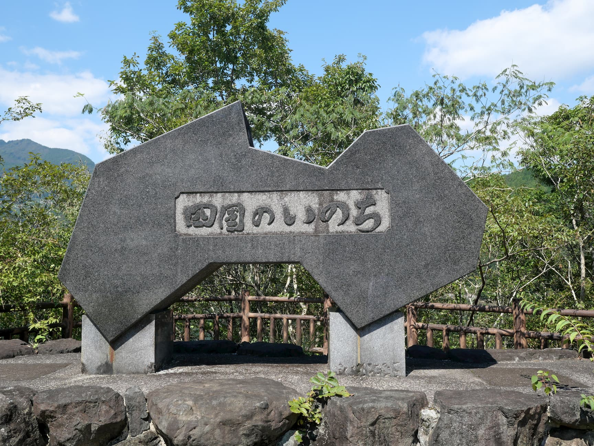
<figcaption>吉野川水系本流の早明浦ダム。すぐそばにある「四国のいのち」の碑は誇張でもなんでもなく、単なる事実である</figcaption>
</figure>

松山市はその水源を石手川ダムという小ダム1基と地下水に依存しており、その人口に対してあまりにも脆弱である。水の豊富な高知方面などからの分水計画はあるものの、予算がつかず目処は立っていない。
