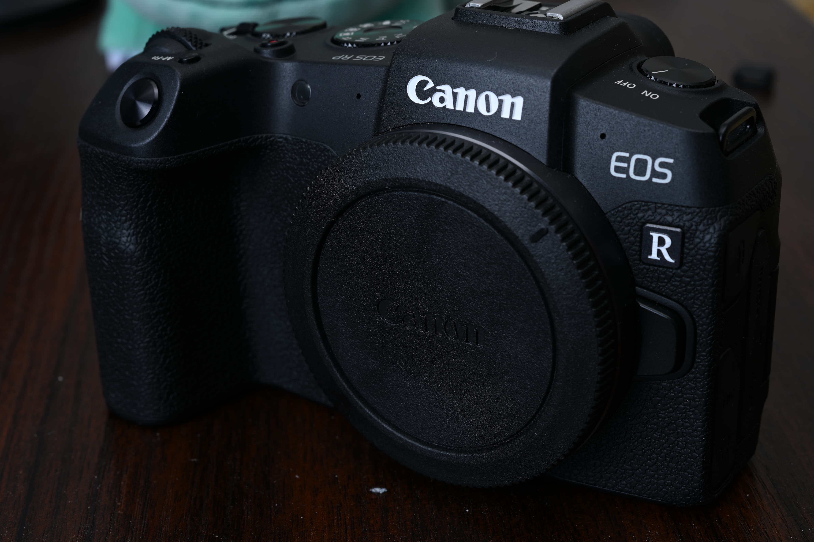

# EOS-RPをレンタルした話

[カメラ自動転送機能比較](../camera-sp/)という記事を昔書いて、そこそこのメーカーに関してはスマートホンとの画像自動同期機能について調べているのだが、肝心のシェア1位のCanonを調べていないということもあり、EOS RPを借りてテストした話。

## カメラの基本的な話
Canonのフルサイズミラーレス最初の入門機。今となっては新品で12万とかで売られており、作られた時期などを考慮すると破格といってもいい。その上軽い。グリップもいい。ただやはりシャッター音など若干のチープさは否めないが、道具としては必要十分な性能がある。軽くて安いフルサイズを探している向きにはかなり有力な選択肢にはなる。

ただ使っていて気になったのは、USB給電が可能なのだが、PD充電にしか対応していないという問題があって、そこらへんに落ちてるUSB端子から充電するのが難しい点。あと他のCanon機と比べてUIが若干違うという話もあった。あとバッテリーが小さい。

## 自動同期機能…ではない？
Camera Connectというアプリでスマホからカメラに接続することができる。Bluetoothに対応しているのでスマホ側からWiFiをONにすることができる。

とりあえずBluetoothのペアリングをすれば接続設定はほぼ完了するのだが、EOS RP側のMENUがかなり奥まったところにあったり、操作項目が多くて若干むずかしい。

接続すると自動同期という機能がメニューにあらわれるのだが、私の認識ではこれは自動同期機能ではない。まずこの画面を表示しておかないと同期がはじまらない。電源を切るとリセットされてしまい、転送済の管理もしていないので、間違って電源を落としてしまった場合は手動でデータを持ってくるしかない。

スマホ側からスマホだけでカメラにWiFiで繋いで画像を持ってくることは可能だが、前回試したα7Cよりは遅い。NFCもない。カメラ側から転送する手段もなさそうにみえる。電源がOFFだと転送できない仕様はSONYと同様。

## まとめ
動作を試した限りでは不安定だったりひどく遅いとかはなさそうだが、Nikonの自動同期に慣れた身としては使いづらいので、要件が変わらない限りCanonに行くことはないかな、という穏やかな気持ちになった。
