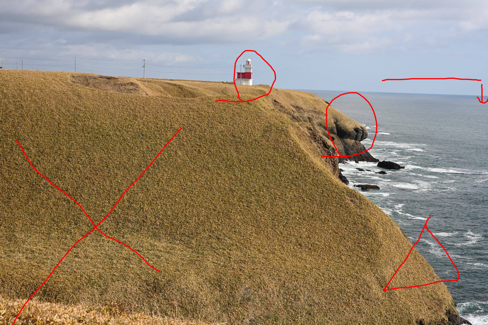
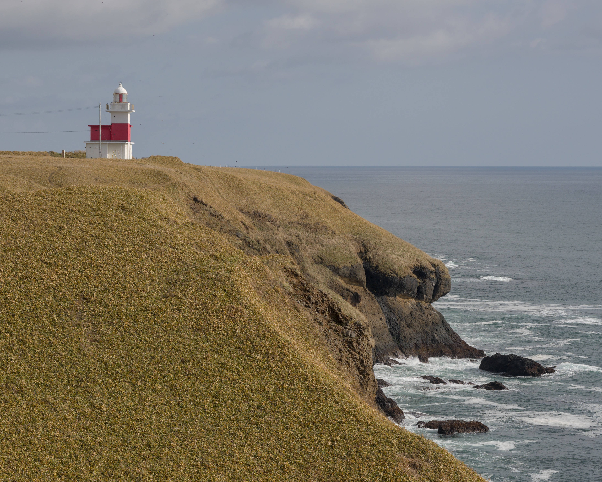
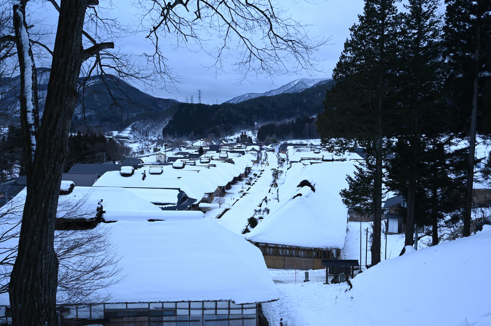
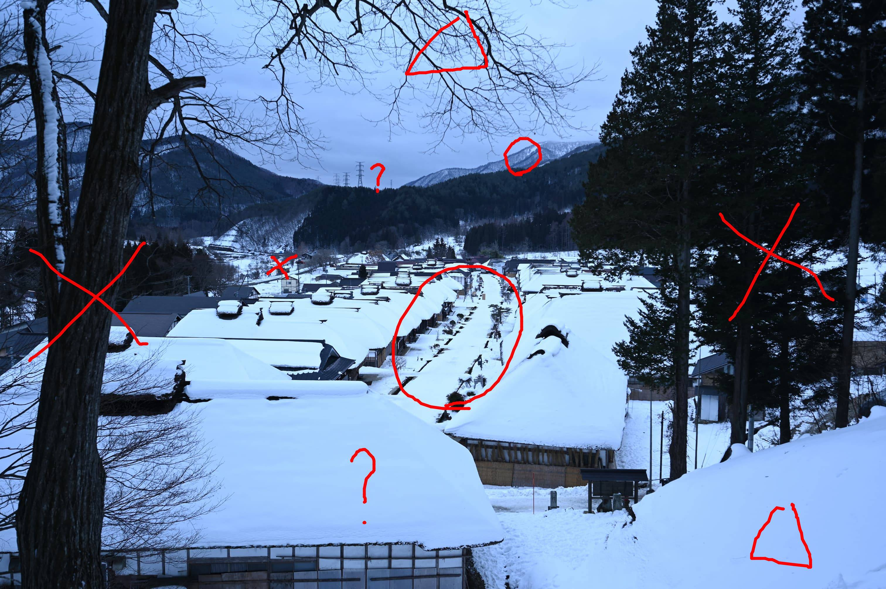
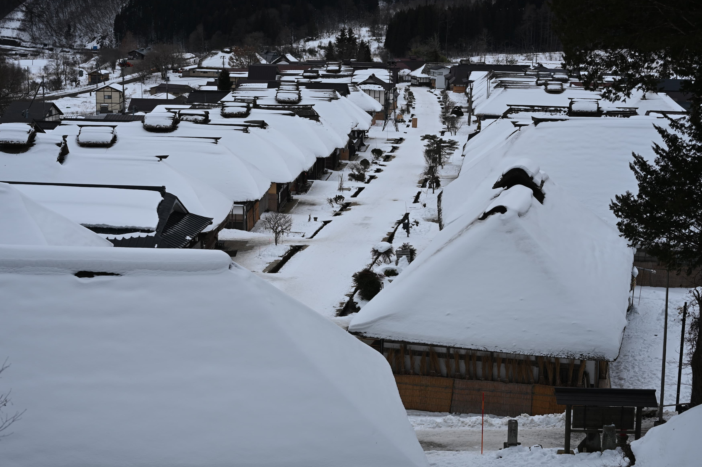
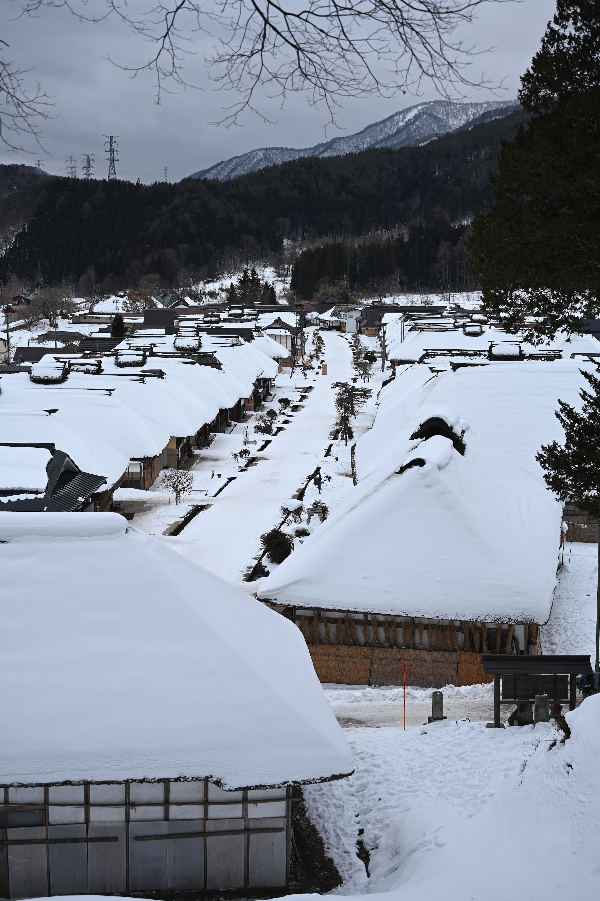
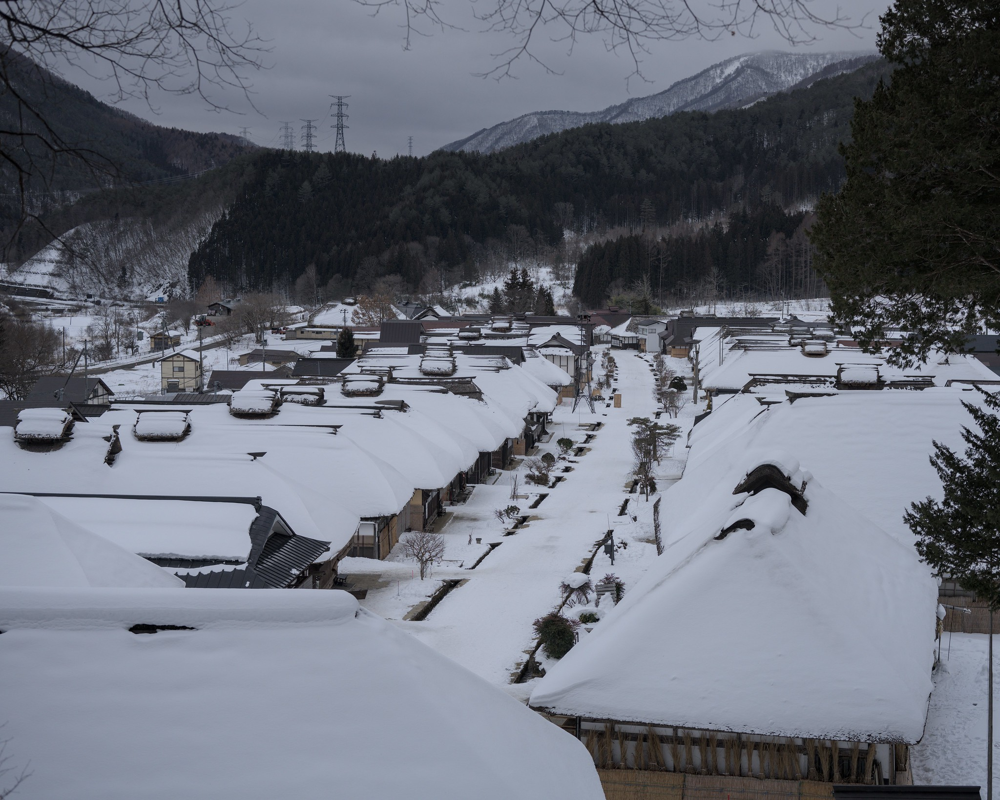

# 良い写真を撮る方法
## 対象
この記事は旅行先でもうちょっといい写真撮りたいとか、そんな素朴な向きに少しでも良く見える写真を撮る方法を指南するのを目的にしています。スマホでも活用できる、構図の話が基本になります。

## 水平を取る
シンプルかつ効果が高いのが「水平を取る」です。建物・鳥居・橋などの構造物、水面は水平を取りましょう。水平からズレている写真は居心地が悪いものです。水平を取るのが面倒くさい場合は、意図的にナナメにしてしまうのもありだとおもいます。撮影の後処理(カメラでは一般に現像と呼んでいる行為)ができる場合、水平を調整することはそれなりに多いです。(意外にズレていることが多いので)

## 狭く撮る
効果は非常に高いものの、むずかしいのが「狭く撮る」です。写真に余計なものを写す必要はありません。表現したいもの、見せたいものを最大限にアップして撮るのが基本です。しかし言うのは簡単で、実際は「自分は何を表現したいのか、何を撮りたいのか、何を見せたいのか」を明確にしないと、余計な部分をカットして撮影することはできません。

実例でしかうまく説明できないので実例で見ていきましょう。

### 落石岬灯台

道東にある灯台です。北海道はどこに行っても本当に広い大地が広がっています。漫然と撮影すると、このようにだだっ広い写真になってしまいます。

だだっ広い場所はいいですが、写真で占める範囲が広過ぎて面白くないです。切りましょう。メインはあくまでも灯台と崖です。実は水平も駄目で、右が下がっています。

最初の修正結果です。Flickrに上がっているのはこの写真なのですが、知り合いからやっぱり左下が冗長だと言われました。ぼくも今見直してみるとそう思います。更に切りましょう。

上下の切る余裕が少なくなっているので5:4に変換して左右を中心に落としてみました。どうでしょうか、よくなっていませんか？

### 大内宿

大内宿という古い民家が沢山残ったので有名な観光地となった場所です。ホワイトバランスがちょっとおかしいですが気にしないでください。どの部分を残しましょうか？

真ん中の大内宿の中心となる道路が一番必要なところです。左右の建物もできるだけ残したいところ。一方で左右の木は要りませんね。原則として消す方向にしましょう。上はちょっと空が広すぎるかもしれません。削れるなら削りましょう。

この時点で残したいところが比較的縦長であることがわかってきます。

ここからは個人の感性にも依るところですが、集落上にある山の稜線は残したいところです。とはいえ左の鉄塔は、メインテーマを考えるとマイナスな気もするので、両方纏めて切ってしまってもいいかもしれません。下をどこまで残すのかも難しいところで、左下の建物を残すか切ってしまうか少し悩ましいところがあります。

おそらく狭く撮るという趣旨にあった解でいうと、こちらかなとおもいます

しかしこうすると左下の建物がちょっと冗長というか変化に乏しい感じがします。エイヤッと縦長にするとどうでしょう。

よい感じです。一番下の建物がこれだと意味が出てきます。とはいうものの、ぼくは最終的に次のようにしました。

これは個人的なクセなんですがメイン被写体を中央下に持っていきがちで、下の部分をバッサリ落として5:4にしています。
