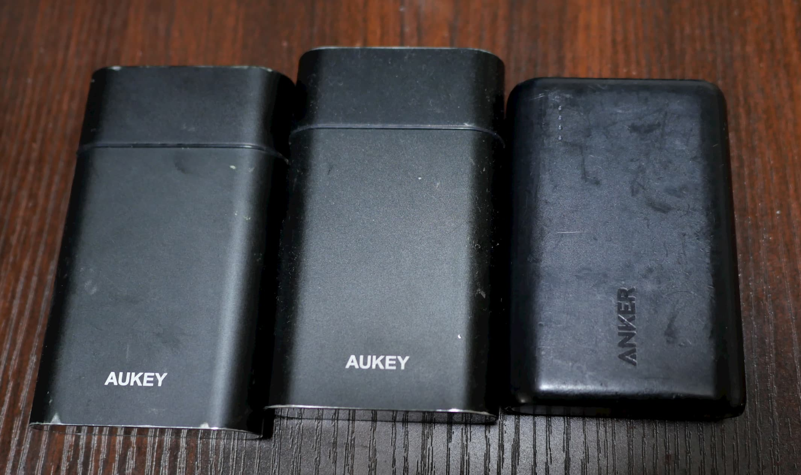
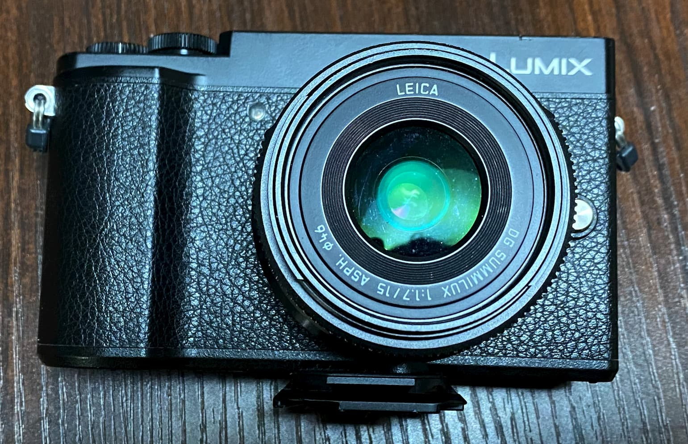
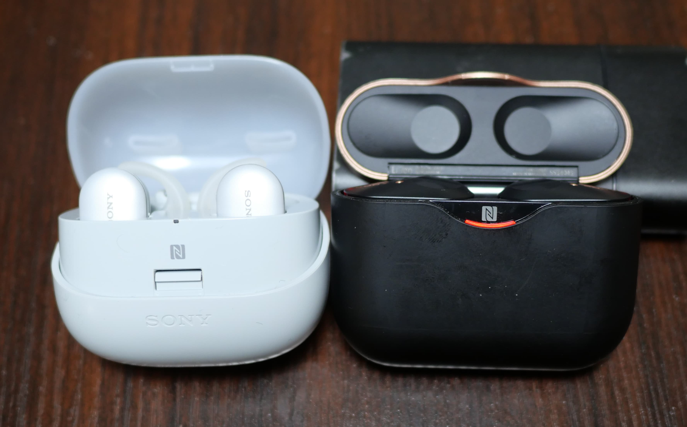

# 遠征ガジェット
## はじめに
この記事は [旅するエンジニア Advent Calendar 2019](https://adventar.org/calendars/4441) の15日目です。

頻繁にIngressや駅メモなどの位置情報ゲーをしに遠征したりするので、そのときに持っていくガジェットの話をします。出先で開発はあんまりしないのでそういう参考にはならないかもしれないです。

## スマホ
今となっては、言うまでもなくスマホは人権・ライフラインetc...
やりたいことによって欲しいスマホは違うとおもうのでここは自分の話だけしておきます。

現在使っているスマホはZenfone5zとiPhone11で、これは以下の理由によるものです。

- DualSIMが欲しい。駅メモをやってるとき電波を捕むかどうかは死活問題なので、1端末でauとdocomoの回線両方に繋ぎたい
- メモリが乗るだけ欲しい。駅メモとTwitterとカメラ起動したら駅メモがメモリから溢れてしまうのはきつい
- iTunes Matchを契約しているので音楽聞くならiOS必須
- 無くしたり壊したりすると死ぬので2台ぐらい欲しい

充電端子はZenfoneがTypeC、iPhone11はLightningです。
違うのは厄介ですがiOSが必要なので仕方ありません。

## モバイルバッテリー
スマホは人権やライフラインだと言いました。
なのにスマホの要件でバッテリーの話が出てきていません。
現代のスマホのバッテリーはおおむね十分だから…
ではなく、どんなにバッテリーがデカいスマホでも1日バッテリーが持つ筈が無いので諦めているのです。
駅メモにせよIngressにせよ、GPSとCPU/GPUをうごかし続けて1日持つ筈がないのです。

そもそもぼくはウッカリであることを自覚しているので充電忘れることがしょっちゅうあります。
なのでガジェットが充電できるようにモバイルバッテリーを持ち歩きます。

左の2台はAUKEYのPB-Y12という機種で、TypeCが1ポート付いてて入出力どちらもできるのと、microUSBからも充電できるのがウリの10500mAhの製品。
右のANKER PowerCoreはmicroUSB1ポートとTypeA1ポートしかないものの小型で10000mAhあるのでよく使います。
旅行のときは3台で、普段は1台減らして持ち歩いています。

現在出回ってるモバイルバッテリーは大体20000mAh/10000mAhが主流です。
スマホのバッテリーは非常にざっくり言って5000mAhで1回満充電できるぐらいを想定するといいです。
なので、1日中位置情報ゲーするような用途でも、スマホの充電という用途に関しては10000mAhが2つあれば十分です。
これ以下の容量はコスパも重量も割に合わないと感じています。

10000mAh2台の方が20000mAh1台より優れていると感じる理由は、充電忘れのウッカリミスの対策や同時充電が可能であることです。
従って、20000mAhが欲しいのは30000mAh以上必要な場合で、以下のパターンぐらいしか思い付きません。

- TypeCで充電できるノートPCを充電したい場合
- 充電できないシチュエーションで宿泊する場合

端子に関してはTypeCで統一したいとかあったんですが、
TypeC-TypeCケーブルでないと充電速度のメリット生かせないわりに、
この充電が時々逆になったりする(モバイルバッテリーがスマホのバッテリー抜いてる)問題があったり、
そも物が少ない・高いとかもあって、
まだmicroUSBで充電するのでもいいんでないの、と思ってます。

## カメラ
旅の必須アイテムです。
エッ…スマホで十分…?
いえ、必須アイテムです(断言)。
位置情報ゲーのサブクエストは現地で沢山写真を撮ることと言って過言ではありません。
折角なのでいいカメラ持っていきましょう。

とはいえデカい重いカメラを持っていって面倒くさくて結局使わないのも問題なので、
どの程度写真にエネルギーを振り分けるかで選びます。

1. とにかくいい写真撮りたい - フルサイズミラーレス一眼
2. コストと重量のバランス - ASP/Cとかマイクロフォーサーズのミラーレス一眼
3. 重量重視(安いとは言ってない) - コンデジ

私はPanasonicのDC-GX7 MK3というマイクロフォーサーズのミラーレス一眼を使ってます。
被写体に合わせてレンズ変えられるカメラでありながら、
レンズも種類あるしまあまあの価格と軽さが実現できるマイクロフォーサーズは、
割とスナップ写真撮るならバランスいいんじゃないかとおもいます。

なおレンズは景色中心なら15mm(換算30mm)の広角寄りをカバーすることをお勧めしておきます。

重量だけ考えるならコンデジもありで、なんなら上位機種とかかなり良い写真撮れるみたいなので、こちらも全然ありみたいです。

フルサイズミラーレスは他のレンズ沼の住人のサイト行って欲しいです…。
滅茶苦茶良い写真撮れるのは保証できるんですが、本体はともかくレンズがめっちゃ重いしコスト高いので考えましょう。

意外に厄介なのはバッテリーです。

- 単体で充電できるカメラにするべき
- 充電しながら撮影できる方が好ましい(が意外に該当しないものは多い)
- 前者が達成できないなら予備バッテリーが必須

スマホみたいに充電できれば予備バッテリーは要らないんですが、そのような機種が少ない。
また、TypeC端子に対応のカメラは更に少ないので統一に際して鬼門になりがち。

## Bluetoothイヤホン
旅先で音楽聞きたいことはよくあるし、位置情報ゲーと音は相性が良いとかあります。
普通にイヤホンでもいいんですが、ケーブルの取り回しが省略できるBluetoothは割と体験が変わります。
そもiPhoneは端子ねえとかもありますしね。

ヘッドフォンでもいいんですが、単体でBluetooth飛ばせて小さく済む完全分離型のイヤホンが割と現実的な性能・価格になってきててオススメです。

左はSONYのWF-SP900で、右はSONYのWF-1000XM3です。
SONY信者かよ。
今買うならWF-1000XM3はほんとにオススメで、音質はぶっちゃけ好みじゃないので置いておくとして(高音質という人が多いけど)、
ノイズキャンセリング付いててマイクも付いてて(口元になにも当ててないけど、結構声の通りもいい)、バッテリーが6時間持つのはとてもいいです。
はい6時間です。
1日持ちませんが、左の1つ前世代のWF-SP900は3時間だったので全然マシなんですこれでも。

2つ撮影してることからも分かるように、WF-1000XM3の充電中はWF-SP900を使うような運用をしています。
一応ケース自身がバッテリーで、1日は辛うじて持つぐらいのバッテリーはあったとおもいます。
が、あんまり信用してない上によく充電忘れるのでモバイルバッテリー繋ぎっぱなしで運用してます。

バッテリーが気になる人はヘッドフォン型を検討するのがいいとおもいます。

## USB充電器
充電しない前提だとバッテリーの量を更に増やさないといけなくてしんどいので、
以上挙げたガジェットは宿に着いたら全部充電器で充電する必要があります。
当然バッテリー自身も充電する必要がありますしね。
最近だと新幹線でも緊急回避的に充電できるのでやっぱり持っていきたい。

前まで4ポートの充電器を1つ持ち歩いていたんですが、ガジェットの数が半端ないので、これが壊れたのを機に2つ買うことにしました。

下がSANWAのACA-IP54Wというモデルで、4ポートで6A30W出力できます。
個人的にSANWAは信用しているのと、これだけのポート数があってコンセントの足が畳めるのが理由です。
上はEwinとかいう怪しいメーカーで、4ポートで4.8A24Wの出力があります。
ただ怪しいメーカーがSANWAに比べてこれだけ小さい容積を達成しているのが不信過ぎてあんまり使ってないです。

よくあるスマホを急速充電する場合、1ポートに2A10Wが必要です。
ただしスマホ並に急速充電可能なガジェットは多くないので、4ポート30Wは若干過剰気味な性能です。

TypeCのノートPCを充電しながら使いたい用途だとポート数とかどうでもよくなって、出力のでかいTypeC出力のある充電器が必須など、要件が全く変わってきます。
ガジェット類はそのノートPCから充電すれば良いという発想もでてくるとおもいます。

## その他
夜の暗い公園でIngressやったり廃トンネルの探検を考慮して頭に装備するライトや、
山で降られたときのことを考慮して登山用のレインウェア買ったり、
食料調達に失敗する(これは駅メモでもたまにある)ことを考慮して羊羹を常備してたりしますが、
多分普通はそんなヤバいとこ行かないと思うので割愛します。

あ、飲み物を入れるボトルホルダーは便利なのでおでかけが多い人は検討してもいいとおもいます。

ちなみにそういう限界装備は登山勢がくわしいです。
結構参考にしてます。

## まとめ
8割ぐらいバッテリーと充電の話しかしてなかったように、旅先で生命線となるのは大体バッテリーなので対策しつつ旅を楽しみましょう。

なんか聞きたい話とか逆に「こっちのほうがよくね」とかも聞きたいので、そういうコメントはTwitterとかでどうぞ。 [@ponkotuy](https://twitter.com/ponkotuy)
