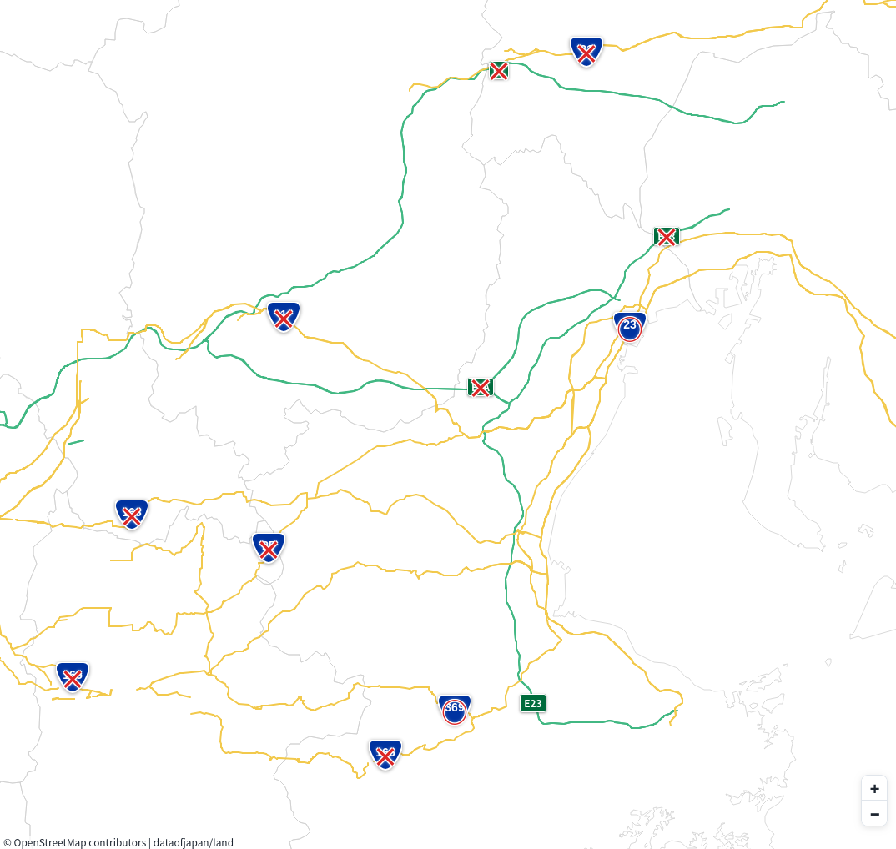

# 関西-名古屋の道路が全封鎖された日に車で突っ込んだ話

## なにこれ

2025年2月7日の夜から雪の影響で予防的に関西と名古屋を結ぶ名神、新名神、名阪国道その他主要ルートが全封鎖されるという事態に、愚かにも東京を朝3時に出て車で奈良に向かい、苦節11時間ほどで辿り着いた話をします。

## 事前情報

7日の20時に名阪国道が全域で封鎖され、21時時点で主要ルートが全封鎖されました。封鎖された範囲は名神が小牧JCT〜京都東で、新名神はみえ川越IC〜草津JCT、東名阪が桑名東ICから全域、伊勢道が亀山IC〜津IC。国道はでかい道で1号線8号線21号線。
残りの国道はあまり情報が纏まっておらず個別に調べる必要があり、最近改良されて有力なルートになった桑名から鈴鹿山脈を抜けて滋賀に至る421号線は滋賀県内で通行止めなのを確認。477号線は元々冬季閉鎖。後で調べて知った話として163号線、165号線、166号線の県境は封鎖されていたらしいです。

## 我々の判断

163号線、165号線、166号線の封鎖を知らなかったため、とりあえず津〜松坂のあたりまで行けばなんとかなるんじゃね、って話と、元々予定していた行き先が奈良で、そんなに大きく迂回せずに行けるぞとなったので、とりあえず行ってみようという話になりました。鈴鹿山脈の雪がヤバいのであって、他は大したことないだろうという予想があったのもあります。

ちなみに車はスタッドレスタイヤ装備で、予備として使い捨ての布製チェーンが入れてありました。

## 実際の経過

朝7時頃に浜松を通過したあたりで大量の雪が降りだし、これは相当ヤバいのではないか、という話が出てきます。このあたりで新東名あたりの積雪は数cm程度だったとおもいます。日が出たら好転するからちょっと時間稼ぎをしようという話になり、東名阪の通行止め区間に向かいますが、名古屋市内は一面真っ白でした。そして桑名まで来たところ、高速道路の1車線が完全に雪で埋まっていました。関西〜名古屋のルートが途絶した最大の理由はどうやら桑名〜四日市の雪であったことがこのタイミングで分かってきました。

桑名市内に到着したのは8時半頃だったとおもいますが、桑名市内は10cmぐらいの雪が積もっていて完全に世紀末みたいな状況でした。都市として雪慣れしていないので、それなりに雪国慣れしていたつもりでいた自分の想定状況と全く違った状況が展開されていました。登り坂では目の前で車がスタックしているし、除雪は全く追い付いていませんでした。市内のファミレスはいても営業はしていましたが、当然のように駐車場は全く除雪されていませんでした。1号線は殆ど動いておらず、23号線が2車線なので辛うじて雪で止まった車を避けながら進める、みたいな状況でした。GoogleMapはこのタイミングで四日市・いなばポートラインを迂回路としてお勧めしてきましたが、通行止めでした。

四日市あたりまで来ると23号線はそれなりに順調に流れていましたが、この時点で11時ぐらいになっていました。当初予定では名張にある女人高野に行く予定で165号線の予定でしたが、通行止めになっており、ナビは名松線沿いに県道を進んで国道369号線に到達、そこから県境を越えるルートを勧めてきました。今思うと、関西に抜けられる数少ないルートの1つでした。

369号線は数少ないルートの割に車の往来は多くありませんでした。ただ反対車線から関西ナンバーが頻繁に来ていたので、開通していそうな雰囲気がかなり漂っていました。途中、1台路肩に衝突して停まっている車いたりして、油断すると次はお前だという雰囲気はありました。

結局当初の予定どおり女人高野に向かいましたが、結果として一番雪が多い道はここを結ぶ県道28号線だったというのが面白いところです。おそらく雪が元々それなりに降るので地元の人が慣れてて、特に交通の支障はなかったです。

そのあとも165号線が通れないことが事前に分かっていたので166号線を迂回したりしてなんとか奈良盆地に出ました。このあたりで精魂尽き果てました。

なお、帰り（次の日）は規制解除されていたので、なんら問題なく帰還できました。

## 反省と事後諸葛亮

もう少し天気情報を読み込んでいれば違った判断になったかもしれないので、道路情報だけでなく天気情報を確認しておくべきでした。伊勢方面への規制情報があまりなかったので楽観視し過ぎたきらいもありますが、実際のところ三重県内における最大のネックは桑名市内であり、紀伊半島に出るルートも途絶していました。唯一問題なく移動できたルートは伊良湖〜鳥羽のフェリーしかなく、しかもその先も369号線しか開通してなかったことが分かっているので、当然のように電車に切り替えるか、行き先を変えた方が良かったですね。フェリーは完全に事後諸葛亮なので、当日乗れたかどうかは分からないですが。

雪道におけるスタックを避けるための封鎖であるため、名神と新名神が除雪しきれないor通行できないと判断された時点で、交通集中する可能性が高い代替ルートにあたる部分がかなり計画的に封鎖されたようです。（これは想像通り）ただ地元民の移動はあまり支障がないように封鎖が設計されていたような気がするので、369号線のような抜け穴がいくらかあった可能性が高いです。
