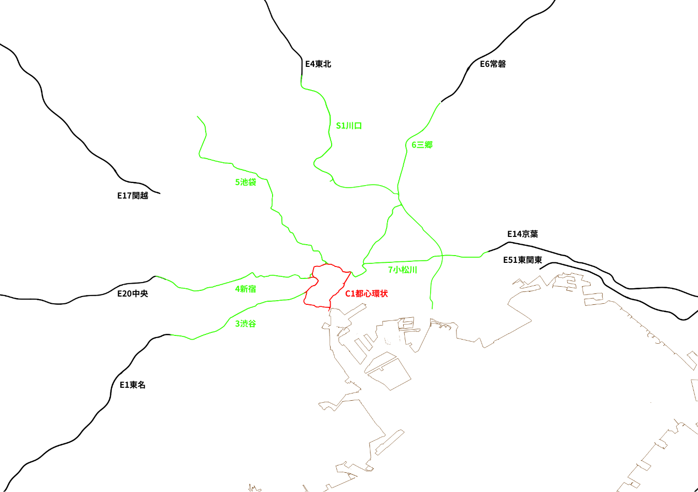
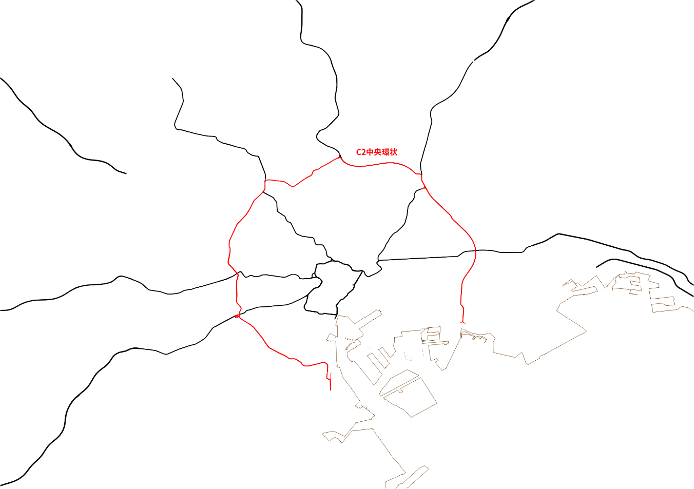
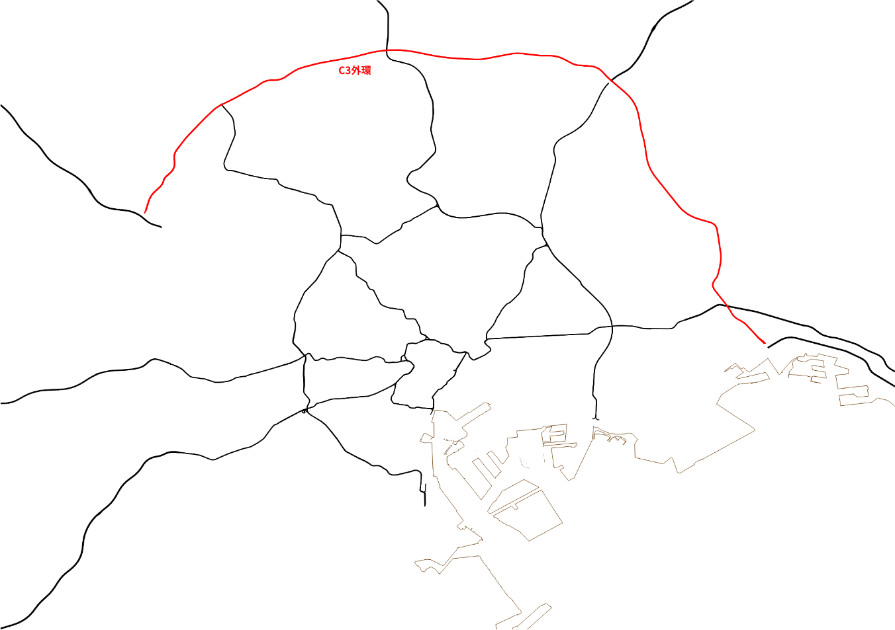
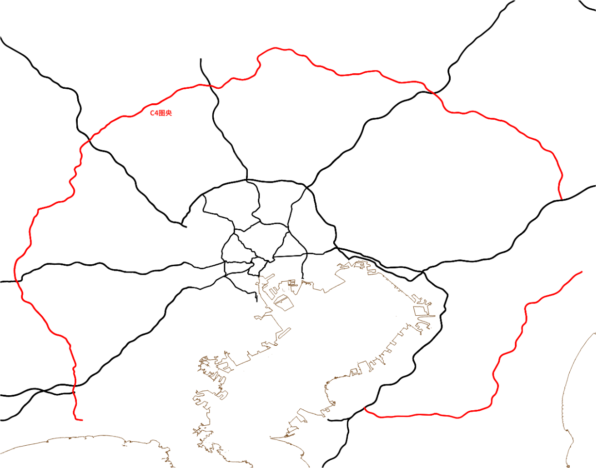
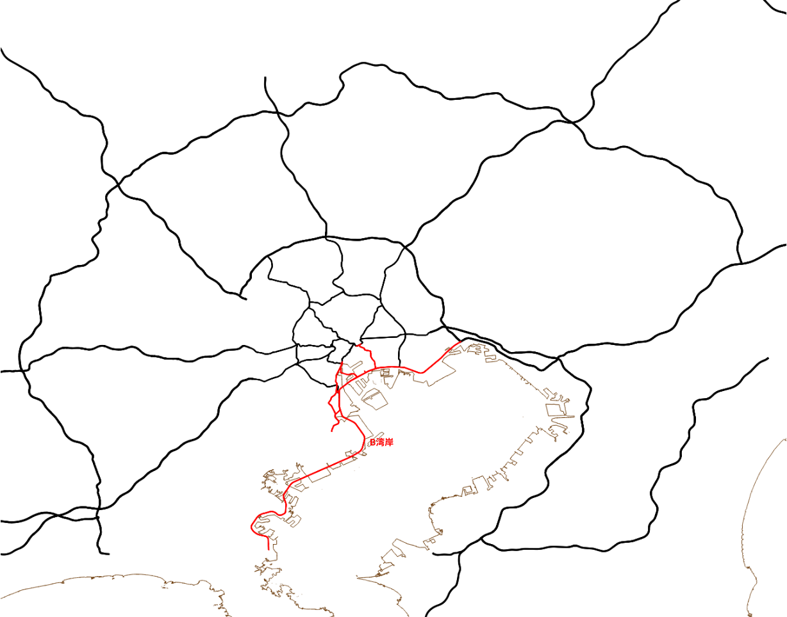
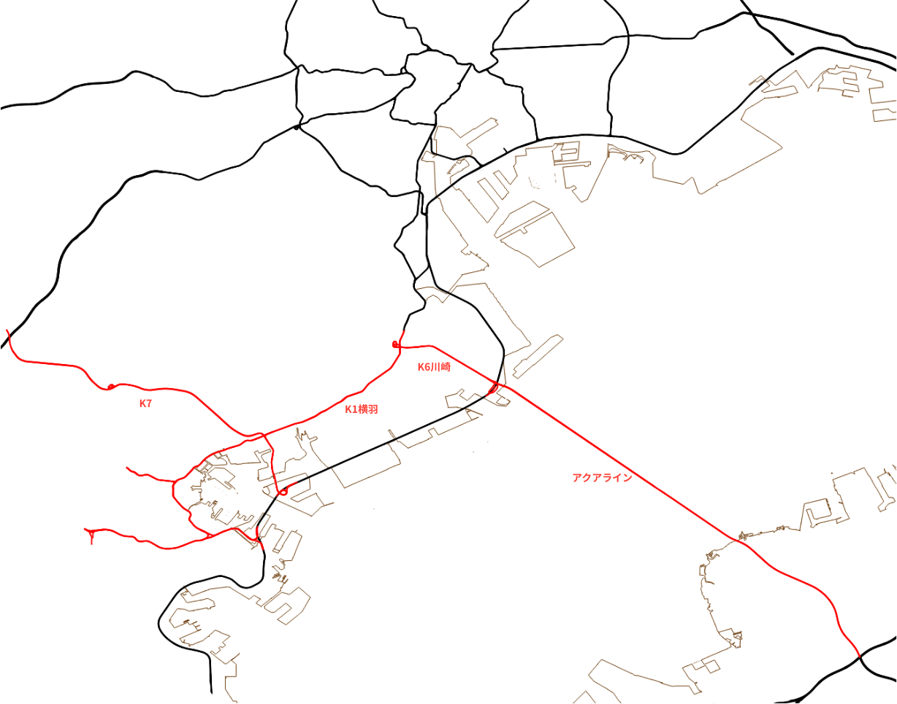

# 首都高速入門

## 概要

首都高速道路、路線が多過ぎてよくわからん、ナビの通りに走るしかねえ、から一歩抜け出して、代替ルートを設計できる程度まで首都高速道路を理解するために作られた入門です。首都高を網羅するための記事ではないので、そういうのはWikipediaとか公式ページを参照してください。

全ての高速道路は記号を併記します。道路標識とかで頻繁に使われていてこちらで覚えた方が利便性が高いためです。是非覚えてください。高速道路の番号は国道の番号がそのまま使われており、首都高の放射状の路線は時計回りに番号が、環状線は内側からC1, C2と振られています。

走行上の注意として、古い道であるほど右合流や右分岐が沢山あることです。看板をよく見て間違えないようにしましょう。新しいB湾岸道などには右合流などが無いので安心できます。

首都高速（含む埼玉・神奈川）の料金制度は他の高速道路と切り離されていて、ETCは従量制、一般は最大額課金です。どう回っても最短経路で計算します。0-4時の間に入出すると深夜料金で2割引きになります。

## C1都心環状線

東京の高速道路は原則として放射線状の道路と環状線の2つから成り立っており、最も内側にある環状線がC1都心環状線です。つまり東名高速、東北道、関越道など、全ての道はC1都心環状に通じているわけです。簡単ですね…と言えればよかったけど、これは原則論であり、実際は多数の例外があります。

まずE14京葉道とE6常磐道は直接C1へ合流せず、この2つが合流してから改めてC1に合流します。渋滞しそうですね、実際渋滞します。

E4東北道、E17関越道、E51東関東道は次以降で説明があります。お待ちください。

残りはシンプルに高速道路は首都高速に名前を変えてC1に接続します。首都高速は料金が割高に設定されているので、基本的にはうまく環状線を使って首都高速に入らないようにするのが料金的にはオススメです。時間帯によっては都心部だけ一般道使う手もあります。

C1は各区間が別々に作られ、結果的に環状線として独立したという経緯があるため、回るルートが必ずしも直進方向ではないという分かりづらさがあります。右分岐・右合流も容赦なく存在し、非常に分岐の多い道路です。カーブもキツく、40km/h制限区間まであります。そのくせに慣れたクルマはガンガン飛ばしてきます。そして基幹路線なので当然のように混む。首都高こわいイメージは大体C1のせい。

## C2中央環状線

環状線の2本目は中央環状線です。料金制度的に首都高速の一部になります。C1ほどは難しくないので、C2に逃げるのは割と有効。

E4東北道が実はC2に繋がっています。C2と5池袋線や6三郷線を乗り継ぐとC1に入ることもできますし、他の放射線状の道路に入りたいだけならC2使って行けます。

## C3外環道

環状線の3本目はC3外環道です。料金制度的にはC3単独で完結し、首都高よりも安く設定されています。従って、首都高に入るよりも安いことが多い一方で、外側から来たとき、C3を経由することで一旦料金が打ち切られます。

この料金制度の最大の被害者としてE17関越道があり、E17関越道はC3を経由しないと都心部に入れない一方で、そこから5池袋線などで都心部に入ると2度料金が打ち切られる設計になっていて、割高な料金を請求されます。

また、E17関越道からE1東名高速までの接続部分が未成道で、特に需要の多い東名に繋がっていない不完全な道路です。不完全な道路にしか繋がらないE17関越道の不遇。

全体を通して80km/h規制なのと右側出口が無いので比較的走りやすい方です。ほぼ全線で一般道と共用するので、ケチるために下道走ることも多々あります。

## C4圏央道

環状線の4本目はC4圏央道です。料金制度的には高速道路の一部なので唯一打ち切りがありません。東京に入る必要がないなら真っ先に候補に上がる道路でしょう。

便利なので渋滞しがちです。特にE1東名の交点である海老名JCTとE20中央道の交点である八王子JCTの周辺が混雑します。

## B湾岸道

環状線とも放射状の路線とも言い難い路線の1つがB湾岸道です。料金制度的には首都高速の一部です。

E51東関東道の接続先はB湾岸道になります。C1からはいくらかの接続線が、C2からは東西から直接、C3は現在東側の接続のみが開通しています。

首都高にしては線形もよく3車線あって走りやすい路線なので比較的早く移動できて便利です。羽田空港と後述するアクアライン、横浜に接続しているのも重要ポイントです。（東名は横浜を経由していない）

## アクアライン

東京より西側から千葉方面に抜ける場合最短となるのがアクアラインを使うルートです。東京側の接続先が川崎なので他の高速道路との接続が地味に悪くて難しいという問題があります。しかしここまで読んだ方なら、殆どの場合B湾岸道から入ればよいことが分かる筈です。簡単ですね。

ただ特筆すべき例外としてE1東名との接続があり、最近開通したK7へ、B湾岸かK1横羽線を経由して入るのがかなり便利です。一応保土ヶ谷バイパスという、ここには書いてない別のルートがあり、K7が開通する前はE1東名高速から横浜方面に入る唯一のルートとして扱われていましたが、信じられないほど混むので今となってはあまりオススメしません。

## 残りの路線

ここに上げられていない路線は沢山あり、それらの分岐が貴方を混乱させることでしょう。しかし、ここに上げた道路以外は基本的に特定の場所に行くためだけのルートであり、その路線沿いのICを使うのでなければ使うことは殆どないはずです。必要が発生したら個別に覚えるだけのことです。
