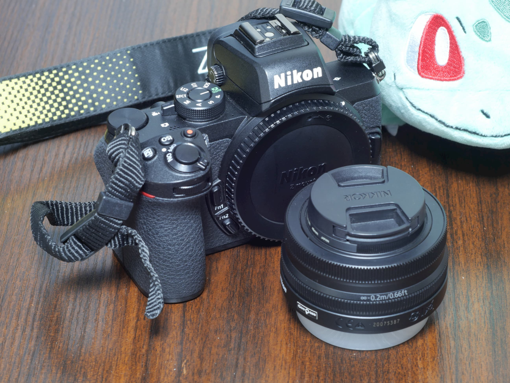
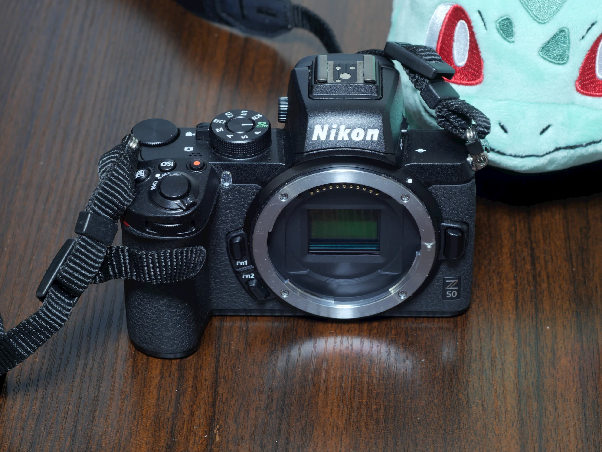

# Nikon Z50をレンタルした話

## なにこれ
GooPassというレンタルサービスでZ50を借りて試用したのでその話を。

## 概要
Z50はNikonから出たミラーレス一眼で、現状唯一のAPS-C機である。マウントは他のフルサイズミラーレスと同じくZマウントで、元々かなり大きなマウントなのでZ50もAPS-C機に不釣り合いな大きなマウントを持つ。Nikon自身ミラーレス市場に参入したばかりであり、Zマウント自身まだレンズがあまり多くないが中でもAPS-C専用レンズは現行2本しかなく、今回借りたレンズキットの16-50mm F3.5-6.3はそのうちの1つである。

## カメラ本体
全体的にとても優秀。サイズが比較的大きめだが、良好なグリップを持つので握りやすく、軽く感じるが、APS-C機のなかでは比較的重い。Nikonのカメラを使うのは初めてなのだが、画面に露出補正の値を常時表示する方法が見つからず、前回設定したものを戻し忘れることが頻繁にあった。それ以外の操作で戸惑うことはなかった。
ISO感度耐性も高く、レンズの暗さもあいまってISO感度をかなり上げることを余儀なくされることは多々あったが、ノイズが目立ってしまうことはほとんどなく、ISO12800とかでも十分耐えるという感触がある。
またカメラ内現像機能もあり、簡単な処理であればその場で修正できる。手動デジタルズームみたいなクロップは何度かお世話になった。

## SnapBridge
[カメラ自動転送機能比較](../camera-sp/index.md) で詳細は書くが、全体的に安定していて優秀。自動転送の画像サイズがかなり小さいのがネックだがそれ以外で困ることはないだろう。

## レンズ
描写は悪くないように思うのだが、望遠端F6.3は流石に暗く、望遠を良く使うのであれば早急に買い替えたくなるようなレンズではある。広角端の換算25mmは便利で比較的明るいのでよくつかうことになるだろう。沈胴機構を持ち、収納状態であれば相応にコンパクトになる。収納状態からレンズを手で繰り出す必要があり、面倒くさいと当初は思ったが、面倒なら繰り出しっぱなしにしておいても良いので、これはこれでアリかもしれない。

## まとめ
非常に完成度の高いAPS-C機であるが、惜しむらくはレンズが圧倒的に足りないので、マウントアダプタで他のマウントのレンズを使う前提の運用か、将来的にフルサイズ移行を見据えてフルサイズのレンズを揃えるか、レンズの流用できるZマウントのサブ機か…分かってる玄人(ニコン信者)向けアイテムなイメージ。Zマウント体験版。私はSnapBridgeの試用がしたかっただけなので買うならZ5/Z6ですね…。
