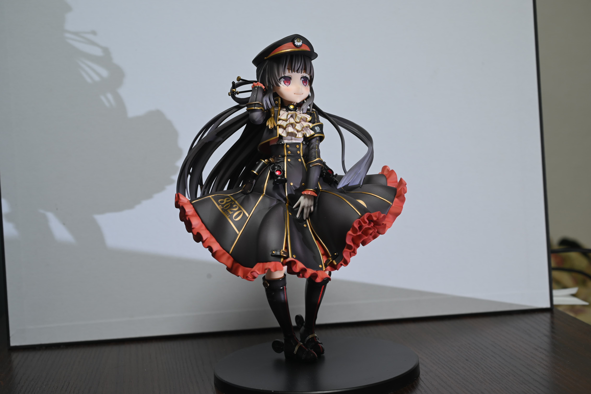
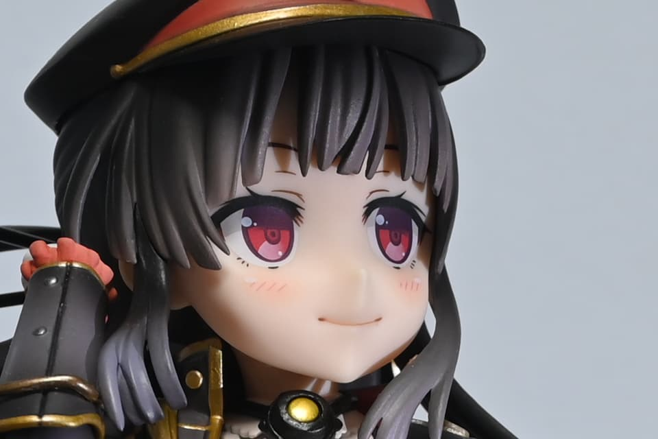
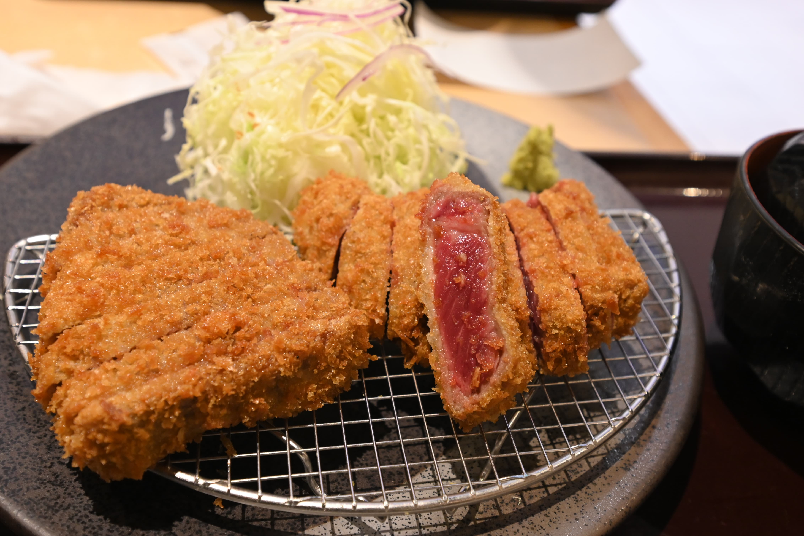

# Z6でNikon入門とフルサイズ入門した話
## マイクロフォーサーズ収集期
長きにわたってマイクロフォーサーズいいぞしつつレンズを揃えていたわけだが、マイクロフォーサーズの広角レンズの種類が少なかったり、優秀な選択肢が少ない、夜景でISO感度上げる方法が取りずらい、という問題が立ちはだかっており、広角レンズが豊富に選べるフルサイズの移行はかなり前から検討していた。あと持ってるM42のオールドレンズの画角がマイクロフォーサーズだと微妙に使いづらいとかもあった。

ただ正直画質面で言うとマイクロフォーサーズでさえ必要十分という認識があり、フルサイズ移行の前に色々試してみようということで、マイクロフォーサーズで画角を揃える方を優先していたわけだが、

- M.ZUIKO 7-14mm F2.8
- LAOWA 7.5mm F2
- Pana 14-140mm F3.5-5.6
- LEICA 15mm F1.7
- SPEEDMASTER 25mm F0.95
- Pana 100-300mm F4.0-5.6

とまあ大体揃って、7.5mmと25mmと14-140mmの3本でほとんど撮影できるという確信を持ったので、マイクロフォーサーズのレンズ収集は完成を見たという認識になった。

SPEEDMASTERを買った段階で、7-14mm or 7.5mmをメイン機であるGX7MK3に刺し、25mmをサブ機のGX7に、14-140mmはカバンに入れておくみたいな運用になっていて、サブ機は割と前提という運用になっていた。

## GX7ご臨終
ところがGX7が壊れてしまい、上記の運用が若干キツくなり、1台増やす必要が生じた。このタイミングで当座のカメラをレンタルしつつ、フルサイズ移行かマイクロフォーサーズ機を買い足すかのどちららを行うか検討しだした。

## メーカー選定
フルサイズのメーカー選定において最も重要だったのは広角レンズの豊富さである。広角レンズ色々試したいからマイクロフォーサーズから移行するので当然である。 (Ref. [フルサイズカメラ調査](../fullsize/)) 調査した結果、Eマウント > Zマウント > RFマウント > Lマウントという優先順位が出た。ZマウントはLAOWAのレンズが一通り出ているのと、14-24mm F2.8の評価が高く、RFマウントより評価が高かった。

次にスマホへの画像転送が一番楽なやつ、というものだが、これは残念ながら店頭で試すだけではあまりよくわからない項目で、GX7の穴埋めをするついでに色々なメーカーのレンタルをすることになる。Ref. [カメラ自動転送機能比較](../camera-sp/)

次に重要なのが最初に買うことになる広角レンズと本体の合計重量で、フルサイズはかなりよく調査した。

スペックは特に手ぶれ補正機能を良く見た。理由はファインダーも見ず、雑に撮ることが多いので、失敗写真を減らすためであった。あと広角レンズの手ぶれ補正はレンズ側で修正があまりできないので、ボディでケチるのは難しいとかもあった。

あと充電端子も重要で、Type-Cに移行したかった。microUSBをそろそろ駆逐したいというモチベがあった。遠征で3種類(+thunderbolt)のケーブルを持っていくのはしんどいためである。

値段は20万以下という感じで考えていた。ぶっちゃけると本命のα7Cがその値段だったからである。

とりあえずスペック表をながめた時点で、候補は以下のような感じだった。

- OLYMPUS PEN E-PL10
- OLYMPUS E-M1 Mark3
- SONY α7C
- Nikon Z5
- Canon RP/R6
- SIGMA fp
- LUMIX S5

ただSIGMA fpは非常に軽いものの手ぶれ補正が無く、同期する機能を持たず、Lマウントもレンズが少ないので早期に選択肢から外れた。S5もLマウント由来のレンズの問題と同期が期待できない、値段も高いとあって外れた。RPは手ぶれ補正がなく、R6は高過ぎ、レンズが少ないという点であまり乗り気ではなかった。

## レンタル
スマホへの画像転送を調査するためにレンタルしたカメラは、最終的にNikon Z50とOLYMPUS PENの2機種で、個人的に本命と思っていたα7Cが借りられなかったのは、単に在庫が無かったからである。

まずZ50を借りたのだが(Ref. [Z50をレンタルした話](../z50/))、SnapBridgeの画像転送の出来が非常に良く、Z50自身もかなり使い勝手がよくて正直惚れ込んでしまった感があった。もちろんレンズが無いカメラという残念な称号を越えられるほど気に入ったわけでもないのでZ50を買うことはなかったが、Nikonの評価が上がる切っ掛けではあった。

次にPEN E-PL10を借りたのだが、正直びみょうだった。自動転送機能がなく、OLYMPUSをメインで運用したいという気持ちにはならなかった。この時点ではE-M1 Mark3はかなり有力候補だったのだが、フルサイズが買えてしまう値段(18万)を正当化できないと感じた。しかもE-PL10はスマホ同期が最も充実していて、いくらかの機能はE-M1 Mark3にはオミットされているらしかった。なお、PENは本体でバッテリーを充電する機能がなかった。宿泊の遠征ででかい充電器持っていけというのはキツい。GX7MK3の下位モデルを買うという行為はあまりにも保守的に見えたとかもある。PEN、GX7MK3のセンサーより出来が良くない印象があった。

このあたりでレンタルし放題の月額パスの更新が12/23に迫っていて、そろそろ決断する必要があった。というか普通にα7Cに決めたつもりだった。

## Twitterの声
- Z5よりZ6の方が筐体が良い
- SONYのカメラは家電
- その条件でSONY行く理由なくね？？？
- Z50気に入った直感は信じた方がいい

なんかやたらSONYよりNikon推しが多くて結構悩んで、あとZ5/Z6がかなり値下がりしたとかもあり、結局最後のセリフが決定打になって前日に翻意してZ6に決めた。このへんはぶっちゃけ「オタク、シェア1位のメーカーきらいだからな」という表現の方がしっくり来る気がする。あとカメラ内現像も好きとかあった。というか異常にSONY嫌い(？)な一人に翻弄された説もある。なぜだ。

## 初手レンズの検討
Z6のキットレンズ24-70mm F4は正直キットレンズとしては破格の優秀さで、本当は欲しかったのだが、中古市場だとあきらかにキットレンズ込みは高くつくことが分かったのでやめて、広角レンズを選定することにした。

14-24mm F2.8が欲しくないと言ったら嘘吐きになるのだが、とはいえ30万出費の勇気も出なかったしフルサイズでF2.8の必要性を感じなかったので除外。LAOWA 15mm F2/LAOWA 11mm F4.5/Voigtlander 15mm F4.5/NIKKOR Z 14-30mm F4を検討したが、LAOWA 15mmは重量で除外、11mmは画角に不安があって除外、Voigtlanderはマウントアダプタが要るので初手は除外、初手ぐらいNikonのレンズ見ておこうという気持ちと、LAOWAとそんな変わらん値段、よく使う24-28mmがカバーできるとかもあって結局Z 14-30mm F4になった。

## 購入
新宿の北村写真機店で安かったので購入。レンズとセットで大体28万円だった。

<figure>

<figcaption>My new gear...</figcaption>
</figure>

## XQD事件
家に帰ってほくほく顔でZ6を開けたが、SDカードがなぜか入るけど固定されない。あきらかに固定されてないから電子接点に繋がってない。なんでやねん、と思って調べてみたらZ6はZ5と違ってSDカードではなくXQDに保存することが発覚。1万円の追加投資でXQDとリーダー(ファームのアプデに必要)を買い事無き。CFExpress？知らない子ですね…。

土壇場でZ6にしたので、Z5(こちらはSDカード)と違って調査が足りてなかった。ちゃんと調べよう。

## 追加購入
M42アダプタを購入。TAKUMAR 55mm F1.8とTAKUMAR MACRO 50mm F4を使えるようにした。物撮りもとりあえず当面はこれで行ける。

<figure>

<figcaption>ハチロクフィギュアをTAKUMAR MACRO 50mm F4で撮ってみる(F8 SS1/6 ISO200)</figcaption>
</figure>

<figure>

<figcaption>顔拡大したやつ。ちなみにZ6の本体内現像機能でクロップした</figcaption>
</figure>

## 感想
まだそんな枚数撮ってないが、メシ撮りで雑にISO感度上げたり楽しい。AFも早い。あとF4でもめっちゃボケるとか。M42が本当にフルサイズに対応しているのを認識したりとかもある。何も考えずにTAKUMAR 55mm F1.8を買ったとき、マイクロフォーサーズで55mmっておかしいでしょって最初は思ったんですよ…。

<figure>

<figcaption>F4だとボケ過ぎるからF8まで落として…部屋が暗いからISO2200までいっちゃったけどフルサイズだし余裕やろパシャリ(F8 SS1/30 ISO2200)</figcaption>
</figure>

## 余談:LAOWAのマウント戦略の話
LAOWAは基本的に高品質かつ小さいレンズを提供することにより差別化して、新興ながらできるだけ高値を維持しようという動きをしていて、ある程度成功している印象のあるメーカーである。で、EマウントとZマウントにはフルラインナップを提供しつつ、RFマウントとLマウントには限定的なラインナップのみ提供している。

まずEマウントは最もシェアの高いフルサイズミラーレスマウントで、サードパーティーに解放されているメリットもあって積極的になるのは当然で、おそらくここをターゲットにレンズの開発をしている。問題は残りのマウントだが、フランジバックの値を見たら以下のようになっていた。

|----|----|
|Eマウント|18mm|
|RFマウント|20mm|
|Zマウント|16mm|
|Lマウント|20mm|

というあたりで、おそらくLAOWAのレンズはギリギリまで小さくするためにEマウント18mmをターゲットにギリギリのレンズ設計をしていて、それより短いZはそのまま出せるが他は出せない、という仮説が成り立つ。

つまり最強のマウントはPentax Q…いやなんでもないです。早くサードパーティー各社のレンズもミラーレスの短いフランジバックに最適化されるといいですね…。